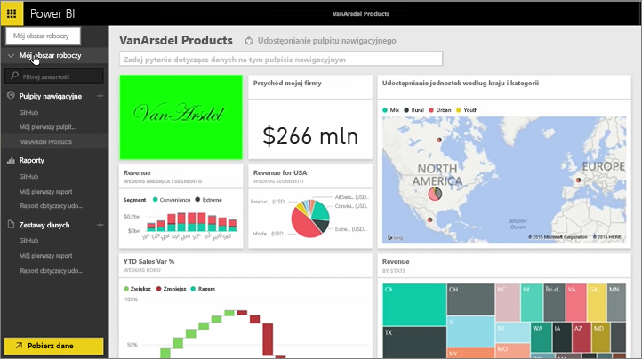
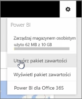
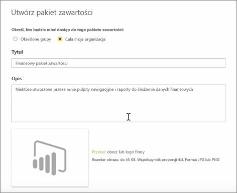
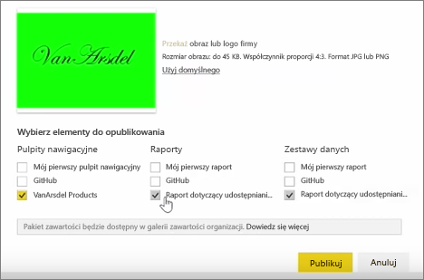
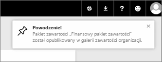

W czasie tej lekcji utworzymy *pakiet zawartości* z artefaktami, które istnieją już w usłudze Power BI, a następnie udostępnimy go współpracownikom.

W oknie **Mój obszar roboczy** mam pulpit nawigacyjny, a poniżej raport i zestaw danych. Chcę udostępnić je osobom w mojej organizacji jako pakiet do ponownego wykorzystania.

Wybierając ikonę **Ustawienia** (koło zębate w prawym górnym rogu okna usługi), mogę sprawdzić, ile miejsca zużywam, oraz utworzyć pakiet zawartości.

W wyświetlonym oknie dialogowym mogę wybrać, czy rozpowszechnić go wśród określonych osób lub grup, a także nadać mu tytuł. W polu **Opis** warto podać szczegółowy opis, aby osoby szukające pakietu zawartości wiedziały, co on zawiera lub co oferuje.

W dolnej części okna dialogowego mogę przekazać obraz dla pakietu zawartości. Następnie wykonuję najważniejszy krok: wybieram pulpit nawigacyjny, który chcę dołączyć do pakietu zawartości. Po wykonaniu tej czynności usługa Power BI automatycznie wybiera raport i zestaw danych, które są używane przez ten pulpit nawigacyjny. Nie mogę usunąć zaznaczenia raportu ani zestawu danych, ponieważ są one wymagane przez pulpit nawigacyjny, który chcę dołączyć do pakietu zawartości.

Mogę również wybrać inne pulpity nawigacyjne, raporty i zestawy danych, ale w tej chwili nie chcę.

Po opublikowaniu pakiet zawartości zostanie dodany do galerii zawartości organizacji.

Przejdźmy do kolejnej lekcji!

