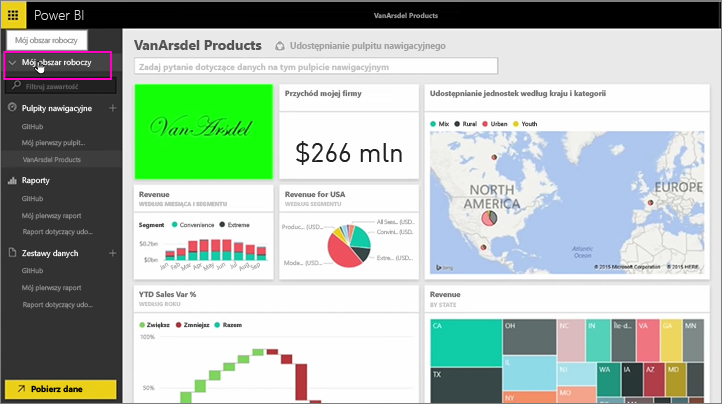
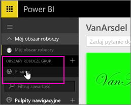
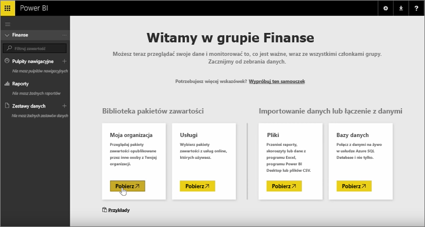
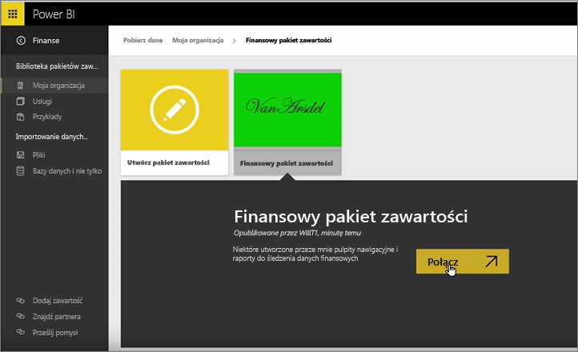
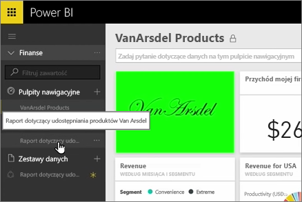
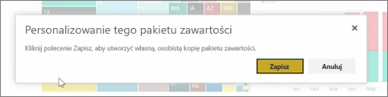
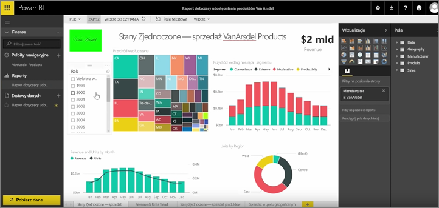

W ramach poprzednich lekcji utworzyliśmy już pakiet zawartości i grupę. Podczas tej lekcji utworzymy wystąpienie pakietu zawartości dla każdego użytkownika w grupie.

Zaczynam w oknie Mój obszar roboczy...

... i wracam do grupy Finanse utworzonej podczas wcześniejszej lekcji.

Grupa nie ma jeszcze żadnych pulpitów nawigacyjnych, raportów ani zestawów danych. Użyję utworzonego przeze mnie pakietu zawartości. Przeglądam pakiety zawartości z mojej organizacji, a nie te, które pochodzą z usług innych firm.

Znajduję utworzony przed chwilą pakiet zawartości. Rozumiem, dlaczego warto było nadać mu dobry tytuł, opis i obraz, aby ułatwić innym osobom jego znalezienie. Łączę się z nim.

Usługa Power BI importuje pulpity nawigacyjne, raporty i zestawy danych, które znajdują się w pakiecie zawartości.

Po zaznaczeniu zestawu danych usługa Power BI pyta, czy chcę spersonalizować pakiet zawartości.

Tworzę kopię pakietu zawartości, w której mogę wprowadzać zmiany, i odłączam ją od opublikowanej wersji pakietu zawartości. Jeśli twórca pakietu zawartości wprowadzi zmiany w opublikowanej wersji, nie otrzymam automatycznie tych aktualizacji.

Ale jeśli chcę, mogę edytować pulpit nawigacyjny, raport, a nawet zestaw danych.

Tak więc pakiety zawartości to prosty sposób na ponowne wykorzystanie zawartości utworzonej przez inne osoby w Twojej organizacji.

Przejdźmy do kolejnej lekcji!

