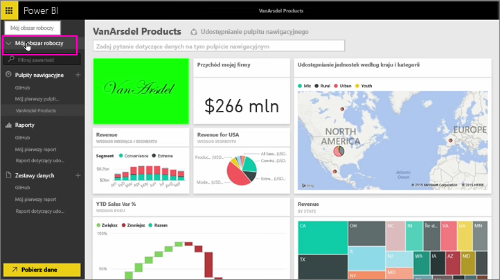
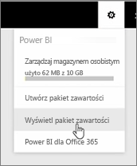
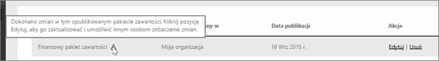
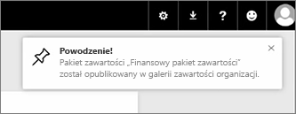

W czasie tej lekcji będziemy edytować utworzony wcześniej oryginalny pakiet zawartości i sprawdzać, jak aktualizuje się on u innych osób, które się z nim połączyły.

Wracam do okna Mój obszar roboczy, aby edytować oryginalny pulpit nawigacyjny.

Za każdym razem, gdy wprowadzam dowolną zmianę na pulpicie nawigacyjnym, otrzymuję przypomnienie, że zostało zmienione coś, co udostępniam innym osobom w pakiecie zawartości, oraz monit o zaktualizowanie udostępnionej wersji.

Wracam do ikony ustawień i wybieram pozycję **Wyświetl pakiet zawartości**, aby wyświetlić pakiety zawartości, które zostały już opublikowane.

Widzę utworzony przeze mnie pakiet zawartości. Ta mała ikona informuje mnie o tym, że coś uległo zmianie w pakiecie zawartości i że muszę przeprowadzić edycję pakietu zawartości, aby inne osoby mogły zobaczyć wprowadzone zmiany.

Po wybraniu pozycji **Edytuj** wracam na ekran, na którym mogę edytować tytuł i opis, ale tym razem znajduje się tam przycisk **Aktualizuj**, który naciskam.

Usługa Power BI pobiera te zmiany i publikuje zaktualizowany pakiet zawartości w galerii pakietów zawartości.

Każdy użytkownik, który połączył się z moim pakietem zawartości, otrzymuje komunikat, że pakiet zawartości został zmieniony, oraz pytanie, czy chce zaakceptować zmiany, czy zachować starszą wersję.

Tak więc jako właściciel pakietu zawartości możesz zarządzać wersjami używanymi przez Twoich współpracowników.

