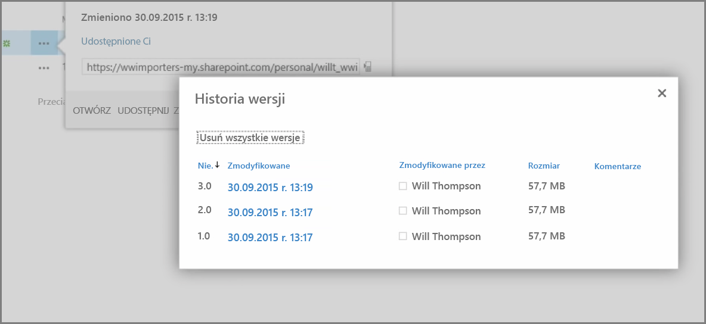
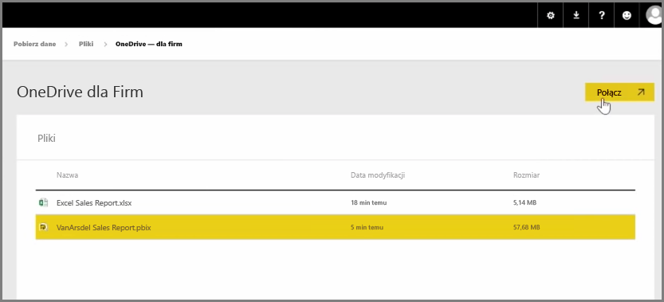
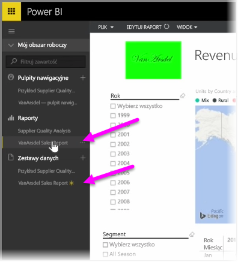

We wcześniejszym artykule zapoznaliśmy się z tworzeniem grup, które ułatwiają organizacji zarządzanie zawartością znajdującą się w usłudze Power BI i wspólną pracę nad tą zawartością. Do współpracy i udostępniania przy użyciu usługi **OneDrive dla Firm** możesz również użyć grup usługi Power BI/Office 365.

Korzystając z usługi OneDrive dla Firm jako źródła dla zawartości usługi Power BI, można uzyskać dostęp do szeregu przydatnych narzędzi, takich jak historia wersji. Pliki możesz również udostępnić w grupie usługi Office 365 z poziomu usługi OneDrive dla Firm, aby zapewnić dostęp i umożliwić wielu użytkownikom pracę na tych samych plikach usługi Power BI lub programu Excel.

Aby połączyć się z plikiem PBIX (Power BI Desktop) w usłudze OneDrive dla Firm, zaloguj się do usługi Power BI i wybierz pozycję **Pobierz dane**. Wybierz pozycję **Pliki** w obszarze Importuj lub Połącz z danymi, a następnie wybierz pozycję **OneDrive — Firma**. Wyróżnij żądany plik i wybierz pozycję **Połącz**.

Zawartość zostanie wyświetlona na pasku nawigacyjnym po lewej stronie.

Teraz wszystkie zmiany wprowadzone w pliku w usłudze **OneDrive dla Firm** zostaną także automatycznie odzwierciedlone w środowisku usługi Power BI i zarejestrowane w historii wersji.

