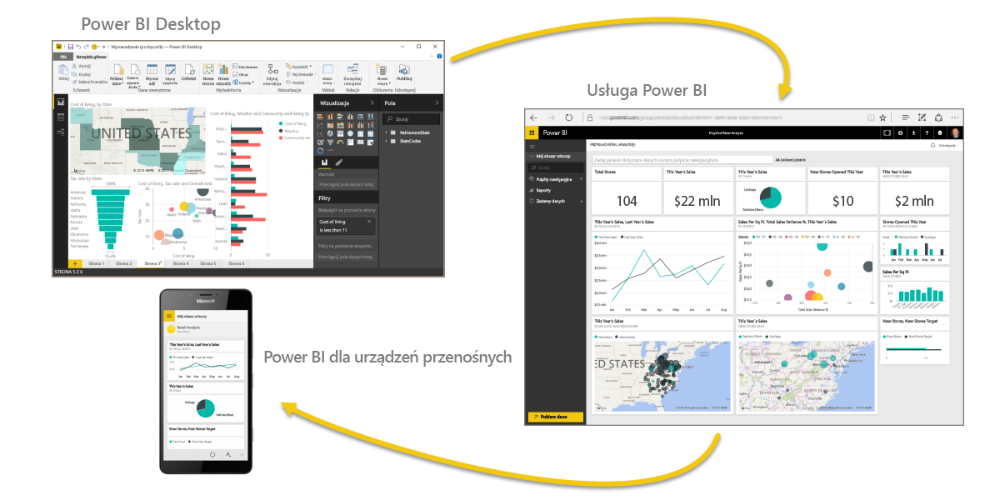
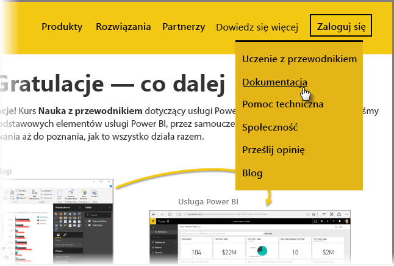

Udało Ci się! **Gratulacje!** Kurs **Nauka z przewodnikiem** dotyczący usługi Power BI został ukończony. Zatoczyliśmy pełny krąg od nauki podstawowych elementów usługi Power BI, przez samouczek prowadzący przez jej funkcje i elementy oprogramowania aż do poznania, jak to wszystko działa razem.

Jest to ostatnia sekcja (i końcowy temat, chyba że chcesz nauczyć się języka DAX) w tym kursie, więc jeśli zostały kolejno przerobione wszystkie te sekcje, poświęć chwilę, aby poklepać się po plecach. Dobra robota! Teraz dobrze znasz te wszystkie **ważne pojęcia**:

* [Czym jest usługa Power BI](../gettingstarted.yml?tutorial-step=1)
* [Bloki konstrukcyjne](../gettingstarted.yml?tutorial-step=3) usługi Power BI
* [Pobieranie](../gettingdata.yml?tutorial-step=3) i [modelowanie](../modeling.yml?tutorial-step=1) danych
* [Wizualizacje](../visualizations.yml?tutorial-step=1)
* [Eksplorowanie danych](../exploringdata.yml?tutorial-step=1) w usłudze Power BI
* Używanie [programu Excel i usługi Power BI](../powerbiandexcel.yml?tutorial-step=1) razem
* [Publikowanie i udostępnianie](../publishingandsharing.yml?tutorial-step=1) swojej pracy

To dużo wiedzy, a teraz, gdy masz już to wszystko w głowie, możesz zacząć z niej korzystać! Oto kilka **linków do plików do pobrania** oraz **połączenia przeglądarki z usługą Power BI**:

* Zawsze możesz [pobrać najnowszy program Power BI Desktop](https://powerbi.microsoft.com/desktop)
* Przejście do [usługi Power BI](https://powerbi.microsoft.com/) jest łatwe
* Wystarczy nacisnąć, aby uzyskać [aplikacje mobilne usługi Power BI](https://powerbi.microsoft.com/mobile/)

Dostępna jest także dodatkowa **pomoc i dokumentacja**. Wystarczy przejść na początek tej strony i wybrać pozycję **Nauka > Dokumentacja**, aby zobaczyć nasz rozbudowany zestaw zawartości referencyjnej dotyczącej usługi Power BI.

Mamy nadzieję, że podobała Ci się podróż przez tę **naukę z przewodnikiem usługi Power BI**. Życzymy Ci dużo szczęścia i niech wizualizacje usługi Power BI zawsze będą angażujące i atrakcyjne.

## Jeszcze jedna sekcja dla użytkowników języka DAX
Chcesz wiedzieć więcej? Chcesz korzystać z języka **DAX (Data Analysis Expressions)** do tworzenia, filtrowania lub używania niestandardowych kolumn i tabel w usłudze Power BI? Jest jeszcze jedna sekcja przeznaczona dla osób chcących coś zakodować w usłudze Power BI: **Wprowadzenie do języka DAX**. Zapoznaj się z nią, jeśli Cię to interesuje — używa ona tego samego przyjaznego podejścia, co reszta nauki z przewodnikiem.

