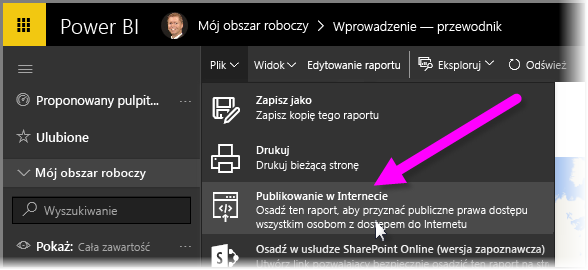
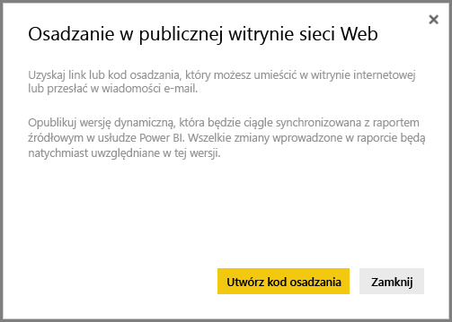
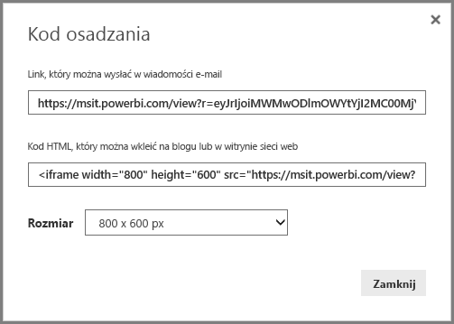
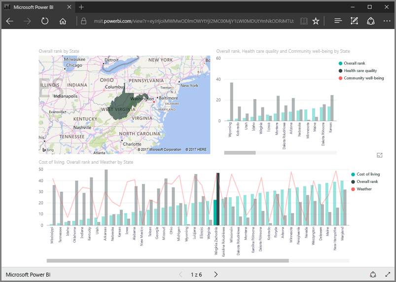
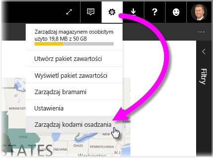
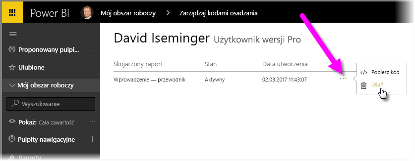

W tej lekcji dowiemy się, jak w kilku prostych krokach udostępnić raport usługi Power BI na stronie internetowej lub za pomocą poczty elektronicznej. Ta funkcja usługi Power BI jest często określana jako **publikowanie w Internecie**. Używanie jej i zarządzanie nią jest bardzo proste.

W usłudze Power BI wybierz raport, który chcesz udostępnić, aby został on wyświetlony na kanwie. Następnie z menu wybierz pozycję **Plik > Publikuj w Internecie**.

Zostanie wyświetlone okno dialogowe, które objaśnia, że otrzymasz *kod osadzania* umożliwiający dołączenie raportu do witryny internetowej lub wiadomości e-mail.

Po wybraniu pozycji **Utwórz kod osadzania** usługa Power BI wyświetli inne okno dialogowe informujące ponownie, że zamierzasz udostępnić swoje dane wszystkim użytkownikom Internetu. Upewnij się, że tego chcesz!

Usługa Power BI wyświetla okno dialogowe z dwoma linkami:

* Linkiem, który możesz udostępnić w wiadomości e-mail i który umożliwia wyświetlenie raportu jako strony internetowej
* Kodem HTML (link wewnątrz elementu iframe) pozwalającym osadzić raport bezpośrednio na stronie internetowej

W przypadku linku HTML możesz wybrać wstępnie zdefiniowany rozmiar osadzonego raportu lub możesz samodzielnie zmodyfikować kod elementu iframe i dostosować jego rozmiar.

Wystarczy wkleić link wiadomości e-mail do przeglądarki, aby wyświetlić raport jako stronę internetową. Z tą stroną internetową możesz wchodzić w interakcje tak, jak gdyby raport był wyświetlany w usłudze Power BI. Następujący obraz pokazuje stronę **Publikowanie w Internecie**, gdzie link został skopiowany bezpośrednio z tego okna dialogowego do przeglądarki:

Link w elemencie iframe możesz również osadzić we wpisie w blogu lub w witrynie internetowej, jak również w swayu.

Chcesz usunąć utworzony kod osadzania? Żaden problem. W usłudze Power BI wybierz ikonę **koła zębatego** w prawym górnym rogu, a następnie wybierz pozycję **Zarządzaj kodami osadzania**.

Obszar roboczy usługi Power BI pokazuje utworzone przez Ciebie kody osadzania (na poniższej ilustracji istnieje tylko jeden). Po kliknięciu przycisku wielokropka możesz wybrać opcję pobrania kodu dla kodu osadzania lub całkowite usunięcie kodu osadzania.

I to wszystko, co trzeba wiedzieć, aby opublikować raport usługi Power BI w Internecie i udostępnić go całemu światu. To proste!

