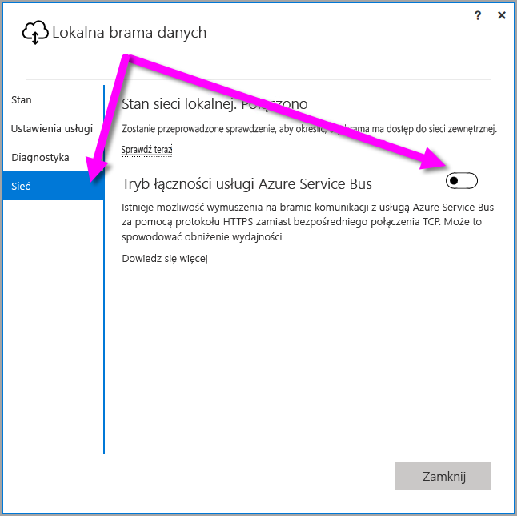
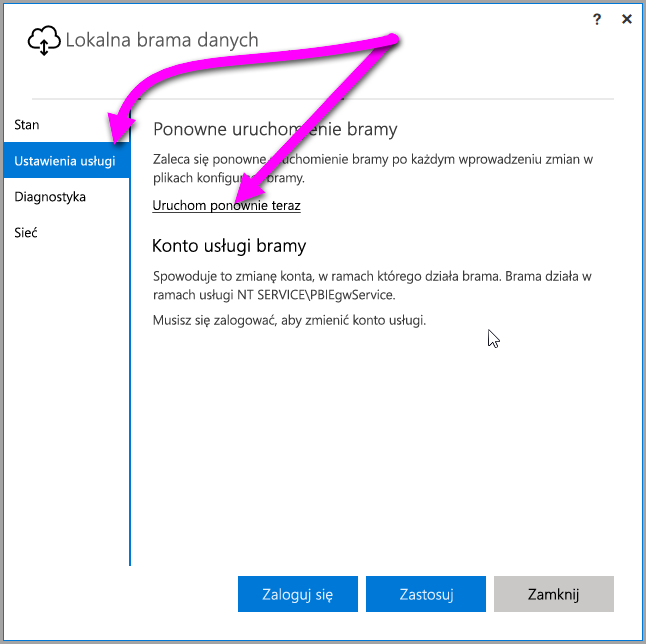

## <a name="sign-in-account"></a>Konto logowania

Użytkownicy logują się za pomocą konta służbowego. To konto to Twoje **konto organizacji**. Jeśli zarejestrujesz się, aby skorzystać z oferty Office 365, ale nie podasz rzeczywistego służbowego adresu e-mail, może to być adres podobny do nancy@contoso.onmicrosoft.com. Twoje konto jest przechowywane w ramach dzierżawy w usłudze Azure Active Directory (AAD). W większości przypadków główna nazwa użytkownika konta usługi AAD jest zgodna z adresem e-mail użytkownika.

## <a name="windows-service-account"></a>Konto usługi systemu Windows

Lokalna brama danych jest skonfigurowana tak, aby używać konta *NT SERVICE\PBIEgwService* jako poświadczenia logowania do usług systemu Windows. Domyślnie ma ona uprawnienia do logowania jako usługa w kontekście maszyny, na której instalujesz bramę. Konto jest inne niż konto używane do łączenia z lokalnymi źródłami danych. Nie jest to również konto służbowe, za pomocą którego logujesz się do usług w chmurze.

> [!NOTE]
> W przypadku wybrania trybu osobistego można skonfigurować konto usługi systemu Windows osobno.

Jeśli wystąpią problemy z uwierzytelnianiem na serwerze proxy, spróbuj zmienić konto usługi systemu Windows na konto użytkownika domeny lub usługi zarządzanej. Aby uzyskać więcej informacji, zobacz temat dotyczący [konfiguracji serwera proxy](../service-gateway-proxy.md#changing-the-gateway-service-account-to-a-domain-user).

## <a name="ports"></a>Porty

Brama tworzy połączenie wychodzące do usługi Azure Service Bus. Komunikuje się ona na portach wychodzących: TCP 443 (domyślnie), 5671, 5672, 9350 do 9354.  Brama nie wymaga portów przychodzących.

Zalecamy dodanie adresów IP dla używanego regionu danych do listy dozwolonych adresów zapory. Możesz pobrać [listę adresów IP centrów danych platformy Microsoft Azure](https://www.microsoft.com/download/details.aspx?id=41653), która jest aktualizowana co tydzień. Brama komunikuje się z usługą Azure Service Bus przy użyciu adresu IP wraz z w pełni kwalifikowaną nazwą domeny (FQDN). Jeśli dla bramy wymuszono komunikację przy użyciu protokołu HTTPS, brama będzie używać wyłącznie nazwy FQDN i nie będzie w ogóle komunikować się przy użyciu adresów IP.

> [!NOTE]
> Na liście adresów IP centrów danych platformy Azure adresy są wymienione w notacji CIDR. Na przykład 10.0.0.0/24 nie oznacza „od 10.0.0.0 do 10.0.0.24”. Dowiedz się więcej na temat [notacji CIDR](http://whatismyipaddress.com/cidr).

Poniżej przedstawiono listę w pełni kwalifikowanych nazw domen używanych przez bramę.

| Nazwy domen | Porty wychodzące | Opis |
| --- | --- | --- |
| *.download.microsoft.com |80 |Protokół HTTP używany do pobierania instalatora. |
| *.powerbi.com |443 |HTTPS |
| *.analysis.windows.net |443 |HTTPS |
| *.login.windows.net |443 |HTTPS |
| *.servicebus.windows.net |5671–5672 |Zaawansowane usługi kolejkowania Protocol (AMQP) |
| *.servicebus.windows.net |443, 9350–9354 |Odbiorniki usługi Service Bus Relay korzystające z protokołu TCP (wymaga portu 443 w celu uzyskania tokenu kontroli dostępu) |
| *.frontend.clouddatahub.net |443 |HTTPS |
| *.core.windows.net |443 |HTTPS |
| login.microsoftonline.com |443 |HTTPS |
| *.msftncsi.com |443 |Służy do sprawdzania połączenia z Internetem, jeśli brama jest nieosiągalna przez usługę Power BI. |
| *.microsoftonline-p.com |443 |Używany do uwierzytelniania w zależności od konfiguracji. |

> [!NOTE]
> Ruch kierowany do adresów visualstudio.com lub visualstudioonline.com jest używany przez usługę App Insights i nie jest wymagany do funkcjonowania bramy.

## <a name="forcing-https-communication-with-azure-service-bus"></a>Wymuszanie komunikacji HTTPS z usługą Azure Service Bus

Istnieje możliwość wymuszenia na bramie komunikacji z usługą Azure Service Bus za pomocą protokołu HTTPS zamiast bezpośredniego połączenia TCP. Użycie protokołu HTTP może mieć wpływ na wydajność. Aby to zrobić, należy zmodyfikować plik *Microsoft.PowerBI.DataMovement.Pipeline.GatewayCore.dll.config*, zmieniając wartość `AutoDetect` na `Https`, jak pokazano we fragmencie kodu poniżej tego akapitu. Domyślna lokalizacja tego pliku to *C:\Program Files\On-premises data gateway*.

```
<setting name="ServiceBusSystemConnectivityModeString" serializeAs="String">
    <value>Https</value>
</setting>
```

W wartości parametru *ServiceBusSystemConnectivityModeString* jest uwzględniana wielkość liter. Prawidłowe wartości to *AutoDetect* i *Https*.

Możesz również wymusić takie działanie bramy, używając interfejsu użytkownika bramy. W interfejsie użytkownika bramy wybierz opcję **Sieć**, a następnie ustaw dla pozycji **Tryb łączności usługi Azure Service Bus** wartość **Włączone**.



Po zmianie, gdy wybierzesz przycisk **Zastosuj** (wyświetlany wyłącznie po wprowadzeniu zmiany), *usługa bramy systemu Windows* zostanie automatycznie ponownie uruchomiona w celu zastosowania zmiany.

W przyszłości możesz ponownie uruchomić *usługę bramy systemu Windows* z poziomu okna dialogowego interfejsu użytkownika, wybierając kolejno pozycje **Ustawienia usługi**, a następnie *Uruchom ponownie teraz*.



## <a name="support-for-tls-12"></a>Obsługa protokołu TLS 1.2

Domyślnie lokalna brama danych używa protokołu Transport Layer Security (TLS) 1.2 do komunikowania się z usługą Power BI. Aby upewnić się, że cały ruch w bramie używa protokołu TLS 1.2, być może trzeba dodać lub zmodyfikować następujące klucze rejestru na maszynie, na której działa usługa bramy:

```
[HKEY_LOCAL_MACHINE\SOFTWARE\Microsoft\.NETFramework\v4.0.30319]"SchUseStrongCrypto"=dword:00000001
[HKEY_LOCAL_MACHINE\SOFTWARE\Wow6432Node\Microsoft\.NETFramework\v4.0.30319]"SchUseStrongCrypto"=dword:00000001
```

> [!NOTE]
> Dodanie lub zmodyfikowanie tych kluczy rejestru powoduje zastosowanie zmiany do wszystkich aplikacji .NET. Informacje na temat zmian rejestru, które mają wpływ na użycie protokołu TLS przez inne aplikacje, są zawarte w artykule [Ustawienia rejestru dla protokołu Transport Layer Security (TLS)](https://docs.microsoft.com/windows-server/security/tls/tls-registry-settings).

## <a name="how-to-restart-the-gateway"></a>Jak ponownie uruchomić bramę

Brama jest uruchamiana jako usługa systemu Windows. Można uruchomić ją i zatrzymać, tak jak inne usługi systemu Windows. Oto jak to zrobić z poziomu wiersza polecenia.

1. Na maszynie, na której jest uruchomiona brama, uruchom wiersz polecenia z uprawnieniami administratora.
2. Użyj następującego polecenia, aby zatrzymać usługę.
   
   net stop PBIEgwService
3. Użyj następującego polecenia, aby uruchomić usługę.
   
   net start PBIEgwService

