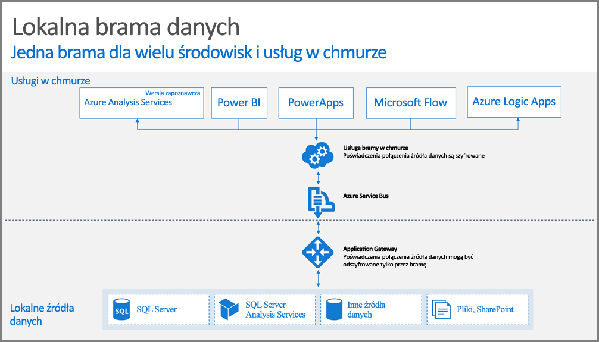

## Jak działa brama

Najpierw przyjrzyjmy się temu, co się dzieje, gdy użytkownik korzysta z elementu połączonego z lokalnym źródłem danych. 

> [!NOTE]
> W przypadku usługi Power BI konieczne jest skonfigurowanie źródła danych dla bramy.

1. Usługa w chmurze tworzy zapytanie wraz z zaszyfrowanymi poświadczeniami dla lokalnego źródła danych i wysyła to zapytanie do kolejki do przetworzenia przez bramę.
2. Usługa bramy w chmurze analizuje zapytanie i wypycha żądanie do usługi [Azure Service Bus](/azure/service-bus-messaging/service-bus-messaging-overview/).
3. Brama danych lokalnych sonduje usługę Azure Service Bus pod kątem żądań oczekujących.
4. Brama pobiera zapytanie, odszyfrowuje poświadczenia i nawiązuje połączenie ze źródłem danych, używając tych poświadczeń.
5. Brama wysyła zapytanie do źródła danych w celu wykonania.
6. Wyniki są odsyłane ze źródła danych do bramy, a następnie do usługi w chmurze. Następnie usługa używa wyników.

