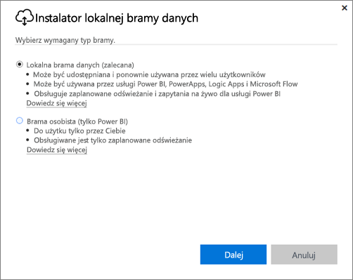
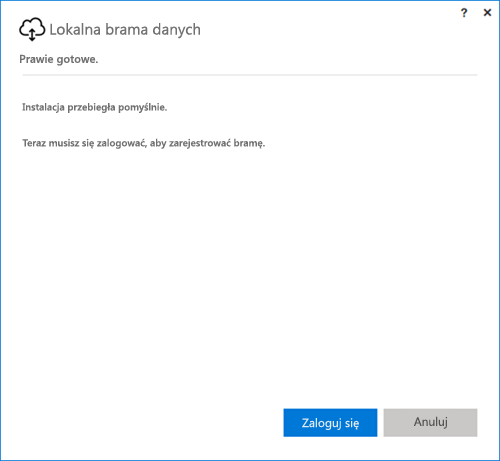
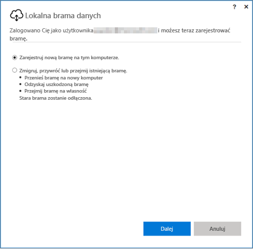
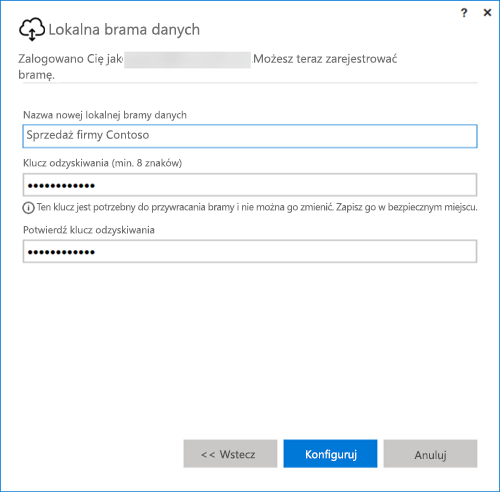

## Instalacja lokalnej bramy danych
Brama danych jest instalowana i uruchamiana na Twoim komputerze. Najlepiej zainstalować bramę na komputerze, który może pozostać uruchomiony przez cały czas.

> [!NOTE]
> Brama jest obsługiwana tylko w 64-bitowych systemach operacyjnych Windows.
> 
> 

W przypadku usługi Power BI najpierw należy wybrać tryb bramy.

* **Lokalna brama danych:** W tym trybie wielu użytkowników może udostępniać bramę i ponownie jej używać. Ta brama może być używana przez usługi Power BI, PowerApps, Flow i Logic Apps. W przypadku usługi Power BI obejmuje obsługę zarówno zaplanowanego odświeżania, jak i zapytań bezpośrednich
* **Osobista:** Dotyczy tylko usługi Power BI i może być używana samodzielnie bez jakiejkolwiek konfiguracji administratora. Może być używana tylko do odświeżania na żądanie i zaplanowanego odświeżania. Ten wybór rozpoczyna instalację bramy osobistej.

Istnieje kilka kwestii, o których należy pamiętać podczas instalowania dowolnego trybu bramy:

* Obie bramy wymagają 64-bitowych wersji systemów operacyjnych Windows.
* Bram nie można instalować na kontrolerze domeny.
* Na jednym komputerze można zainstalować maksymalnie dwie lokalne bramy danych — jedną w trybie osobistym, a drugą w trybie standardowym. 
* Na jednym komputerze może znajdować się tylko jedna brama uruchomiona w danym trybie.
* Na różnych komputerach można zainstalować wiele lokalnych bram danych i zarządzać nimi z tego samego interfejsu zarządzania bramami usługi Power BI (wyjątek stanowi brama osobista, zobacz następny punkt).
* Każdy użytkownik usługi Power BI może mieć uruchomioną tylko jedną bramę w trybie osobistym. Zainstalowanie kolejnej bramy w trybie osobistym dla tego samego użytkownika, nawet na innym komputerze, spowoduje zastąpienie poprzedniej instalacji najnowszą.

Oto kilka kwestii, które należy rozważyć przed zainstalowaniem bramy.

* Jeśli zainstalujesz bramę na laptopie i laptop zostanie wyłączony lub uśpiony albo utraci połączenie z Internetem, brama nie będzie działać i dane w usłudze w chmurze nie będą synchronizowane z danymi lokalnymi.
* Jeśli komputer jest połączony z siecią bezprzewodową, brama może działać wolniej, co spowoduje, że synchronizacja danych w usłudze w chmurze z danymi lokalnymi będzie trwała dłużej.

Po zainstalowaniu bramy należy zalogować się przy użyciu konta służbowego.

Po zalogowaniu będzie dostępna opcja skonfigurowania nowej bramy lub migrowania, przywrócenia albo przejęcia istniejącej bramy.

## Konfigurowanie nowej bramy
1. Wprowadź **nazwę** bramy
2. Wprowadź **klucz odzyskiwania**. Musi on mieć co najmniej 8 znaków.
3. Wybierz pozycję **Skonfiguruj**.

> [!NOTE]
> Klucz odzyskiwania będzie potrzebny, jeśli kiedykolwiek zajdzie potrzeba migracji, przywrócenia lub przejęcia bramy. Pamiętaj, że ten klucz należy przechowywać w bezpiecznym miejscu.
> 
> 

### Migrowanie, przywracanie lub przejmowanie istniejącej bramy
Musisz wybrać bramę, którą chcesz odzyskać, a następnie podać klucz odzyskiwania, którego użyto do utworzenia bramy.

### Połączona lokalna brama danych
Po skonfigurowaniu bramy będzie można z niej korzystać w celu nawiązywania połączeń z lokalnymi źródłami danych.

Jeśli brama jest przeznaczona dla usługi Power BI, musisz dodać do bramy swoje źródła danych w usłudze Power BI. Jest to realizowane w ramach obszaru **Zarządzanie bramami**. Aby uzyskać więcej informacji, możesz się zapoznać z artykułami dotyczącymi zarządzania źródłami danych.

W przypadku usługi PowerApps musisz wybrać bramę dla określonego połączenia z obsługiwanymi źródłami danych. Dla usług Flow i Logic Apps ta brama jest gotowa do użycia z połączeniami lokalnymi.

