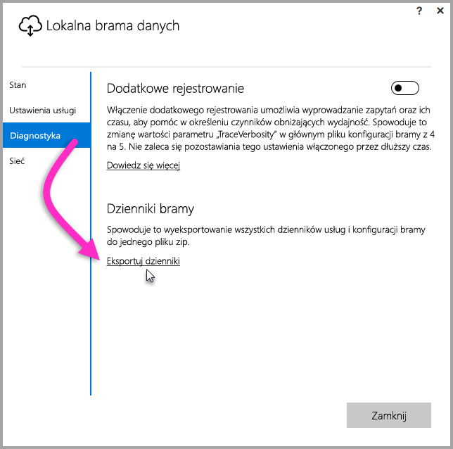
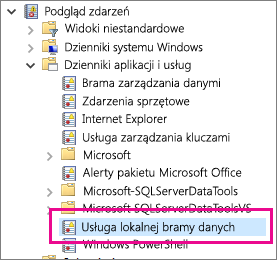

## Narzędzia do rozwiązywania problemów
<a name="logs" />

### Zbieranie dzienników z konfiguratora bramy
Istnieje kilka dzienników, które można zebrać dla bramy, i zawsze należy zaczynać od dzienników. Najprostszym sposobem zbierania dzienników po zainstalowaniu bramy jest użycie interfejsu użytkownika. W interfejsie użytkownika bramy **Lokalna brama danych** wybierz pozycję **Diagnostyka**, a następnie wybierz link **Eksportuj dzienniki** w dolnej części strony, jak pokazano na poniższej ilustracji.

**Dzienniki instalatora**

    %localappdata%\Temp\On-premises_data_gateway_*.log

**Dzienniki konfiguracji**

    %localappdata%\Microsoft\On-premises Data Gateway\GatewayConfigurator*.log

**Dzienniki usługi lokalnej bramy danych**

    C:\Users\PBIEgwService\AppData\Local\Microsoft\On-premises Data Gateway\Gateway*.log

### Dzienniki zdarzeń
Dzienniki zdarzeń **usługi lokalnej bramy danych** znajdują się w obszarze **Dzienniki aplikacji i usług**.

<a name="fiddler" />

### Śledzenie za pomocą narzędzia Fiddler
[Fiddler](http://www.telerik.com/fiddler) to bezpłatne narzędzie firmy Telerik, które monitoruje ruch HTTP.  Dzięki niemu można sprawdzić ruch przychodzący i wychodzący w ramach usługi Power BI z maszyny klienckiej. W ten sposób można ujawnić błędy i inne istotne informacje.

