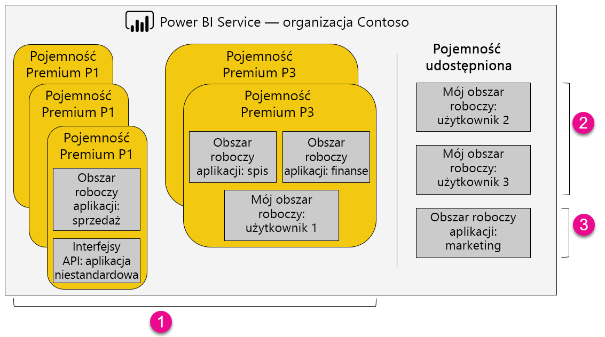

1. Elementy w ramach pojemności Premium
   
   * Uzyskiwanie dostępu do obszarów roboczych aplikacji (jako członkowie lub administratorzy) oraz publikowanie aplikacji wymaga licencji usługi Power BI Pro.

   * Udostępnianie aplikacji wymaga licencji Pro, ale korzystanie z aplikacji już nie.

   * Wszyscy odbiorcy pulpitu nawigacyjnego, niezależnie od przypisanej do nich licencji, mogą ustawiać alerty dotyczące danych.

   * Interfejsy API REST do osadzania używają konta usługi z licencją Pro, a nie konta użytkownika.

2. Mój obszar roboczy w pojemności udostępnionej
   
   * Udostępnianie i używanie aplikacji wymaga licencji Pro.

3. Obszary robocze aplikacji w pojemności udostępnionej
   
   * Każde użycie aplikacji wymaga licencji Pro.

