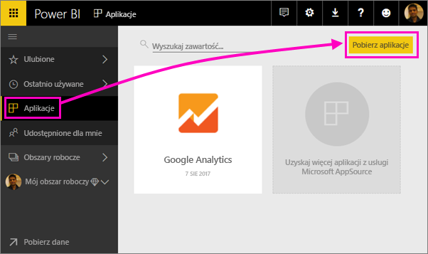
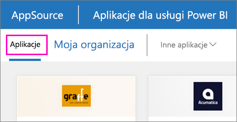

1. Wybierz pozycję **Aplikacje** w lewym okienku nawigacji, a następnie wybierz pozycję **Pobierz aplikacje** w prawym górnym rogu.
   
     
2. W usłudze AppSource wybierz kartę **Aplikacje** i wyszukaj odpowiednią usługę.
   
    

