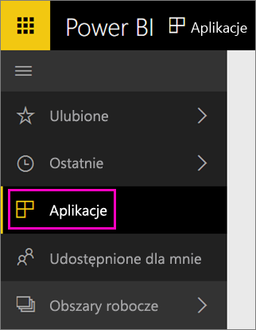

Po zakończeniu importowania nowa aplikacja zostanie wyświetlona na stronie Aplikacje.

1. Wybierz pozycję **Aplikacje** w lewym okienku nawigacji, a następnie wybierz aplikację.
   
     
2. Zadaj pytanie, wpisując je w polu Pytania i odpowiedzi, lub kliknij kafelek, aby otworzyć raport źródłowy. 

