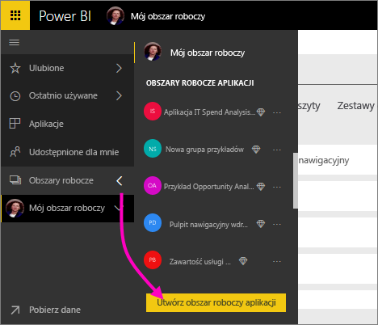

1. Rozpocznij od utworzenia obszaru roboczego. Wybierz pozycję **Obszary robocze** > **Utwórz obszar roboczy aplikacji**.
   
     
   
    Będzie to miejsce na zawartość, nad którą pracujecie wraz ze współpracownikami.

2. Nadaj nazwę obszarowi roboczemu. Jeśli odpowiedni **Identyfikator obszaru roboczego** nie jest dostępny, edytuj go, aby skorzystać z unikatowego identyfikatora.
   
     Będzie to również nazwa aplikacji.
   
     

3. Istnieje kilka opcji do ustawienia. Jeśli wybierzesz opcję **Publiczny**, wszystkie osoby w organizacji będą mogły zobaczyć zawartość tego obszaru roboczego. Z drugiej strony opcja **Prywatny** oznacza, że tylko członkowie obszaru roboczego będą mogli wyświetlić jego zawartość.
   
     
   
    Nie możesz zmienić ustawienia Publiczny/Prywatny po utworzeniu grupy.

4. Ponadto możesz zdecydować, czy członkowie uzyskają dostęp do **edycji** lub **tylko do wyświetlania**.
   
     
   
     Wystarczy dodać osoby do obszaru roboczego aplikacji, aby mogły edytować zawartość. Jeśli dane osoby mają tylko wyświetlać zawartość, nie dodawaj ich do obszaru roboczego. Możesz uwzględnić je podczas publikowania aplikacji.

5. Dodaj adresy e-mail osób, które mają mieć dostęp do obszaru roboczego, a następnie wybierz opcję **Dodaj**. Nie można dodawać aliasów grupy, tylko osoby.

6. Zdecyduj wobec każdej osoby, czy jest członkiem, czy administratorem.
   
     
   
    Administratorzy mogą edytować obszar roboczy, w tym dodawać innych członków. Członkowie mogą edytować zawartość w obszarze roboczym, chyba że mają dostęp tylko do wyświetlania. Administratorzy i członkowie mogą opublikować aplikację.

7. Wybierz pozycję **Zapisz**.

Usługa Power BI tworzy obszar roboczy i otwiera go. Zostanie on wyświetlony na liście obszarów roboczych, których członkiem jesteś. Jako że jesteś administratorem, możesz wybrać wielokropek (...), aby powrócić i wprowadzić zmiany, dodając nowych członków lub zmieniając ich uprawnienia.

