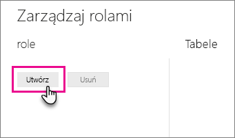
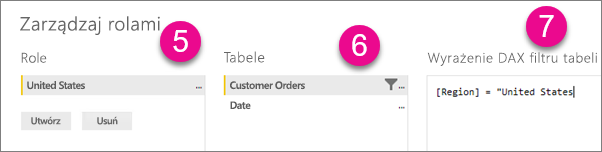
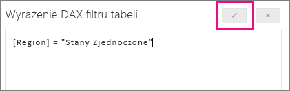

## Definiowanie ról i reguł w programie Power BI Desktop
W programie Power BI Desktop możesz definiować role i reguły. Podczas publikowania w usłudze Power BI są również publikowane definicje ról.

Aby zdefiniować role zabezpieczeń, możesz wykonać poniższe czynności.

1. Zaimportuj dane do raportu programu Power BI Desktop lub skonfiguruj połączenie zapytania bezpośredniego.
   
   > [!NOTE]
   > W programie Power BI Desktop nie można zdefiniować ról dla połączeń na żywo usług Analysis Services. Należy to zrobić w modelu usług Analysis Services.
   > 
   > 
2. Wybierz kartę **Modelowanie**.
3. Wybierz pozycję **Zarządzaj rolami**.
   
   
4. Wybierz pozycję **Utwórz**.
   
   
5. Podaj nazwę roli. 
6. Wybierz tabelę, w której chcesz zastosować regułę języka DAX.
7. Wprowadź wyrażenia języka DAX. To wyrażenie powinno zwracać wartość „prawda” lub „fałsz”. Na przykład: [Entity ID] = “Value”.
   
   > [!NOTE]
   > W tym wyrażeniu możesz użyć funkcji *username()*. Pamiętaj, że w programie Power BI Desktop funkcja *username()* ma format *DOMENA\nazwa_użytkownika*. W usłudze Power BI będzie to format nazwy głównej użytkownika (UPN). Alternatywnie możesz użyć funkcji *userprincipalname()*, która zawsze zwraca użytkownika w formacie nazwy głównej użytkownika.
   > 
   > 
   
   
8. Po utworzeniu wyrażenia języka DAX możesz wybrać znacznik wyboru powyżej pola wyrażenia, aby sprawdzić poprawność wyrażenia.
   
   
9. Wybierz pozycję **Zapisz**.

W programie Power BI Desktop nie można przypisywać użytkowników do roli. Robi się to w usłudze Power BI. Zabezpieczenia dynamiczne w programie Power BI Desktop możesz włączyć, używając funkcji języka DAX *username()* lub *userprincipalname()* i konfigurując odpowiednie relacje.

