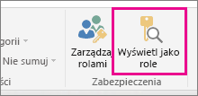
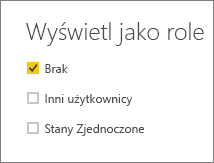
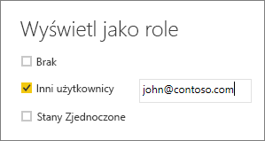

## Sprawdzanie poprawności roli w programie Power BI Desktop
Po utworzeniu roli możesz przetestować jej wyniki w programie Power BI Desktop. Aby to zrobić, wybierz pozycję **Wyświetl jako role**.

Zostanie otwarte okno dialogowe **Wyświetlanie jako role** umożliwiające zmianę widoku elementów wyświetlanych w przypadku konkretnego użytkownika lub roli. Są w nim wyświetlane utworzone przez Ciebie role.

Wybierz utworzoną przez Ciebie rolę, a następnie wybierz pozycję **OK**, aby zastosować tę rolę do wyświetlanych elementów. W raportach będą odzwierciedlane tylko dane istotne dla tej roli.

Możesz również wybrać pozycję **Inny użytkownik** i podać użytkownika. Najlepiej podać nazwę główną użytkownika (UPN), ponieważ to jej używa usługa Power BI. Wybierz pozycję **OK**. Raporty będą generowane w oparciu o elementy widoczne dla tego użytkownika. 

> [!NOTE]
> W programie Power BI Desktop inne wyniki zostaną wyświetlone tylko wtedy, gdy używasz zabezpieczeń dynamicznych opartych na wyrażenia języka DAX.
> 
> 

