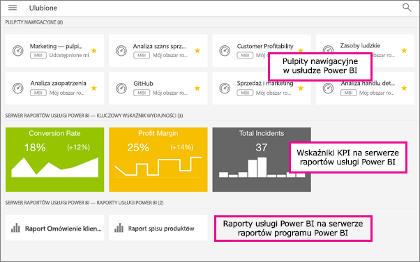

# Tworzenie i wyświetlanie ulubionych w aplikacjach mobilnych usługi Power BI
Dotyczy:

|  |  |  |  |  |
|:--- |:--- |:--- |:--- |:--- |
| Telefony iPhone |Urządzenia iPad |Telefony z systemem Android |Tablety z systemem Android |Urządzenia z systemem Windows 10 |

Dowiedz się więcej o tworzeniu i wyświetlaniu ulubionych pulpitów nawigacyjnych, raportów i aplikacji usługi Power BI oraz ulubionych wskaźników KPI i raportów lokalnego serwera raportów usługi Power BI oraz usług Reporting Services w aplikacjach mobilnych.

Po ustawieniu elementu jako ulubionego w aplikacjach mobilnych usługi Power BI jest on widoczny na stronie Ulubione usługi Power BI ([https://powerbi.com](https://powerbi.com)) i na wszystkich urządzeniach przenośnych. 

Możesz również [tworzyć ulubione pulpity nawigacyjne i aplikacje usługi Power BI w usłudze Power BI](service-dashboard-favorite.md). Następnie zobaczysz je na stronie ulubionych w aplikacji mobilnej.

Wskaźniki KPI i raporty można oznaczyć jako ulubione na serwerze raportów usługi Power BI lub w portalu internetowym usług Reporting Services, a następnie wyświetlać je w jednym wygodnym folderze na swoim urządzeniu przenośnym wraz z ulubionymi pulpitami nawigacyjnymi usługi Power BI.

## Wyświetlanie ulubionych usługi Power BI
* Naciśnij  w górnym menu nawigacji, następnie wybierz pozycję **Ulubione**.
  
  
  
  Zobacz wszystkie ulubione razem na tej stronie:
  
  

## Ustawianie aplikacji jako ulubionej
1. Na liście aplikacji w aplikacji mobilnej naciśnij wielokropek (...) obok aplikacji > **Ulubione**.
   
    
   
    Teraz jest ona wyświetlana z innymi ulubionymi pulpitami nawigacyjnymi i aplikacjami.
   
    

## Ustawianie pulpitu nawigacyjnego lub raportu jako ulubionego w aplikacjach mobilnych systemów iOS i Windows 10
Możesz ustawić pulpit nawigacyjny lub raport usługi Power BI jako ulubiony przy użyciu listy pulpitów nawigacyjnych lub raportów albo samego pulpitu nawigacyjnego bądź raportu.

* Na liście pulpitów nawigacyjnych lub raportów w aplikacji mobilnej naciśnij pustą gwiazdkę obok nazwy . Gwiazdka zmieni kolor na żółty .
  
    
* Naciśnij pustą gwiazdkę na wstążce w pulpicie nawigacyjnym lub raporcie . Gwiazdka zmieni kolor na żółty .
  
    

## Ustawianie pulpitu nawigacyjnego lub raportu jako ulubionego w aplikacjach mobilnych systemu Android
Możesz ustawić pulpit nawigacyjny lub raport jako ulubiony przy użyciu listy pulpitów nawigacyjnych lub raportów albo samego pulpitu nawigacyjnego bądź raportu.

* Na liście pulpitów nawigacyjnych lub raportów w aplikacji mobilnej naciśnij wielokropek pionowy (...) obok nazwy, a następnie naciśnij przycisk **Ulubione**. Obok nazwy zobaczysz żółtą gwiazdkę .
  
    
* Naciśnij pustą gwiazdkę na wstążce w pulpicie nawigacyjnym lub raporcie . Gwiazdka zmieni kolor na ciemnoszary .
  
    

## Ustaw raporty i wskaźniki KPI serwera raportów usługi Power BI i usług Reporting Services jako ulubione
Możesz wyświetlić swoje ulubione raporty i wskaźniki KPI serwera raportów usługi Power BI i usług Reporting Services w aplikacjach mobilnych usługi Power BI, ale nie możesz ustawić ich jako ulubionych w aplikacjach mobilnych. Możesz [oznaczyć je jako ulubione w portalu internetowym](report-server/getting-around.md#tag-your-favorite-reports-and-kpis). 

## Następne kroki
* [Ulubione pulpity nawigacyjne w usłudze Power BI](service-dashboard-favorite.md) 
* Masz pytania? [Zadaj pytanie społeczności usługi Power BI](http://community.powerbi.com/)

