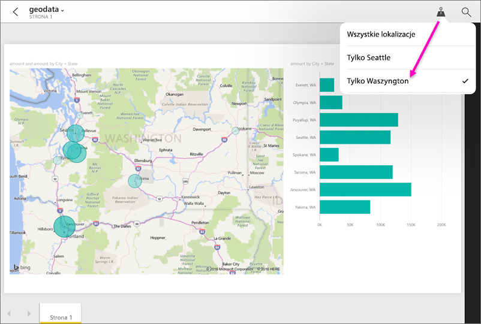

# Filtrowanie raportu według lokalizacji geograficznej w aplikacjach mobilnych Power BI
Dotyczy:

|  |  |  |  |  |
|:--- |:--- |:--- |:--- |:--- |
| Telefony iPhone |Urządzenia iPad |Telefony z systemem Android |Tablety z systemem Android |Telefony z systemem Windows 10 |

Czy kiedy wyświetlasz raport usługi Power BI na urządzeniu przenośnym, widzisz małą ikonę pinezki w prawym górnym rogu? Jeśli tak, możesz filtrować ten raport na podstawie swojej lokalizacji geograficznej.

> [!NOTE]
> Filtrować według lokalizacji można tylko wtedy, jeśli nazwy geograficzne w raporcie są w języku angielskim — na przykład „New York City” lub „Germany”. Tablety i komputery z systemem Windows 10 nie obsługują filtrowania geograficznego, ale telefony z systemem Windows 10 obsługują je.
> 
> 

## Filtrowanie raportu według lokalizacji geograficznej
1. Otwórz raport w aplikacji mobilnej Power BI na urządzeniu przenośnym.
2. Jeśli raport zawiera dane geograficzne, zobaczysz komunikat z prośbą o umożliwienie usłudze Power BI uzyskania dostępu do Twojej lokalizacji. Kliknij pozycję **Zezwalaj**, następnie ponownie naciśnij pozycję **Zezwalaj**.
3. Naciśnij ikonę pinezki . Możesz filtrować według miasta, województwa lub kraju/regionu w zależności od danych w raporcie. W filtrze są wymienione tylko opcje zgodne z bieżącą lokalizacją.
   
    

## Dlaczego nie widać tagów lokalizacji w raporcie?
Aby tagi lokalizacji były widoczne, muszą być spełnione wszystkie trzy poniższe warunki. 

* Osoba, która utworzyła raport w programie Power BI Desktop, [skategoryzowała dane geograficzne](desktop-mobile-geofiltering.md) dla co najmniej jednej kolumny, takiej jak Miejscowość, Województwo lub Kraj/Region.
* Jesteś w jednej z lokalizacji, które zawierają dane w tej kolumnie.
* Używasz jednego z tych urządzeń przenośnych:
  * z systemem iOS (iPad, iPhone i iPod);
  * telefon lub tablet z systemem Android;
  * telefon z systemem Windows 10 (inne urządzenia z systemem Windows 10, takie jak komputery i tablety, nie obsługują filtrowania geograficznego).

Przeczytaj więcej na temat [konfigurowania filtrowania geograficznego](desktop-mobile-geofiltering.md) w programie Power BI Desktop.

### Następne kroki
* [Nawiązywanie połączenia z danymi usługi Power BI ze środowisk rzeczywistych](mobile-apps-data-in-real-world-context.md) za pomocą aplikacji mobilnych
* [Kategoryzacja danych w programie Power BI Desktop](desktop-data-categorization.md) 
* Masz pytania? [Zadaj pytanie społeczności usługi Power BI](http://community.powerbi.com/)

