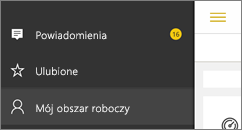

# Uzyskiwanie powiadomień w aplikacjach mobilnych Power BI
Dotyczy:

|  |  |  |  |  |
|:--- |:--- |:--- |:--- |:--- |
| Telefony iPhone |Urządzenia iPad |Telefony z systemem Android |Tablety z systemem Android |Urządzenia z systemem Windows 10 |

Powiadomienia dostarczają informacje dotyczące środowiska usługi Power BI bezpośrednio do użytkownika, w usłudze Power BI lub na urządzeniu przenośnym. Po otwarciu obszaru powiadomień zostanie wyświetlony sekwencyjny kanał komunikatów dotyczących [ustawionych alertów](mobile-set-data-alerts-in-the-mobile-apps.md), nowych udostępnionych pulpitów nawigacyjnych, zmian obszaru roboczego grupy, informacji na temat zdarzeń i spotkań związanych z usługą Power BI i innych.

> [!NOTE]
> Na urządzeniu z systemem iOS podczas pierwszego logowania się do [zaktualizowanej wersji aplikacji Power BI](https://powerbi.microsoft.com/mobile/) zostanie wyświetlony komunikat z pytaniem o zgodę na wysyłanie powiadomień przez usługę Power BI. W sekcji **Ustawienia** danego urządzenia można również skonfigurować sposób wysyłania powiadomień przez usługę Power BI. 
> 
> 

## Wyświetlanie powiadomień na urządzeniu przenośnym
1. Po otrzymaniu powiadomienia na urządzeniu przenośnym usługa Power BI domyślnie odtwarza dźwięk i wyświetla transparent powiadomienia.
   
   
   
   Lub na urządzeniu iPad:
   
   
   
   Możesz [zmienić sposób, w jaki usługa Power BI wysyła powiadomienia](mobile-apps-notification-center.md#change-or-turn-off-notifications-on-your-mobile-device).
2. Po zalogowaniu się do usługi Power BI na urządzeniu przenośnym w przypadku otrzymania powiadomień na globalnym przycisku nawigacji  (Android) lub na ikonie **Powiadomienia** zostanie wyświetlona żółta kropka. 
   
   
3. Wybierz ikonę powiadomień  (Windows 10).
   
    Powiadomienia są wyświetlane od najnowszego na górze, a nieprzeczytane wiadomości są wyróżnione. Powiadomienia są przechowywane przez 90 dni, chyba że je usuniesz lub osiągną maksymalną granicę równą 100.
   
   
4. Aby odrzucić powiadomienie, naciśnij i przytrzymaj je, a następnie wybierz pozycję **Odrzuć**.

## Zmiana lub wyłączanie powiadomień na urządzeniu przenośnym
Możesz zmienić sposób, w jaki usługa Power BI wysyła powiadomienia.

1. Na urządzeniu z systemem iOS przejdź do pozycji **Ustawienia** > **Powiadomienia**. 
   
    Na telefonie z systemem Android przejdź do pozycji **Ustawienia powiadomień**.
   
    Na urządzeniu z systemem Windows w menu **Ustawienia** przejdź do pozycji **System** > **Powiadomienia i akcje**.
2. Na liście aplikacji wybierz pozycję **Power BI**. 
3. W tym miejscu możesz wyłączyć powiadomienia całkowicie lub wybrać powiadomienia, które chcesz otrzymywać.
   
    **Na telefonie iPhone**
   
    
   
    **Na telefonie z systemem Android**
   
    

    **Na urządzeniu z systemem Windows 10**

    

## Następne kroki
* [Alerty dotyczące danych w usłudze Power BI](service-set-data-alerts.md)
* [Ustawianie alertów danych w aplikacji iPhone (Power BI dla systemu iOS)](mobile-set-data-alerts-in-the-mobile-apps.md)
* [Ustawianie alertów dotyczących danych w aplikacji Power BI dla urządzeń przenośnych w systemie Windows 10](mobile-set-data-alerts-in-the-mobile-apps.md)
* [Pobieranie najnowszych wersji aplikacji Power BI](https://powerbi.microsoft.com/mobile/) (urządzenia przenośne)

