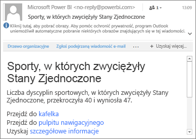

# Ustawianie alertów danych w aplikacjach mobilnych Power BI
Dotyczy:

|  |  |  |  |  |
|:--- |:--- |:--- |:--- |:--- |
| Telefony iPhone |Tablety iPad |Telefony z systemem Android |Tablety z systemem Android |Urządzenia z systemem Windows 10 |

Możesz ustawić alerty w aplikacjach mobilnych Power BI i w usłudze Power BI, aby otrzymywać powiadomienia, gdy zmiany dotyczące danych na pulpicie nawigacyjnym przekroczą skonfigurowane progi. Alerty działają w przypadku kafelków prezentujących pojedyncze liczby, takich jak karty i mierniki, ale nie w przypadku danych przesyłanych strumieniowo. Alerty dotyczące danych można ustawić na urządzeniu przenośnym i wyświetlać je w usłudze Power BI oraz na odwrót. Tylko Ty możesz zobaczyć ustawione przez siebie alerty dotyczące danych, nawet jeśli udostępnisz pulpit nawigacyjny lub migawkę kafelka.

> [!WARNING]
> Powiadomienia o alertach oparte na danych dostarczają informacji o danych. Jeśli urządzenie zostanie skradzione, zalecamy przejście do usługi Power BI i wyłączenie wszystkich reguł alertów opartych na danych. 
> 
> Dowiedz się więcej o [zarządzaniu alertami dotyczącymi danych w usłudze Power BI](service-set-data-alerts.md).
> 
> 

## Alerty dotyczące danych na telefonie iPhone lub tablecie iPad
### Ustawianie alertu na telefonie iPhone lub tablecie iPad
1. Naciśnij kafelek z liczbą lub miernikiem na pulpicie nawigacyjnym, aby otworzyć go w trybie koncentracji uwagi.  
   
   
2. Naciśnij ikonę dzwonka , aby dodać alert.  
3. Naciśnij pozycję **Dodaj regułę alertów**.
   
   
4. Wybierz opcję otrzymywania alertu w przypadku wartości powyżej lub poniżej progu, a następnie ustaw wartość progu.
   
   
5. Zdecyduj, czy chcesz otrzymywać alerty co godzinę, czy raz dziennie, a także czy wraz z alertem chcesz otrzymać wiadomość e-mail.
   
   > [!NOTE]
   > Nie będziesz otrzymywać alertów co godzinę ani codziennie, jeśli dane nie zostaną w tym czasie faktycznie odświeżone.
   > 
   > 
6. Możesz też zmienić tytuł alertu.
7. Naciśnij pozycję **Zapisz**.
8. Dla pojedynczego kafelka można ustawić alerty dla wartości zarówno powyżej, jak i poniżej progów. W obszarze **Zarządzanie alertami** naciśnij pozycję **Dodaj regułę alertów**.
   
   

### Zarządzanie alertami na telefonie iPhone lub tablecie iPad
Możesz zarządzać poszczególnymi alertami na urządzeniu przenośnym lub [zarządzać wszystkimi alertami w usłudze Power BI](service-set-data-alerts.md).

1. Na pulpicie nawigacyjnym naciśnij kafelek z liczbą lub miernikiem, dla którego ustawiono alert.  
   
   
2. Naciśnij ikonę dzwonka .  
3. Naciśnij nazwę alertu, aby go edytować, naciśnij suwak, aby wyłączyć alerty w wiadomościach e-mail, lub naciśnij ikonę kosza na śmieci, aby usunąć ten alert.
   
    

## Alerty dotyczące danych na urządzeniu z systemem Android
### Ustawianie alertu na urządzeniu z systemem Android
1. Na pulpicie nawigacyjnym usługi Power BI naciśnij kafelek z liczbą lub miernikiem, aby go otworzyć.  
2. Naciśnij ikonę dzwonka , aby dodać alert.  
   
   
3. Naciśnij ikonę znaku plus (+).
   
   
4. Wybierz opcję otrzymywania alertu w przypadku wartości powyżej lub poniżej progu, a następnie wpisz wartość progu.
   
   
5. Naciśnij pozycję **Gotowe**.
6. Zdecyduj, czy chcesz otrzymywać alerty co godzinę, czy raz dziennie, a także czy wraz z alertem chcesz otrzymać wiadomość e-mail.
   
   > [!NOTE]
   > Nie będziesz otrzymywać alertów co godzinę ani codziennie, jeśli dane nie zostaną w tym czasie faktycznie odświeżone.
   > 
   > 
7. Możesz też zmienić tytuł alertu.
8. Naciśnij pozycję **Zapisz**.

### Zarządzanie alertami na urządzeniu z systemem Android
Możesz zarządzać poszczególnymi alertami w aplikacji mobilnej Power BI lub [zarządzać wszystkimi alertami w usłudze Power BI](service-set-data-alerts.md).

1. Na pulpicie nawigacyjnym naciśnij kafelek z kartą lub miernikiem, dla którego ustawiono alert.  
2. Naciśnij ikonę nieprzezroczystego dzwonka .  
3. Naciśnij alert, aby zmienić wartość lub aby go wyłączyć.
   
    
4. Naciśnij ikonę znaku plus (+), aby dodać kolejny alert do tego samego kafelka.
5. Aby całkowicie usunąć alert, naciśnij ikonę kosza na śmieci .

## Alerty dotyczące danych na urządzeniu z systemem Windows
### Ustawianie alertów dotyczących danych na urządzeniu z systemem Windows
1. Naciśnij kafelek z liczbą lub miernikiem na pulpicie nawigacyjnym, aby go otworzyć.  
2. Naciśnij ikonę dzwonka , aby dodać alert.  
   
   
3. Naciśnij ikonę znaku plus (+).
   
   
4. Wybierz opcję otrzymywania alertu w przypadku wartości powyżej lub poniżej progu, a następnie wpisz wartość progu.
   
   
5. Zdecyduj, czy chcesz otrzymywać alerty co godzinę, czy raz dziennie, a także czy wraz z alertem chcesz otrzymać wiadomość e-mail.
   
   > [!NOTE]
   > Nie będziesz otrzymywać alertów co godzinę ani codziennie, jeśli dane nie zostaną w tym czasie faktycznie odświeżone.
   > 
   > 
6. Możesz też zmienić tytuł alertu.
7. Naciśnij znacznik wyboru.
8. Dla pojedynczego kafelka można ustawić alerty dla wartości zarówno powyżej, jak i poniżej progów. W obszarze **Zarządzanie alertami** naciśnij znak plus (+).
   
   

### Zarządzanie alertami na urządzeniu z systemem Windows
Możesz zarządzać poszczególnymi alertami w aplikacji mobilnej Power BI lub [zarządzać wszystkimi alertami w usłudze Power BI](service-set-data-alerts.md).

1. Na pulpicie nawigacyjnym naciśnij kafelek z kartą lub miernikiem, dla którego ustawiono alert.  
2. Naciśnij ikonę dzwonka .  
   
   
3. Naciśnij alert, aby zmienić wartość lub aby go wyłączyć.
   
    
4. Aby całkowicie usunąć alert, kliknij go prawym przyciskiem myszy lub naciśnij i przytrzymaj, a następnie wybierz pozycję **Usuń**.

## Otrzymywanie alertów
Alerty otrzymujesz w [Centrum powiadomień](mobile-apps-notification-center.md) usługi Power BI na urządzeniu przenośnym lub w usłudze Power BI wraz z powiadomieniami o nowych pulpitach nawigacyjnych udostępnionych Ci przez inne osoby.

Dla źródeł danych jest często skonfigurowane codzienne odświeżanie, a inne są odświeżane jeszcze częściej. Gdy po odświeżeniu danych na pulpicie nawigacyjnym śledzone dane osiągną jeden z ustawionych progów, zostanie wykonanych kilka działań.

1. Usługa Power BI sprawdza, czy od ostatniego wysłania alertu upłynęła więcej niż godzina lub więcej niż 24 godziny (w zależności od wybranej opcji).
   
   Jeśli dane przekroczą wyznaczony próg, otrzymasz alert co godzinę lub co 24 godziny.
2. Jeśli ustawiony przez Ciebie alert ma wysyłać wiadomości e-mail, w swojej skrzynce odbiorczej znajdziesz wiadomość podobną do tej.
   
   
3. Usługa Power BI dodaje komunikat do **Centrum powiadomień** oraz ikonę nowego alertu do odpowiedniego kafelka .
4. Naciśnij przycisk nawigacji globalnej  w celu [otwarcia **Centrum powiadomień**](mobile-apps-notification-center.md), aby wyświetlić szczegóły alertu.
   
      

> [!NOTE]
> Alerty działają tylko z odświeżonymi danymi. Podczas odświeżania danych usługa Power BI sprawdza, czy został dla nich ustawiony alert. Jeśli dane osiągną wartość progową alertu, alert zostanie wywołany.
> 
> 

## Porady i rozwiązywanie problemów
* Alerty nie są obecnie obsługiwane przez kafelki usługi Bing ani kafelki kart z miarami daty i godziny.
* Alerty działają tylko z danymi liczbowymi.
* Alerty działają tylko z odświeżonymi danymi. Nie działają z danymi statycznymi.
* Alerty nie działają z kafelkami zawierającymi dane przesyłane strumieniowo.

## Następne kroki
* [Manage your alerts in the Power BI service](service-set-data-alerts.md) (Zarządzanie alertami dotyczącymi danych w usłudze Power BI)
* [Power BI Mobile Notification Center](mobile-apps-notification-center.md) (Mobilne centrum powiadomień usługi Power BI)
* Masz pytania? [Zadaj pytanie społeczności usługi Power BI](http://community.powerbi.com/)

