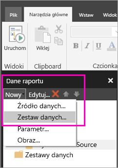
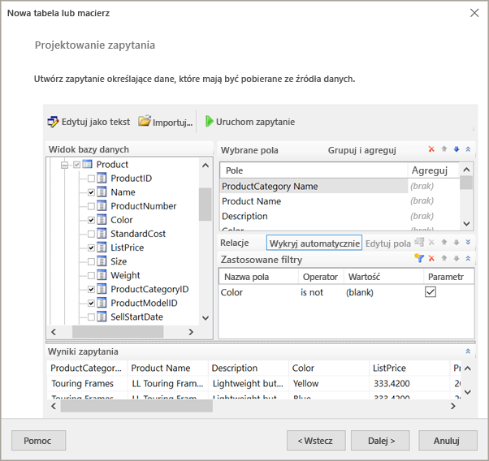
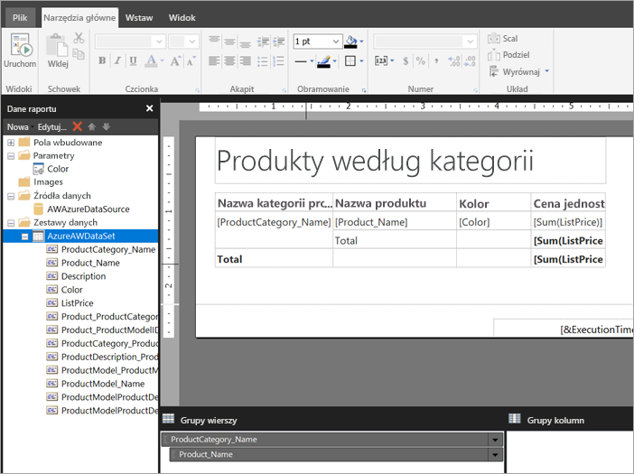

# Tworzenie osadzonego zestawu danych dla raportu podzielonego na strony w usłudze Power BI (wersja zapoznawcza)
Z tego artykułu dowiesz się, jak tworzyć i osadzać zestaw danych w oparciu o osadzone źródło danych dla raportu podzielonego na strony w usłudze Power BI. Osadzone zestawy danych znajdują się i są używane w jednym raporcie podzielonym na strony. Obecnie raporty podzielone na strony opublikowane w usłudze Power BI potrzebują osadzonych zestawów danych i osadzonych źródeł danych. Osadzone źródło danych i zestaw danych są tworzone w programie Report Builder podczas tworzenia raportu. 

Zanim będzie można utworzyć zestaw danych, należy utworzyć źródło danych. Aby dowiedzieć się, jak to zrobić, zobacz temat [Osadzone źródła danych dla raportów podzielonych na strony w usłudze Power BI](paginated-reports-embedded-data-source.md).
  
## Tworzenie osadzonego zestawu danych
  
1. W okienku Dane raportu w programie Report Builder wybierz pozycję **Nowe** > **Zestaw danych**.

1. Na karcie **Zapytanie** okna dialogowego **Właściwości zestawu danych** nazwij zestaw danych. Osadzone źródło danych znajduje się już w polu **Źródło danych**. Można również wybrać pozycję **Nowe**, aby utworzyć inne osadzone źródło danych.
 
     

3. W obszarze **Typ zapytania** wybierz typ polecenia lub zapytania do użycia dla zestawu danych. 
    - Wartość **Tekst** powoduje uruchomienie zapytania w celu pobrania danych z bazy danych. Jest to wartość domyślna i używana w większości zapytań. Wpisz zapytanie lub zaimportuj istniejące zapytanie, wybierając pozycję **Importuj**. Aby skompilować zapytanie w sposób graficzny, wybierz pozycję **Projektant zapytań**. Jeśli użyjesz projektanta zapytań w celu skompilowania zapytania, tekst zapytania pojawi się w tym polu. Wybierz przycisk **Wyrażenie** (**fx**), aby użyć wyrażenia do dynamicznego generowania zapytania. 
    - Wartość **Tabela** powoduje wybranie wszystkich pól w tabeli. Wprowadź nazwę tabeli, której chcesz użyć jako zestawu danych.
    - Wartość **Procedura składowana** powoduje uruchomienie procedury składowanej według nazwy.

4. W projektancie zapytań możesz wyświetlać tabele i pola w zestawie danych oraz przeprowadzać interakcję z nimi, importować zapytanie lub edytować dane jako tekst. Możesz w nim również dodawać filtry i parametry. 

    

5. W projektancie zapytań wybierz pozycję **Uruchom zapytanie**, aby przetestować zapytanie, a następnie wybierz przycisk **OK**.

1. Po powrocie do okna dialogowego Właściwości zestawu danych w polu **Limit czasu (w sekundach)** wpisz liczbę sekund do upłynięcia limitu czasu zapytania. Wartość domyślna to 30 sekund. Pole **Limit czasu** musi pozostać puste lub jego wartość musi być większa od zera. Jeśli pole jest puste, zapytanie nie ma limitu czasu.

7.  Inne właściwości zestawu danych można ustawiać na innych kartach:
    - Utwórz pola obliczeniowe na karcie **Pola**.
    - Ustaw opcje zaawansowane na karcie **Opcje**.
    - Dodaj lub zaktualizuj **filtry** i **parametry** na odpowiednich kartach.

8. Wybierz przycisk **OK**.
 
   Raport zostanie otwarty w widoku Projekt raportu. Źródło danych, zestaw danych i kolekcja pól zestawu danych zostaną wyświetlone w okienku Dane raportu i będzie można kontynuować projektowanie raportu podzielonego na strony.  

     
 
## Następne kroki 

- [Czym są raporty podzielone na strony w usłudze Power BI Premium? (wersja zapoznawcza)](paginated-reports-report-builder-power-bi.md)  
- [Samouczek: tworzenie raportu podzielonego na strony i przekazywanie go do usługi Power BI](paginated-reports-quickstart-aw.md)
- [Publikowanie raportu podzielonego na strony w usłudze Power BI](paginated-reports-save-to-power-bi-service.md)

