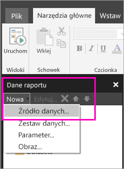

# Tworzenie osadzonego źródła danych dla raportów podzielonych na strony w usłudze Power BI (wersja zapoznawcza)
Z tego artykułu dowiesz się, jak tworzyć i modyfikować osadzone źródło danych dla raportu podzielonego na strony w usłudze Power BI. Osadzone źródło danych jest definiowane w jednym raporcie i używane tylko w tym raporcie. Obecnie raporty podzielone na strony opublikowane w usłudze Power BI potrzebują osadzonych zestawów danych i osadzonych źródeł danych i mogą nawiązywać połączenia z następującymi źródłami danych:

- Usługi Azure SQL Database i Data Warehouse
- SQL Server
- SQL Server Analysis Services 

Raporty podzielone na strony łączą się z lokalnymi źródłami danych za pośrednictwem bramy. Bramę należy skonfigurować po opublikowaniu raportu w usłudze Power BI. Dowiedz się więcej o [bramach usługi Power BI](service-gateway-getting-started.md). 

## Tworzenie osadzonego źródła danych
  
1. Otwórz program Report Builder.

1. Na pasku narzędzi w okienku danych raportu wybierz kolejno pozycje **Nowe** > **Źródło danych**. Zostanie otwarte okno dialogowe **Właściwości źródła danych**.

    
  
2.  W polu tekstowym **Nazwa** wpisz nazwę źródła danych lub zaakceptuj nazwę domyślną.  
  
3.  Wybierz pozycję **Użyj połączenia osadzonego w tym raporcie**.  
  
1.  Z listy **Wybierz typ połączenia** wybierz typ źródła danych. 

1.  Określ parametry połączenia przy użyciu jednej z następujących metod:  
  
    -   Wpisz parametry połączenia bezpośrednio w polu tekstowym **Parametry połączenia**. 
  
    -   Wybierz przycisk wyrażenia (**fx)**, aby utworzyć wyrażenie obliczające wartość parametrów połączenia. W oknie dialogowym **Wyrażenie** wpisz wyrażenie w okienku Wyrażenie. Wybierz przycisk **OK**. 
  
    -   Wybierz pozycję **Kompilacja**, aby otworzyć okno dialogowe **Właściwości połączenia** dla źródła danych wybranego w kroku 2.  
  
        Wypełnij pola okna dialogowego **Właściwości połączenia** zgodnie z typem źródła danych. Właściwości połączenia obejmują typ źródła danych, nazwę źródła danych i poświadczenia do użycia. Po określeniu wartości w oknie dialogowym wybierz pozycję **Testuj połączenie**, aby sprawdzić, czy źródło danych jest dostępne i czy podane poświadczenia są poprawne.  
  
4.  Wybierz pozycję **Poświadczenia**.  
  
     Określ poświadczenia do użycia dla źródła danych. Właściciel źródła danych wybiera typ obsługiwanych poświadczeń. Aby uzyskać więcej informacji, zobacz temat [Specify Credential and Connection Information for Report Data Sources](https://docs.microsoft.com/sql/reporting-services/report-data/specify-credential-and-connection-information-for-report-data-sources) (Określanie informacji dotyczących poświadczeń i połączeń na potrzeby źródeł danych raportu).
  
5.  Wybierz przycisk **OK**.  
  
     Źródło danych zostanie wyświetlone w okienku danych raportu.  

## Następne kroki

- [Tworzenie osadzonego zestawu danych dla raportu podzielonego na strony w usłudze Power BI](paginated-reports-create-embedded-dataset.md)
- [Czym są raporty podzielone na strony w usłudze Power BI Premium? (wersja zapoznawcza)](paginated-reports-report-builder-power-bi.md)