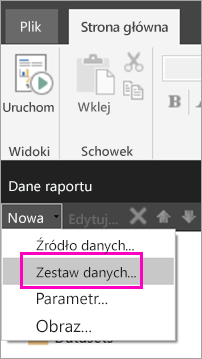
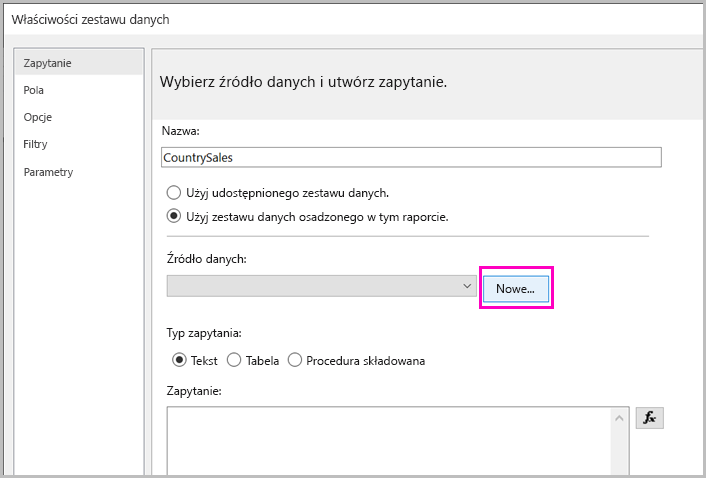
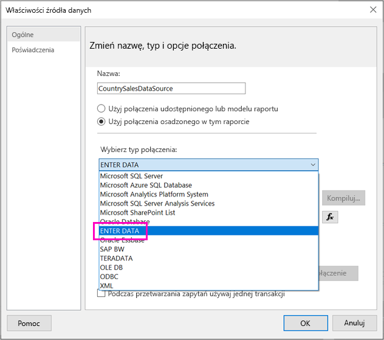
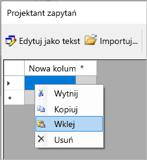
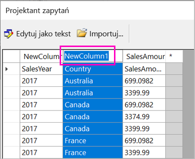
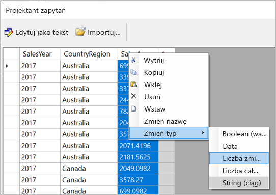
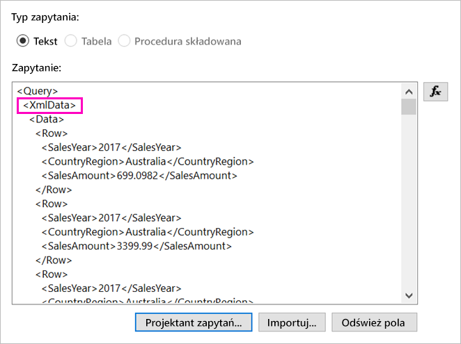
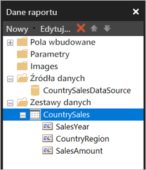

# <a name="enter-data-directly-in-a-paginated-report-in-report-builder---power-bi"></a>Wprowadzanie danych bezpośrednio w raporcie podzielonym na strony w programie Report Builder — Power BI

W tym artykule opisano funkcję dostępną w nowej wersji programu SQL Server 2016 Report Builder, która pozwala na wprowadzanie danych bezpośrednio w raporcie RDL w formie osadzonego zestawu danych.  Ta funkcja działa podobnie do programu Power BI Desktop. Możesz wpisać dane bezpośrednio w zestawie danych w raporcie lub wkleić je z innego programu, takiego jak Microsoft Excel. Zestaw danych utworzony przez wprowadzenie danych może być używany tak jak każdy inny utworzony przez Ciebie osadzony zestaw danych. Ponadto można dodać więcej niż jedną tabelę i użyć jednej z nich jako filtru dla innej tabeli. Ta funkcja jest szczególnie przydatna w przypadku małych, statycznych zestawów danych, które mogą być potrzebne w raporcie, takich jak parametry raportu.
 
## <a name="prerequisites"></a>Wymagania wstępne

- Aby wprowadzić dane bezpośrednio w raporcie podzielonym na strony, zainstaluj nową wersję programu [Report Builder z Centrum pobierania Microsoft](https://www.microsoft.com/download/details.aspx?id=53613). 
- Aby móc zapisać raport podzielony na strony w usłudze Power BI, musisz mieć [konto usługi Power BI Pro](service-self-service-signup-for-power-bi.md) i uprawnienia zapisu w obszarze roboczym w [pojemności usługi Power BI Premium](service-premium.md).
- Aby móc zapisać raport podzielony na strony na serwerze raportów, musisz mieć uprawnienia do [edytowania pliku RsReportServer.config](#upload-the-paginated-report-to-a-report-server).

## <a name="get-started"></a>Rozpoczęcie

Po pobraniu i zainstalowaniu programu Report Builder należy postępować tak jak w przypadku dodawania osadzonego źródła danych i zestawu danych do raportu. W poniższej procedurze w obszarze **Źródła danych** jest dostępna nowa opcja: **Wprowadź dane**.  To źródło danych należy skonfigurować w raporcie tylko raz. Później będzie można utworzyć wiele tabel z wprowadzonymi danymi w osobnych zestawach danych przy użyciu tego źródła danych.

1. W okienku **Dane raportu** wybierz pozycję **Nowe**  >  **Zestaw danych**.

    

1. W oknie dialogowym **Właściwości zestawu danych** wybierz pozycję **Użyj zestawu danych osadzonego w tym raporcie**.

1. Obok pozycji **Źródło danych** wybierz pozycję **Nowe**.

    

1. W oknie dialogowym **Właściwości źródła danych** wybierz pozycję **Użyj połączenia osadzonego w tym raporcie**.
2. W polu **Wybierz typ połączenia** wybierz pozycję **PODAJ DANE**  >  **OK**.

    

1. W oknie dialogowym **Właściwości zestawu danych** wybierz pozycję **Projektant zapytań**.
2. W okienku **Projektant zapytań** kliknij prawym przyciskiem myszy i wklej dane w tabeli.

    

1. Aby ustawić nazwy kolumn, kliknij dwukrotnie kolumnę **Nowa kolumna** i wpisz nazwę.

    

1. Jeśli pierwszy wiersz zawiera nagłówki kolumn z oryginalnych danych, kliknij prawym przyciskiem myszy i usuń go.
    
9. Domyślnie typem danych dla każdej kolumny jest ciąg. Aby zmienić typ danych, kliknij prawym przyciskiem myszy nagłówek kolumny, wybierz pozycję **Zmień typ** i ustaw inny typ danych, taki jak data lub liczba zmiennoprzecinkowa.

    

1. Po zakończeniu tworzenia tabeli wybierz przycisk **OK**.  

    Wygenerowane zapytanie jest takie samo jak w przypadku źródła danych XML. W tle używamy środowiska XML jako dostawcy danych.  Zmieniliśmy jego przeznaczenie, aby umożliwić również obsługę tego scenariusza.

    

12. W oknie dialogowym **Właściwości zestawu danych** wybierz przycisk **OK**.

13. Źródło danych i zestaw danych będą wyświetlane w okienku **Dane raportu**.

    

Zestaw danych może służyć jako podstawa dla wizualizacji danych w raporcie. Możesz też dodać inny zestaw danych i używać dla niego tego samego źródła danych.

## <a name="upload-the-paginated-report-to-the-power-bi-service"></a>Przekazywanie raportu podzielonego na strony w usłudze Power BI

Teraz raporty podzielone na strony są obsługiwane w usłudze Power BI w wersji zapoznawczej, dzięki czemu możesz przekazać raport podzielony na strony do pojemności Premium. Aby uzyskać szczegółowe informacje, zobacz [Przekazywanie raportu podzielonego na strony](paginated-reports-save-to-power-bi-service.md#upload-a-paginated-report).

## <a name="upload-the-paginated-report-to-a-report-server"></a>Przekazywanie raportu podzielonego na strony na serwer raportów

Możesz również przekazać raport podzielony na strony na serwer raportów usługi Power BI albo serwer raportów usług SQL Server Reporting Services 2016 lub 2017. Zanim to zrobisz, dodaj poniższy element do pliku RsReportServer.config jako rozszerzenie danych. Na wypadek problemów przed wprowadzeniem zmiany wykonaj kopię zapasową pliku RsReportServer.config.

```
<Extension Name=”ENTERDATA” Type=”Microsoft.ReportingServices.DataExtensions.XmlDPConnection,Microsoft.ReportingServices.DataExtensions”>
<Configuration>
<ConfigName>ENTERDATA</ConfigName>
</Configuration>
</Extension>
```

Po zakończeniu edycji lista dostawców danych w pliku konfiguracji powinna wyglądać następująco:


To wszystko — teraz możesz publikować raporty, które używają tej nowej funkcji, na serwerze raportów.

## <a name="next-steps"></a>Następne kroki

- [Czym są raporty podzielone na strony w usłudze Power BI Premium? (wersja zapoznawcza)](paginated-reports-report-builder-power-bi.md)
- [Co to jest serwer raportów usługi Power BI?](report-server/get-started.md)
