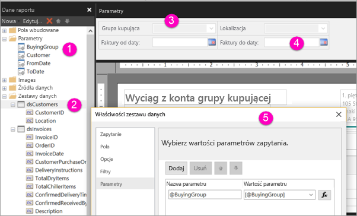

# Tworzenie parametrów dla raportów podzielonych na strony w usłudze Power BI (wersja zapoznawcza)

Z tego artykułu dowiesz się, jak utworzyć parametry raportów podzielonych na strony w usłudze Power BI.  Parametr raportu udostępnia metodę wybierania danych raportu oraz zmienianie prezentacji raportu. Możesz podać wartość domyślną oraz listę dostępnych wartości, aby czytelnicy raportu mogli zmieniać wybrane opcje.  

Poniższa ilustracja przedstawia widok Projekt w programie Report Builder dla raportu z następującymi parametrami: @BuyingGroup, @Customer, @FromDate i @ToDate. 
  

  
1.  Parametry raportu w okienku Dane raportu.  
  
2.  Tabela z jednym z parametrów w zestawie danych.  
  
3.  Okienko parametrów. W okienku parametrów można dostosować układ parametrów. 
  
4.  Parametry @FromDate i @ToDate mają typ danych **DateTime**. Podczas przeglądania raportu możesz wpisać datę w polu tekstowym lub wybrać datę za pomocą kontrolki kalendarza. 

5.  Jeden z parametrów w oknie dialogowym **Właściwości zestawu danych**.  

  
## Tworzenie lub edytowanie parametru raportu  
  
1.  Otwórz raport podzielony na strony w programie Report Builder.

1. W okienku **Dane raportu** kliknij prawym przyciskiem myszy węzeł **Parametry** > **Dodaj parametr**. Zostanie otwarte okno dialogowe **Właściwości parametru raportu**.  
  
2.  W polu **Nazwa** wpisz nazwę parametru lub zaakceptuj nazwę domyślną.  
  
3.  W polu **Monit** wpisz tekst do wyświetlenia obok pola tekstowego parametru, gdy użytkownik uruchomi raport.  
  
4.  W polu **Typ danych** wybierz typ danych dla wartości parametru.  
  
5.  Jeśli parametr może zawierać pustą wartość, wybierz pozycję **Zezwalaj na wartość pustą**.  
  
6.  Jeśli parametr może zawierać wartość null, wybierz pozycję **Zezwalaj na wartość null**.  
  
7.  Aby zezwolić użytkownikowi na wybranie więcej niż jednej wartości parametru, wybierz pozycję **Zezwalaj na wiele wartości**.  
  
8.  Ustaw opcję widoczności.  
  
    -   Aby wyświetlić parametr na pasku narzędzi w górnej części raportu, wybierz pozycję **Widoczny**.  
  
    -   Aby ukryć parametr, tak aby nie był wyświetlany na pasku narzędzi, wybierz pozycję **Ukryty**.  
  
    -   Aby ukryć parametr i zabezpieczyć go przed modyfikacją na serwerze raportów po opublikowaniu raportu, wybierz pozycję **Wewnętrzny**. W takiej sytuacji parametr będzie widoczny tylko definicji raportu. Dla tej opcji należy ustawić wartość domyślną lub umożliwić parametrowi akceptowanie wartości null.  
  
9. Wybierz przycisk **OK**. 
  
## Następne kroki

Zobacz temat [View parameters for paginated reports](paginated-reports-view-parameters.md) (Wyświetlanie parametrów raportów podzielonych na strony), aby zobaczyć, jak wyglądają parametry w usłudze Power BI.

Aby uzyskać szczegółowe informacje o parametrach w raportach podzielonych na strony, zobacz artykuł [Report Parameters (Report Builder and Report Designer)](https://docs.microsoft.com/sql/reporting-services/report-design/report-parameters-report-builder-and-report-designer) (Parametry raportu (Report Builder i Projektant raportów)) w dokumentacji usług SQL Server Reporting Services.  
