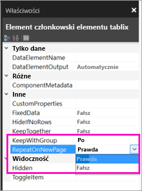

# Samouczek: tworzenie raportu podzielonego na strony i przekazywanie go do usługi Power BI (wersja zapoznawcza)

W tym samouczku nawiążesz połączenie z przykładową bazą danych Azure SQL Database. Następnie przy użyciu kreatora w programie Report Builder utworzysz raport podzielony na strony z tabelą zawijaną na wielu stronach. Raport podzielony na strony zostanie przekazany do obszaru roboczego w pojemności Premium w usłudze Power BI. Raporty podzielone na strony w usłudze Power BI są obecnie dostępne w wersji zapoznawczej.

W ramach tego samouczka wykonasz następujące czynności:

> [!div class="checklist"]
> * Tworzenie przykładowej bazy danych platformy Azure.
> * Tworzenie macierzy w programie Report Builder za pomocą kreatora.
> * Formatowanie raportu przy użyciu tytułu, numerów stron i nagłówków kolumn na każdej stronie.
> * Formatowanie waluty.
> * Przekazywanie raportu do usługi Power BI.

Jeśli nie masz subskrypcji platformy Azure, przed rozpoczęciem utwórz [bezpłatne konto](https://azure.microsoft.com/free/?WT.mc_id=A261C142F).
 
## Wymagania wstępne  

Poniżej przedstawiono wymagania wstępne dotyczące tworzenia raportów podzielonych na strony:

- Zainstaluj program [Report Builder z Centrum pobierania Microsoft](http://go.microsoft.com/fwlink/?LinkID=734968). 

- Postępuj zgodnie z czynnościami opisanymi w przewodniku Szybki start [Tworzenie przykładowej bazy danych Azure SQL Database w witrynie Azure Portal](https://docs.microsoft.com/azure/sql-database/sql-database-get-started-portal). Skopiuj i zapisz wartość w polu **Nazwa serwera** na karcie **Przegląd**. Zapamiętaj nazwę użytkownika i hasło utworzone na platformie Azure.

Poniżej przedstawiono wymagania wstępne dotyczące przekazywania raportu podzielonego na strony do usługi Power BI:

- Potrzebujesz [licencji usługi Power BI Pro](service-admin-power-bi-pro-in-your-organization.md).
- Potrzebujesz obszaru roboczego aplikacji w usłudze w ramach [pojemności usługi Power BI Premium](service-premium.md). Obok nazwy obszaru roboczego znajduje się ikona diamentu .

## Tworzenie macierzy za pomocą kreatora
  
1.  Uruchom program Report Builder z komputera.  
  
     Zostanie otwarte okno dialogowe **Wprowadzenie**.  
  
     
  
1.  Upewnij się, że w okienku po lewej stronie zaznaczono pozycję **Nowy raport**, a następnie w okienku po prawej stronie wybierz pozycję **Kreator tabeli lub macierzy**.  
  
4.  Na stronie **Wybieranie zestawu danych** wybierz pozycję **Utwórz zestaw danych** > **Dalej**.  

    
  
5.  Na stronie **Wybieranie połączenia ze źródłem danych** wybierz pozycję **Nowe**. 

    
  
     Zostanie otwarte okno dialogowe **Właściwości źródła danych**.  
  
6.  Nazwa źródła danych może być dowolna i może zawierać znaki oraz znaki podkreślenia. Na potrzeby tego samouczka w polu **Nazwa** wpisz **MyAzureDataSource**.  
  
7.  W polu **Wybierz typ połączenia** wybierz pozycję **Microsoft Azure SQL Database**.  
  
8.  Wybierz pozycję **Kompilacja** obok pola **Parametry połączenia**. 

    

9. **Na platformie Azure:** wróć do witryny Azure Portal i wybierz pozycję **Bazy danych SQL**.

1. Wybierz bazę danych Azure SQL Database utworzoną w przewodniku Szybki start dotyczącym tworzenia przykładowej bazy danych Azure SQL Database w witrynie Azure Portal w sekcji **Wymagania wstępne** tego artykułu.

1. Na karcie **Przegląd** skopiuj wartość w polu **Nazwa serwera**.

2. **W programie Report Builder**: w oknie dialogowym **Właściwości połączenia** w polu **Nazwa serwera** wklej skopiowaną nazwę serwera. 

1. W obszarze **Logowanie do serwera** upewnij się, że wybrano opcję **Użyj uwierzytelniania programu SQL Server**, a następnie wpisz nazwę użytkownika i hasło utworzone na platformie Azure w przykładowej bazie danych.

1. W obszarze **Łączenie z bazą danych** wybierz strzałkę listy rozwijanej i wybierz nazwę bazy danych utworzonej na platformie Azure.
 
    

1. Wybierz pozycję **Testuj połączenie**. Zostanie wyświetlony komunikat **Wyniki testu** wskazujący, że **Testowanie połączenia zakończyło się pomyślnie**.

1. Wybierz przycisk **OK** > **OK**. 

   Teraz w polu **Parametry połączenia** program Report Builder wyświetli parametry właśnie utworzonego połączenia. 

    

1. Wybierz przycisk **OK**.
  
9. Na stronie **Wybieranie połączenia ze źródłem danych** pod właśnie utworzonym połączeniem ze źródłem danych zobaczysz frazę „(w tym raporcie). Wybierz to źródło danych > **Dalej**.  

    

10. Wpisz tę samą nazwę użytkownika i hasło w polu. 
  
10. Na stronie **Projektowanie zapytania** rozwiń węzeł SalesLT, rozwiń węzeł Tables i wybierz te tabele:

    - Adres
    - Klient
    - Produkt
    - ProductCategory
    - SalesOrderDetail
    - SalesOrderHeader

     Ponieważ wybrano pozycję **Relacje** > **Autowykrywanie**, program Report Builder wykrywa relacje między tymi tabelami. 
    
    
 
1.  Wybierz pozycję **Uruchom zapytanie**. W programie Report Builder zostanie wyświetlony obszar **Wyniki zapytania**. 
 
     

18. Wybierz pozycję **Dalej**. 

19. Na stronie **Wybieranie zestawu danych** wybierz właśnie utworzony zestaw danych > **Dalej**.

    

1. Na stronie **Porządkowanie pól** przeciągnij te pola z okna **Dostępne pola** do pola **Grupy wierszy**:

    - CompanyName
    - SalesOrderNumber
    - Product_Name

1. Przeciągnij te pola z okna **Dostępne pola** do pola **Wartości**:

    - OrderQty
    - UnitPrice
    - LineTotal

    Program Report Builder automatycznie oznaczył pola w oknie **Wartości** jako sumy.

    

24. Na stronie **Wybieranie układu** zachowaj wszystkie ustawienia domyślne, ale wyczyść obszar **Rozwiń/Zwiń grupy**. Mówiąc ogólnie, funkcja rozwijania/zwijania grup jest doskonała, ale tym razem chcesz, aby tabela znajdowała się na wielu stronach.

1. Wybierz pozycje **Dalej** > **Zakończ**. Tabela jest wyświetlana na powierzchni projektowej.
 
## Co zostało utworzone

Zatrzymajmy się na chwilę, aby wyświetlić wyniki działania kreatora.

1. W okienku danych raportu zobaczysz osadzone źródło danych platformy Azure i oparty na nim osadzony zestaw danych (obydwa elementy utworzone przez Ciebie). 

2. Szerokość powierzchni projektowej wynosi około 6 cali. Na powierzchni projektowej zobaczysz macierz z wyświetlonymi nagłówkami kolumn i wartościami symboli zastępczych. Macierz ma sześć kolumn i wygląda jakby składała się tylko z pięciu wierszy. 

3. Wiersze Order Qty (Zamówiona ilość), Unit Price (Cena jednostkowa) i Line Total (Wiersz łącznie) to sumy, a każda grupa wierszy ma sumę częściową. 

    Nadal nie widać rzeczywistych wartości danych. Aby je zobaczyć, musisz wrócić do raportu.

4. W okienku Właściwości wybrana macierz nosi nazwę Tablix1. *Element tablix* w programie Report Builder to obszar danych, który wyświetla dane w wierszach i kolumnach. Może być to tabela lub macierz.

5. W okienku grupowania zobaczysz trzy grupy wierszy utworzone w kreatorze: 

    - CompanyName
    - Zamówienie sprzedaży
    - Nazwa produktu

    Ta macierz nie zawiera żadnych grup kolumn.

### Uruchamianie raportu

Aby zobaczyć rzeczywiste wartości, należy uruchomić raport.

1. Wybierz pozycję **Uruchom** na pasku narzędzi **Narzędzia główne**.

   Spowoduje to wyświetlenie wartości. Macierz zawiera o wiele więcej wierszy niż wyświetlono w widoku Projekt. Zauważ, że w programie Report Builder jest wyświetlona informacja, że jest to strona **1** z **2?** Program Report Builder ładuje raport tak szybko, jak to możliwe, dlatego ilość danych pobrana w danym momencie wystarcza tylko na kilka stron. Znak zapytania wskazuje, że program Report Builder nie załadował jeszcze wszystkich danych.

   

2. Wybierz pozycję **Układ wydruku**. Raport będzie miał taki format po wydrukowaniu. Program Report Builder wie teraz, że raport zawiera 33 strony, i automatycznie dodał datę i znacznik czasu w stopce.

## Formatowanie raportu

Masz teraz raport z macierzą zajmującą 33 strony. Dodajmy inne funkcje i poprawmy wygląd raportu. Jeśli chcesz zobaczyć, jak raport się zmienia, możesz go uruchomić po każdym kroku.

- Na karcie **Uruchamianie** na Wstążce wybierz pozycję **Projekt**, aby kontynuować modyfikowanie.  

### Ustawianie szerokości strony

Zazwyczaj raport podzielony na strony jest sformatowany do drukowania, a typowa strona ma wymiary 8 1/2 x 11 cali. 

1. Przeciągnij linijkę, aby powierzchnia projektowa miała 7 cali szerokości. Marginesy domyślne to 1 cal po każdej stronie, więc marginesy boczne muszą być węższe.

1. Kliknij szary obszar wokół powierzchni projektowej, aby wyświetlić właściwości **raportu**.

    Jeśli nie widzisz okienka Właściwości, kliknij kartę **Widok** > **Właściwości**.

2. Rozwiń węzeł **Marginesy** i zmień wartości **Lewy** i **Prawy** z 1 cala na 0,75 cala. 

    
  
### Dodawanie tytułu raportu  

1. Wybierz słowa **Kliknij, aby dodać tytuł** w górnej części strony, a następnie wpisz frazę **Sprzedaż według firmy**.  

2. Wybierz tekst tytułu i w okienku właściwości w obszarze **Czcionka** zmień **Kolor** na **Niebieski**.
  
### Dodawanie numeru strony

Wiesz już, że raport ma znacznik daty i godziny w stopce. Do stopki można również dodać numer strony.

1. W dolnej części powierzchni projektowej zobaczysz oznaczenie [&ExecutionTime] po prawej stronie w stopce. 

2. W okienku Dane raportu rozwiń folder pól wbudowanych. Przeciągnij element **Numer strony** do lewej strony stopki i umieść go na tej samej wysokości co element [&ExecutionTime].

3. Przeciągnij prawą stronę pola [&PageNumber], aby utworzyć kwadrat.

4. Na karcie **Wstaw** wybierz pozycję **Pole tekstowe**.

5. Kliknij prawą stronę pola [&PageNumber], wpisz „z”, a następnie przekształć następne pole tekstowe w kwadrat.

6. Przeciągnij element **Ogólna łączna liczba stron** do stopki i umieść go po prawej stronie listy „z”, a następnie przeciągnij prawą stronę tego elementu, aby przekształcić go w kwadrat.

    

### Zwiększanie szerokości tabeli  

Można teraz ustawić szerokość macierzy tak, aby wypełniała stronę, oraz rozszerzyć kolumny tekstowe, aby nie trzeba było tak bardzo przewijać tekstu. 
 
1. Wybierz macierz, a następnie wybierz kolumnę Nazwa firmy.

3. Najedź kursorem na szary pasek w górnej części macierzy przy prawej krawędzi w kolumnie Nazwa firmy. Przeciągaj do prawej strony do momentu, gdy kolumna będzie się kończyć na 3 1/8 cala. 

    

4. Przeciągaj prawą krawędź kolumny Nazwa produktu do momentu, gdy kolumna będzie się kończyć na 3 3/4 cala.   

Teraz macierz jest prawie tak szeroka jak cały obszar wydruku.

### Formatowanie waluty

Jak na pewno wiesz, po uruchomieniu raportu kwoty w dolarach nie zostały jeszcze sformatowane jako waluta.

1. Zaznacz lewą górną komórkę [Sum(OrderQty)], naciśnij i przytrzymaj klawisz Shift, a następnie zaznacz prawą dolną komórkę [Sum(LineTotal)].

    

2. Na karcie **Narzędzia główne** wybierz znak dolara (**$**) jako symbol waluty, a następnie wybierz strzałkę obok pozycji **Style symbolu zastępczego** > **Przykładowe wartości**.
 
    

    Teraz już widzisz, że wartości zostały sformatowane jako waluta.

    

### Dodawanie nagłówków kolumn na każdej stronie

Przed opublikowaniem raportu w usłudze Power BI można wprowadzić jeszcze jedno ulepszenie formatowania: można ustawić wyświetlanie nagłówków kolumn na każdej stronie raportu.

1. Na prawym końcu górnego paska w okienku Grupowanie wybierz strzałkę listy rozwijanej > **Tryb zaawansowany**.

    

2. Wybierz górny pasek **Statyczne** w obszarze **Grupy wierszy**. Zobaczysz, że komórka Nazwa firmy w macierzy została zaznaczona.

   

3. W okienku **Właściwości** widzisz właściwości **elementu członkowskiego elementu tablix**. Ustaw opcję **KeepWithGroup** na **Po**, a opcję **RepeatOnNewPage** na **Prawda**.

    

    Nadszedł czas, aby uruchomić raport i zobaczyć, jak wygląda teraz.

5. Wybierz pozycję **Uruchom** na karcie **Narzędzia główne**.

6. Wybierz pozycję **Układ wydruku**, jeśli nie została jeszcze wybrana. Teraz raport zawiera 29 stron. Przewiń kilka stron. Zobaczysz, że waluta została sformatowana, kolumny na każdej stronie mają nagłówki, a raport ma na każdej stronie stopkę z numerami stron oraz znacznikiem daty i godziny.
 
    

7. Zapisz raport na komputerze.
 
##  Przekazywanie raportu do usługi

Teraz, po utworzeniu tego raportu podzielonego na strony, nadszedł czas na przekazanie go do usługi Power BI.

1. W usłudze Power BI (http://app.powerbi.com) w lewym okienku nawigacji wybierz kolejno pozycje **Obszary robocze** > **Utwórz obszar roboczy aplikacji**.

2. Nadaj obszarowi roboczemu nazwę **Azure AW** lub inną unikatową nazwę. W tej chwili jesteś jego jedynym członkiem. 

3. Wybierz strzałkę obok pozycji **Zaawansowane** i włącz opcję **Pojemność dedykowana**. 

    

    Jeśli nie możesz jej włączyć, musisz poprosić administratora usługi Power BI o przyznanie uprawnień do dodawania obszaru roboczego do dedykowanej pojemności Premium.

4. W razie potrzeby wybierz **dostępną dedykowaną pojemność dla tego obszaru roboczego** > przycisk **Zapisz**.
    
    

    Jeśli obszar roboczy nie znajduje się w pojemności Premium, po podjęciu próby przekazania raportu zobaczysz komunikat „Nie można przekazać raportu podzielonego na strony”. Skontaktuj się z administratorem usługi Power BI, aby przenieść obszar roboczy.

1. W nowym obszarze roboczym wybierz pozycję **Pobierz dane**.

2. W polu **Pliki** wybierz pozycję **Pobierz**.

3. Wybierz pozycję **Plik lokalny**, przejdź do lokalizacji, w której zapisano plik, i wybierz pozycję **Otwórz**.

   Usługa Power BI zaimportuje plik. Zobaczysz go w obszarze **Raporty** na stronie listy aplikacji.

    

4. Wybierz raport, aby go wyświetlić.

5. Jeśli wystąpi błąd, być może trzeba będzie ponownie wprowadzić poświadczenia. Wybierz ikonę **Zarządzaj**.

    

6. Wybierz pozycję **Edytuj poświadczenia** i wprowadź poświadczenia użyte na platformie Azure podczas tworzenia bazy danych platformy Azure.

    

7. Teraz możesz przeglądać raport podzielony na strony w usłudze Power BI.

    

## Następne kroki

[Czym są raporty podzielone na strony w usłudze Power BI Premium? (wersja zapoznawcza)](paginated-reports-report-builder-power-bi.md)

