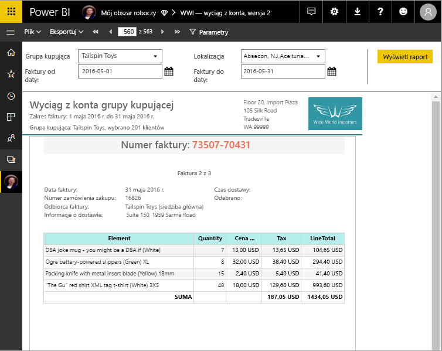

# Czym są raporty podzielone na strony w usłudze Power BI Premium? (Wersja zapoznawcza)
Raporty podzielone na strony, które przez długi czas stanowiły standardowy format w usługach SQL Server Reporting Services, są teraz dostępne w usłudze Power BI. Raporty podzielone na strony zostały zaprojektowane pod kątem drukowania lub udostępniania. Noszą one nazwę „podzielone na strony", ponieważ są formatowane tak, aby dane mieściły się w obrębie strony. Zawierają one na przykład wszystkie dane w tabeli, nawet jeśli tabela zajmuje wiele stron. Są one również określane jako „co do piksela” (ang. pixel perfect), ponieważ można dokładnie kontrolować układ ich stron. Raporty podzielone na strony są oparte na technologii raportów RDL dostępnej w usługach SQL Server Reporting Services. Report Builder to autonomiczne narzędzie do tworzenia raportów podzielonych na strony. 

Raporty podzielone na strony mogą mieć wiele stron. Raport w poniższym przykładzie ma 563 strony, z których każda ma dokładnie rozmieszczoną zawartość i jedną stronę na fakturę oraz powtarzające się nagłówki i stopki.

Podgląd raportu można wyświetlić w programie Report Builder, a następnie opublikować raport w usłudze Power BI pod adresem http://app.powerbi.com. Do publikowania raportu w usłudze jest niezbędna licencja usługi Power BI Pro. Raporty podzielone na strony można publikować i udostępniać w obszarze Mój obszar roboczy lub innych obszarach roboczych w aplikacji, jeśli obszar roboczy znajduje się w pojemności Premium usługi Power BI. Ponadto administrator usługi Power BI musi również włączyć raporty podzielone na strony w portalu administracyjnym usługi Power BI. Dowiedz się więcej na temat [konfigurowania obciążeń](service-admin-premium-manage.md#configure-workloads). 

## Tworzenie raportów w programie Report Builder

Raporty podzielone na strony mają własne narzędzie do projektowania, czyli program Report Builder. Jeśli utworzono raporty podzielone na strony dla serwera raportów usługi Power BI lub usług SQL Server Reporting Services (SSRS), można używać tego samego narzędzia i tej samej wersji. W rzeczywistości raporty podzielone na strony, które utworzono dla usług SSRS 2016 i 2017 lub dla serwera raportów usługi Power BI w środowisku lokalnym, są zgodne z usługą Power BI. Usługa Power BI zachowuje zgodność z poprzednimi wersjami, dlatego można przenosić raporty do nowszej wersji oraz uaktualniać wszystkie raporty podzielone na strony z poprzedniej wersji. Nie wszystkie funkcje raportu są dostępne po uruchomieniu. Zobacz sekcję [Ograniczenia i istotne zagadnienia](#limitations-and-considerations) w tym artykule, aby uzyskać szczegółowe informacje.
     
## Raport z różnych źródeł danych

Pojedynczy raport podzielony na strony może mieć wiele różnych źródeł danych. W przeciwieństwie do raportów usługi Power BI nie ma on podstawowego źródła danych. Na potrzeby początkowej wersji raportów podzielonych na strony w usłudze Power BI osadzone źródła danych i zestawy danych są tworzone w samym raporcie — raport nie jest łączony z udostępnionymi źródłami danych ani zestawami danych na serwerze. Raporty są tworzone w programie Report Builder na komputerze lokalnym. Jeśli raport łączy się z danymi lokalnymi, po przekazaniu raportu usługi Power BI musisz utworzyć bramę i przekierować połączenie danych. Poniżej przedstawiono źródła danych, z którymi można nawiązać połączenie na potrzeby wersji początkowej:

- Usługi Azure SQL Database i Data Warehouse
- Program SQL Server za pośrednictwem bramy
- Usługi SQL Server Analysis Services za pośrednictwem bramy
 
Większą liczbą źródeł danych udostępnimy w okresie obowiązywania wersji zapoznawczej.

## Projektowanie raportu  

### Tworzenie raportów podzielonych na strony przy użyciu układów macierzy, wykresu i dowolnej postaci

Raporty tabeli można tworzyć dla danych opartych na kolumnach, raporty macierzy (np. raporty krzyżowe lub PivotTable) dla danych zbiorczych, raporty wykresu dla danych graficznych, a raporty *listy* w dowolnej postaci dla innych danych, takich jak faktury. 
  
Pracę można rozpocząć przy użyciu jednego z kreatorów programu Report Builder. Kreatorzy tabeli, macierzy i wykresu zawierają instrukcje dotyczące tworzenia połączenia z osadzonym źródłem danych oraz osadzonego zestawu danych. Następnie należy przeciągnąć i upuścić pola, aby utworzyć zapytanie dotyczące zestawu danych, wybrać układ i styl oraz dostosować raport.  
  
Kreator mapy umożliwia tworzenie raportów zawierających zagregowane dane na tle geograficznym lub geometrycznym. Danymi mapy mogą być dane przestrzenne z zapytań języka Transact-SQL lub pliku kształtu ESRI (Environmental Systems Research Institute, Inc.). Można również dodać tło kafelków mapy Microsoft Bing.  

### Dodawanie kolejnych elementów do raportu

Dane można modyfikować przez filtrowanie, grupowanie i sortowanie albo przez dodawanie formuł lub wyrażeń. Aby podsumować dane w formacie wizualizacji, można dodawać wykresy, mierniki, wykresy przebiegu w czasie oraz wskaźniki.  Aby filtrować dane w celu użycia widoków niestandardowych, można korzystać z parametrów i filtrów. Można również osadzać i przywoływać obrazy i inne zasoby, w tym zawartość zewnętrzną.  

Wszystkie elementy raportu podzielonego na strony, od samego raportu do każdego pola tekstowego, obrazu, tabeli i wykresu, mają szereg właściwości, które można ustawić tak, aby dopasować wygląd raportu do swoich potrzeb.

## Tworzenie definicji raportu

Projektowanie raportu podzielonego na strony to tak naprawdę tworzenie *definicji raportu*. Nie zawiera ona żadnych danych. Określa natomiast, skąd i które dane pobrać oraz jak je wyświetlać. Po uruchomieniu raportu procesor raportów przejmuje utworzoną definicję raportu, pobiera dane i łączy je z układem raportu w celu wygenerowania raportu. Definicja raportu jest przekazywana do usługi Power BI (http://app.powerbi.com): do obszaru Mój obszar roboczy lub do obszaru roboczego, który udostępniasz współpracownikom. Jeśli źródło danych raportu znajduje się w środowisku lokalnym, po przekazaniu raportu należy przekierować połączenie ze źródłem danych, aby przechodziło przez bramę. 

## Wyświetlanie raportu podzielonego na strony
Raport podzielony na strony można wyświetlać w usłudze Power BI w przeglądarce, a także w aplikacjach mobilnych usługi Power BI. W usłudze Power BI można eksportować raport do wielu formatów zorientowanych na Internet, zorientowanych na strony i klasycznych aplikacji, takich jak HTML, MHTML, PDF, XML, CSV, TIFF, Word i Excel. Można również udostępniać go innym osobom.  
  
## Ograniczenia i istotne zagadnienia

Poniżej przedstawiono niektóre funkcje, które nie są obsługiwane w wersji początkowej:

- Przypinanie wizualizacji lub stron raportu do pulpitów nawigacyjnych usługi Power BI.
- Funkcje interaktywne, takie jak mapy dokumentów i przyciski typu Pokaż/Ukryj.
- Podraporty i raporty przeglądania szczegółowego.
- Subskrypcje.
- Udostępnione źródła danych i udostępnione zestawy danych.
- Zestawy danych usługi Power BI.
- Wizualizacje z raportów usługi Power BI.
- Raporty podzielone na strony w aplikacji. Raport podzielony na strony można udostępnić w obszarze roboczym aplikacji, ale nie można uwzględnić go podczas publikowania aplikacji z tego obszaru roboczego.
 
## Następne kroki

- [Install Report Builder from the Microsoft Download Center](http://go.microsoft.com/fwlink/?LinkID=734968) (Instalowanie programu Report Builder z Centrum pobierania Microsoft)

- [Samouczek: tworzenie raportu podzielonego na strony](paginated-reports-quickstart-aw.md)
  

