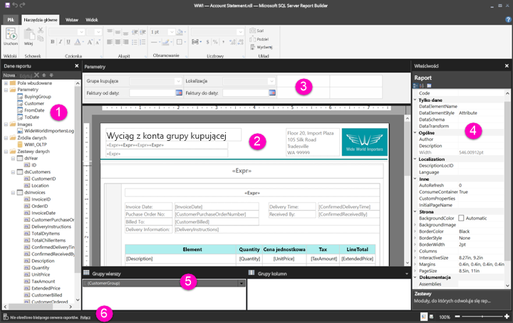

# Poruszanie się w widoku projektu raportu dla raportów podzielonych na strony

Widok projektu raportu w programie Report Builder to przestrzeń projektowa służąca do tworzenia raportów podzielonych na strony, które można publikować w usłudze Power BI. Powierzchnia projektowa znajduje się w środku ekranu programu Report Builder z wstążką i okienkami wokół niej. Powierzchnia projektowa to miejsce, w którym dodajesz i organizujesz elementy raportu. W tym artykule opisano okienka używane do dodawania, wybierania i organizowania zasobów raportu oraz zmieniania właściwości elementów raportu.  

1.  [Okienko danych raportu](#report-data-pane) 
2.  [Powierzchnia projektowa raportu](#report-design-surface)  
3.  [Okienko parametrów](#parameters-pane) 
4.  [Okienko właściwości](#properties-pane) 
5.  [Okienko grupowania](#grouping-pane) 
6.  [Pasek bieżącego stanu raportu](#current-report-status-bar)  
  
## 1. Okienko danych raportu  
 W okienku danych raportu przed rozpoczęciem projektowania układu raportu są definiowane potrzebne dane raportu i zasoby raportu. Do okienka danych raportu można dodać źródła danych, zestawy danych, pola obliczeniowe, parametry raportu i obrazy.  
  
 Po dodaniu elementów do okienka danych raportu przeciągnij pola do elementów raportu na powierzchni projektowej, aby sterować lokalizacją wyświetlania danych w raporcie.  
  
> [!TIP]  
>  Jeśli przeciągniesz pole z poziomu okienka danych raportu bezpośrednio na powierzchnię projektową raportu, zamiast umieścić je w obszarze danych, takim jak tabela lub wykres, po uruchomieniu raportu zobaczysz tylko pierwszą wartość spośród danych w tym polu.  
  
 Możesz również przeciągnąć pola wbudowane z poziomu okienka danych raportu na powierzchnię projektową raportu. Po zakończeniu renderowania pola te będą zawierać informacje na temat raportu, takie jak nazwa raportu, łączna liczba stron w raporcie i numer bieżącej strony.  
  
 Niektóre elementy są automatycznie dodawane do okienka danych raportu po dodaniu czegoś do powierzchni projektowej raportu. Jeśli na przykład osadzisz obraz w raporcie, będzie można go dodać do folderu obrazów w okienku danych raportu.  
  
> [!NOTE]  
>  Do dodania nowego elementu do okienka danych raportu możesz użyć przycisku **Nowy**. Do raportu można dodać wiele zestawów danych z tego samego źródła danych lub z różnych źródeł danych. Aby dodać nowy zestaw danych z tego samego źródła danych, kliknij prawym przyciskiem myszy źródło danych > **Dodaj zestaw danych**.  
  
## 2. Powierzchnia projektowa raportu  
 Powierzchnia projektowa raportu programu Report Builder to główny obszar roboczy służący do projektowania raportów. Aby w raporcie umieścić elementy, takie jak obszary danych, podraporty, pola tekstowe, obrazy, prostokąty i wiersze, należy dodać je ze wstążki lub Galerii składników Report Part do powierzchni projektowej. W tym miejscu można dodawać grupy, wyrażenia, parametry, filtry, akcje, widoczność i formatowanie do elementów raportu.  
  
 Można również zmienić następujące elementy:  
  
-   Właściwości treści raportu, takie jak kolor obramowania i wypełnienia, klikając prawym przyciskiem myszy biały obszar powierzchni projektowej poza wszystkimi elementami raportu i wybierając pozycję **Właściwości treści**.  
  
-   Właściwości nagłówka i stopki, takie jak kolor obramowania i wypełnienia, klikając prawym przyciskiem myszy biały obszar powierzchni projektowej w nagłówku lub stopce poza wszystkimi elementami raportu i wybierając pozycję **Właściwości nagłówka** lub **Właściwości stopki**.  
  
-   Właściwości samego raportu, takie jak ustawienia strony, klikając prawym przyciskiem myszy szary obszar wokół powierzchni projektowej i wybierając pozycję **Właściwości raportu**.  
  
-   Właściwości elementów raportu, klikając je prawym przyciskiem myszy i wybierając pozycję **Właściwości**.  
  
### Rozmiar powierzchni projektowej i obszar wydruku  
Rozmiar powierzchni projektowej może różnić się od obszaru wydruku dla rozmiaru strony wybranego na potrzeby drukowania raportu. Zmiana rozmiaru powierzchni projektowej nie spowoduje zmiany obszaru wydruku raportu. Niezależnie od tego, jaki rozmiar obszaru wydruku został ustawiony dla raportu, rozmiar pełnego obszaru projektowania nie zmienia się. Aby uzyskać więcej informacji, zobacz temat dotyczący zachowań renderowania. 
  
- Aby wyświetlić linijkę, na karcie **Widok** zaznacz pole wyboru **Linijka**.  
  
## 3. Okienko parametrów  
 Przy użyciu parametrów raportu można kontrolować dane raportu, łączyć ze sobą powiązane raporty i tworzyć różne prezentacje raportu. Okienko Parametry oferuje elastyczny układ parametrów raportu.  
  
 Dowiedz się więcej o parametrach raportu   
  
## 4. Okienko właściwości
 Każdy element w raporcie, w tym obszary danych, obrazy, pola tekstowe i sama treść raportu, ma skojarzone właściwości. Na przykład właściwość BorderColor pola tekstowego pokazuje wartość koloru obramowania pola tekstowego, a właściwość PageSize raportu — rozmiar strony raportu.  
  
 Te właściwości są wyświetlane w okienku Właściwości. Właściwości w okienku zmieniają się w zależności od wybranego elementu raportu.  
  
- Aby wyświetlić okienko właściwości, na karcie **Widok** w grupie **Pokaż/Ukryj** wybierz pozycję **Właściwości**.  
  
### Zmienianie wartości właściwości  
 W programie Report Builder można zmieniać właściwości elementów raportu na kilka sposobów:  
  
-   Wybierając przyciski i listy na wstążce.  
  
-   Zmieniając ustawienia w oknach dialogowych.  
  
-   Zmieniając wartości właściwości w okienku właściwości.  
  
 Najczęściej używane właściwości są dostępne w oknach dialogowych i na wstążce.  
  
 W zależności od właściwości można ustawić wartość właściwości z listy rozwijanej, wpisać wartość lub wybrać element `<Expression>` w celu utworzenia wyrażenia.  
  
### Zmienianie widoku okienka właściwości  
 Domyślnie właściwości wyświetlane w okienku Właściwości są organizowane w ramach obszernych kategorii, takich jak Akcja, Obramowanie, Wypełnienie, Czcionka i Ogólne. Każda kategoria ma skojarzony zestaw właściwości. Na przykład kategoria Czcionka ma następujące właściwości: Color, FontFamily, FontSize, FontStyle, FontWeight, LineHeight i TextDecoration. Jeśli chcesz, możesz również uporządkować wszystkie właściwości wyświetlane w okienku alfabetycznie. Spowoduje to usunięcie kategorii i wyświetlenie listy wszystkich właściwości w porządku alfabetycznym, niezależnie od ich kategorii.  
  
 W górnej części okienka Właściwości znajdują się trzy przyciski: **Kategoria**, **Uporządkuj alfabetycznie** i **Strona właściwości**. Aby przełączać się między widokami okienka Właściwości, należy wybierać przyciski Kategoria i Uporządkuj alfabetycznie. Wybierz przycisk **Strona właściwości**, aby otworzyć okno dialogowe właściwości wybranego elementu raportu.  
  
  
## 5. Okienko grupowania

 Grupy służą do organizowania danych raportu w postaci hierarchii wizualizacji oraz do obliczania sum. Grupy wierszy i kolumn można wyświetlić w obszarze danych na powierzchni projektowej, a także w okienku Grupowanie. Okienko Grupowanie zawiera dwa okienka: Grupy wierszy i Grupy kolumn. Po wybraniu obszaru danych w okienku Grupowanie wszystkie grupy w ramach tego obszaru zostaną wyświetlone w postaci listy hierarchicznej: grupy podrzędne będą znajdować się z wcięciem pod odpowiednimi grupami nadrzędnymi.  
  
 Grupy można tworzyć, przeciągając pola z okienka danych raportu i upuszczając je na powierzchni projektowej lub w okienku Grupowanie. W okienku grupowania można dodawać grupy nadrzędne, sąsiadujące lub podrzędne, zmieniać właściwości grup albo usuwać grupy.  
  
 Okienko Grupowanie jest domyślnie wyświetlane, ale możesz je zamknąć, usuwając zaznaczenie pola wyboru okienka grupowania na karcie Widok. Okienko Grupowanie nie jest dostępne w obszarach danych Wykres i Miernik.  
  
 Więcej informacji można znaleźć w częściach dotyczących okienka grupowania i interpretacji grup.  
  
## 6. Pasek bieżącego stanu raportu

Pasek bieżącego stanu raportu pokazuje nazwę serwera, z którym połączono raport, lub zawiera komunikat „Nie określono bieżącego serwera raportów”. W celu nawiązania połączenia z serwerem można wybrać pozycję **Połącz**.

## Następne kroki

[Czym są raporty podzielone na strony w usłudze Power BI Premium? (wersja zapoznawcza)](paginated-reports-report-builder-power-bi.md) 

  
  
