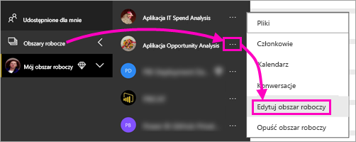
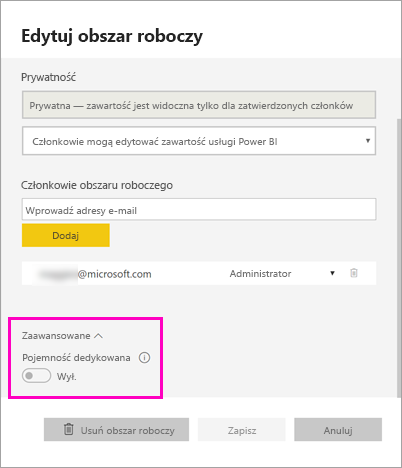
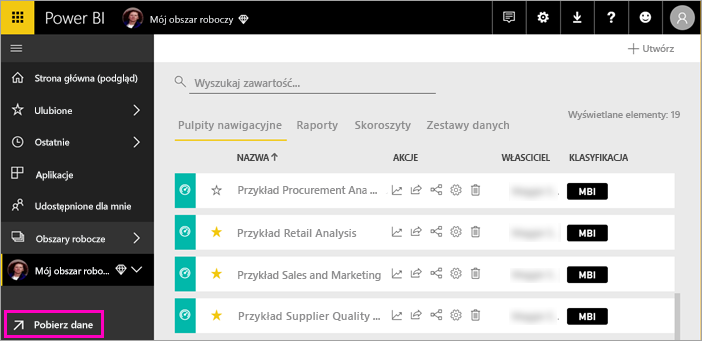
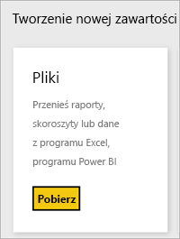
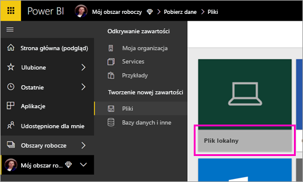
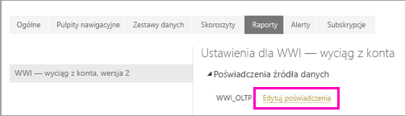
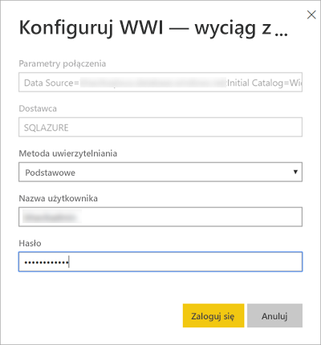
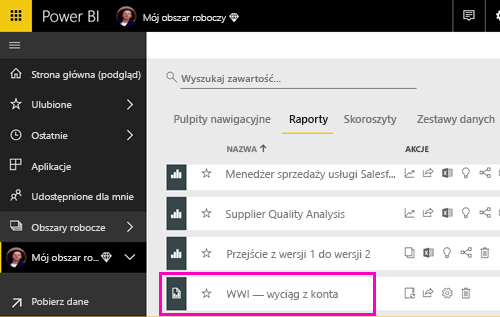
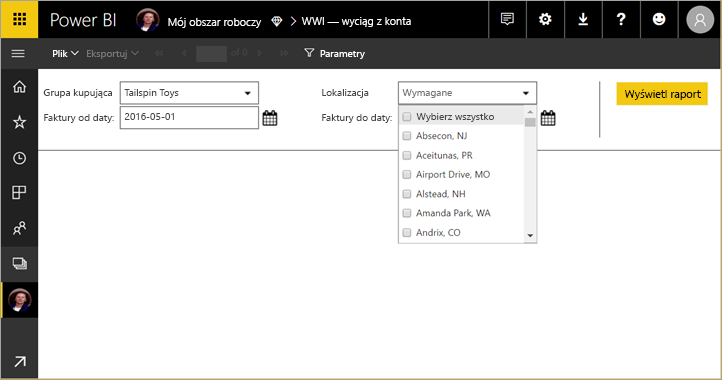
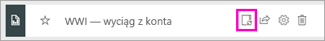

# Publikowanie raportu podzielonego na strony w usłudze Power BI (wersja zapoznawcza)

Z tego artykułu dowiesz się więcej na temat publikowania raportu podzielonego na strony w usłudze Power BI przez przekazanie go z komputera lokalnego. Raporty podzielone na strony można załadować do obszaru Mój obszar roboczy lub innego obszaru roboczego, jeśli obszar roboczy znajduje się w pojemności Premium. Poszukaj ikony diamentu  obok nazwy obszaru roboczego. 

Jeśli źródło danych raportu znajduje się w środowisku lokalnym, należy [utworzyć bramę](#create-a-gateway-to-an-on-premises-data-source) po przekazaniu raportu.

## Dodawanie obszaru roboczego do pojemności Premium

Jeśli obszar roboczy nie ma ikony diamentu  obok nazwy, należy dodać obszar roboczy do pojemności Premium. 

1. Wybierz pozycję **Obszary robocze**, wybierz symbol wielokropka (**...**) znajdujący się obok nazwy obszaru roboczego, a następnie wybierz pozycję **Edytuj obszar roboczy**.

    

1. W oknie dialogowym **Edytowanie obszaru roboczego** rozwiń węzeł **Zaawansowane**, a następnie przesuń suwak **Pojemność dedykowana** do pozycji **Wł.**

    

   Zmiana tego ustawienia może okazać się niemożliwa. W takiej sytuacji skontaktuj się z administratorem pojemności usługi Power BI Premium i poproś go o nadanie Ci praw do przypisywania, dzięki którym zyskasz możliwość dodawania obszaru roboczego do pojemności Premium.

## Przekazywanie raportu podzielonego na strony

1. Utwórz raport podzielony na strony w programie Report Builder i zapisz go na komputerze lokalnym.

1. Otwórz usługę Power BI w przeglądarce i przejdź do obszaru roboczego w wersja Premium, w którym chcesz opublikować raport. Zwróć uwagę na ikonę diamentu  obok nazwy. 

1. Wybierz pozycję **Pobierz dane**.

    

1. W polu **Pliki** wybierz opcję **Pobierz**.

    

1. Wybierz pozycję **Plik lokalny** > przejdź do raportu podzielonego na strony > **Otwórz**.

    

1. Wybierz kolejno pozycje **Kontynuuj** > **Edytuj poświadczenia**.

    

1. Skonfiguruj poświadczenia i wybierz pozycję **Zaloguj się**.

    

   Raport zostanie wyświetlony na liście raportów.

    

1. Wybierz raport, aby otworzyć go w usłudze Power BI. Jeśli raport ma parametry, musisz je wybrać, aby można było wyświetlić raport.
 
    

## Tworzenie bramy

Podobnie jak w przypadku każdego innego raportu usługi Power BI, jeśli źródło danych raportu jest lokalne, w celu uzyskania dostępu do danych należy utworzyć bramę lub połączyć się z nią.

1. Obok nazwy raportu wybierz pozycję **Zarządzaj**.

   

1. Zapoznaj się z artykułem [Instalowanie bramy](service-gateway-install.md) dotyczącym usługi Power BI, aby uzyskać szczegółowe informacje i poznać następne kroki.

### Ograniczenia dotyczące bramy

Obecnie bramy nie obsługują parametrów z wieloma wartościami.

## Następne kroki

- [Wyświetlanie raportu podzielonego na strony w usłudze Power BI](paginated-reports-view-power-bi-service.md)
- [Czym są raporty podzielone na strony w usłudze Power BI Premium? (wersja zapoznawcza)](paginated-reports-report-builder-power-bi.md)

