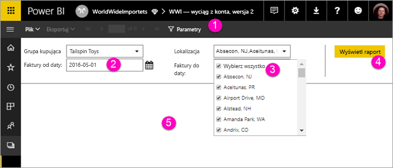

# Wyświetlanie parametrów dla raportów podzielonych na strony w usłudze Power BI (wersja zapoznawcza)

Z tego artykułu dowiesz się, jak pracować z parametrami raportów podzielonych na strony w usłudze Power BI.  Parametr raportu udostępnia sposób filtrowania danych raportu. Parametry oferują listę dostępnych wartości. Można wybrać jedną lub wiele wartości. Czasami parametry mają wartość domyślną, a czasami trzeba wybrać wartość, zanim zobaczysz raport.  

Gdy wyświetlasz raport, który ma parametry, na pasku narzędzi przeglądarki raportów są widoczne poszczególne parametry i możesz interaktywnie podawać ich wartości. Na poniższej ilustracji przedstawiono obszar parametrów raportu z parametrami **Grupa kupująca**, **Lokalizacja**, **Data początkowa** i **Data końcowa**.  

## Okienko parametrów w usłudze Power BI

  
1.  **Okienko parametrów**. Pasek narzędzi przeglądarki raportów zawiera monit, taki jak „Wymagany”, lub wartość domyślną dla każdego parametru.    
  
2.  **Parametry Faktury od/do daty**. Dwa parametry danych mają wartości domyślne. Aby zmienić datę, wpisz datę w polu tekstowym lub wybierz ją w kalendarzu.  
  
3.  **Parametr Lokalizacja**. Parametr Lokalizacja jest ustawiony tak, aby zezwalać na wybranie jednej, wielu lub wszystkich wartości. 
  
4.  **Wyświetl raport**. Po wprowadzeniu lub zmianie wartości parametrów kliknij pozycję **Wyświetl raport** w celu uruchomienia raportu. 

5. **Wartości domyślne**. Jeśli wszystkie parametry mają wartości domyślne, raport jest uruchamiany automatycznie w pierwszym widoku. Niektóre parametry w tym raporcie nie mają wartości domyślnych, dlatego nie zobaczysz raportu, dopóki nie wybierzesz wartości.  

## Następne kroki

[Tworzenie parametrów dla raportów podzielonych na strony w usłudze Power BI](paginated-reports-parameters.md)
