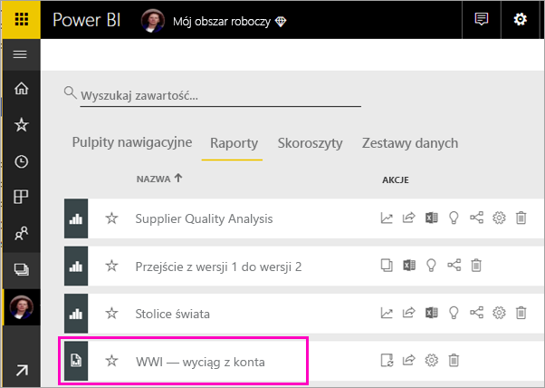
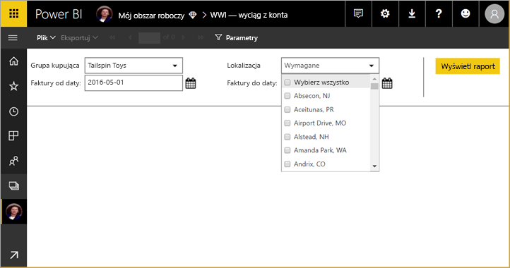
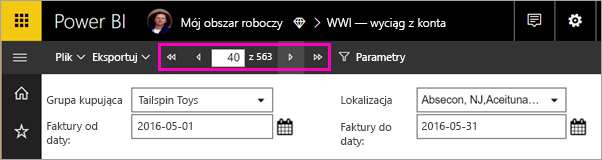
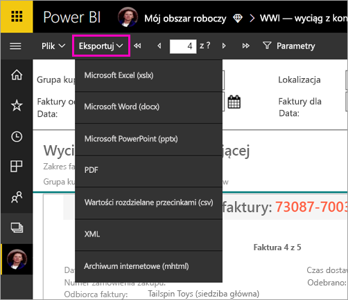

# Wyświetlanie raportu podzielonego na strony w usłudze Power BI

W tym artykule dowiesz się więcej na temat wyświetlania raportu podzielonego na strony w usłudze Power BI. Raporty podzielone na strony to raporty tworzone w programie Report Builder, a następnie przekazywane do obszarów roboczych w pojemności Premium. Poszukaj ikony diamentu  obok nazwy obszaru roboczego. 

Raporty podzielone na strony mają własną ikonę: .

Raporty podzielone na strony można również eksportować do wielu formatów: 

- Microsoft Excel
- Microsoft Word
- Microsoft PowerPoint
- PDF
- Wartości rozdzielane przecinkami
- XML
- Archiwum internetowe (mhtml)

## Wyświetlanie raportu podzielonego na strony

1. Wybierz raport podzielony na strony w obszarze roboczym.

    

2. Jeśli raport ma parametry, tak jak ten, nie będzie on widoczny do momentu pierwszego otwarcia. Wybierz parametry, a następnie wybierz pozycję **Wyświetl raport**. 

     

    Parametry można również zmienić w dowolnym momencie.

1. Aby przeglądać kolejne strony raportu, można wybrać strzałki w górnej części strony lub wpisać numer strony w polu.
    
   

4. Wybierz pozycję **Eksportuj**, aby znaleźć format, do którego będziesz eksportować raporty podzielone na strony.

    

## Następne kroki

[Czym są raporty podzielone na strony w usłudze Power BI Premium? (wersja zapoznawcza)](paginated-reports-report-builder-power-bi.md)
