# Zmiana rozmiaru strony raportu (samouczek)
W [poprzednim artykule i filmie wideo](power-bi-report-display-settings.md) omówiliśmy dwa różne sposoby kontrolowania wyświetlania strony w raportach usługi Power BI: **Widok** i **Rozmiar strony**. Teraz je wypróbujemy.

## Po pierwsze zmienimy ustawienie Widok strony
1. Otwórz raport w widoku odczytu lub edycji. W tym przykładzie użyto strony „Nowe sklepy” [próbnych danych dotyczących analizy handlu detalicznego](sample-retail-analysis.md).  Strona ta jest wyświetlana przy użyciu ustawienia **Dopasuj do strony**.  W tym przypadku opcja Dopasuj do strony wyświetla stronę raportu bez pasków przewijania, ale niektóre szczegóły i tytuły są zbyt małe, żeby dało się je odczytać.
   
   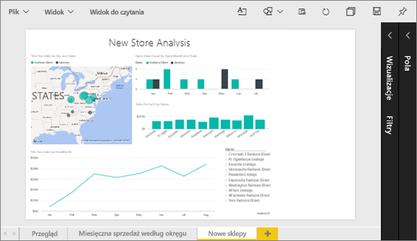
2. Upewnij się, że na kanwie nie wybrano żadnych wizualizacji. Wybierz opcję **Widok** i przejrzyj opcje wyświetlania.

* Widok odczytu będzie następujący.
  
     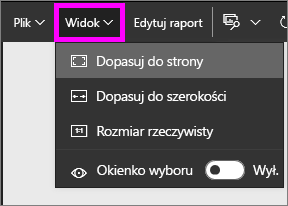
* Widok edycji będzie następujący.
  
    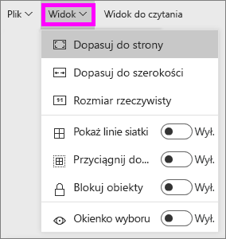

1. Zobaczmy, jak wygląda strona przy użyciu ustawienia **Rozmiar rzeczywisty**.
   
   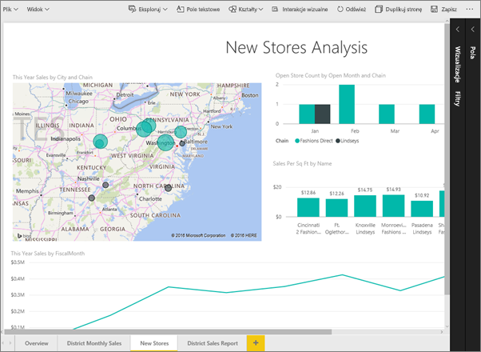
   
   Niezbyt dobrze. Pulpit nawigacyjny ma teraz podwójne paski przewijania.
2. Przełącz się na opcję **Dopasuj do szerokości**.
   
   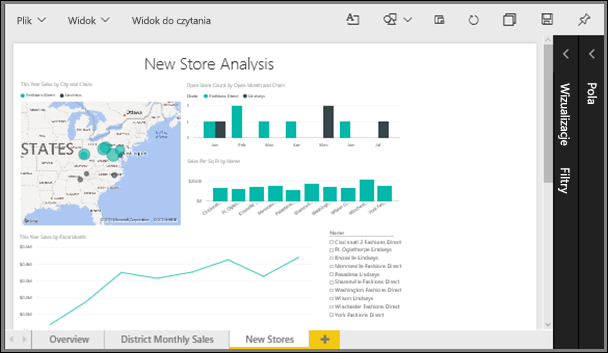
   
   Teraz strona wygląda lepiej. Mamy paski przewijania, ale też łatwiej odczytać szczegóły.

## Zmiana domyślnego widoku strony raportu
Wszystkie raporty usługi Power BI domyślnie wyświetlane są w widoku **Dopasuj do strony**. Co zrobić, jeśli chcesz, aby ta strona raportu zawsze była otwierana w widoku **Rozmiar rzeczywisty**?

1. Na stronie **Nowe sklepy** raportu przełącz się z powrotem na widok **Rozmiar rzeczywisty**.
   
   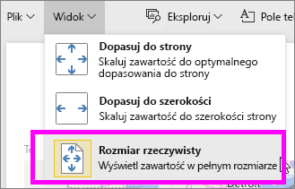
2. Zapisz raport pod inną nazwą, wybierając opcję **Plik > Zapisz jako**. Masz teraz dwie kopie tego raportu; raport oryginalny, **Nowe sklepy** nadal będzie otwierany w widoku domyślnym, ale w przypadku nowego raportu będzie stosowany widok **Rozmiar rzeczywisty**. Sprawdźmy to.
   
   
3. Wybierz nazwę bieżącego obszaru roboczego z górnego paska nawigacyjnego, aby powrócić do tego obszaru roboczego.  
   
   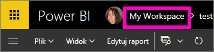
4. Wybierz kartę **Raporty** i wybierz nowy utworzony raport (będzie oznaczony żółtą gwiazdką).
   
    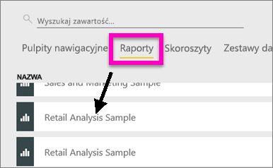
5. Raport zostanie otwarty w widoku **Rozmiar rzeczywisty**.
   
   

## Teraz przyjrzymy się ustawieniom *rozmiaru strony*
Ustawienia rozmiaru strony są dostępne tylko w [Widoku edycji](service-interact-with-a-report-in-editing-view.md). Aby otworzyć raport w widoku edycji, musisz mieć uprawnienia właściciela raportu. W przypadku połączenia z dowolnym z naszych [przykładów](sample-datasets.md) będziesz mieć uprawnienia właściciela do tych raportów.

1. Otwórz stronę „Sprzedaż miesięczna regionu” [próbnych danych dotyczących analizy handlu detalicznego](sample-retail-analysis.md) w widoku edycji.
2. Upewnij się, że na kanwie nie wybrano żadnych wizualizacji.  W okienku **Wizualizacje** wybierz ikonę wałka do malowania .
3. Wybierz opcję **Rozmiar strony** &gt; **Typ**, aby wyświetlić opcje rozmiaru strony.
   
   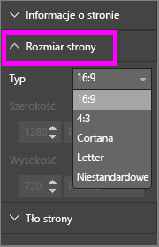
4. Wybierz opcję **Letter**.  Na białej części kanwy pozostanie tylko zawartość mieszcząca się w obszarze 816 × 1056 pikseli (rozmiar Letter).
   
   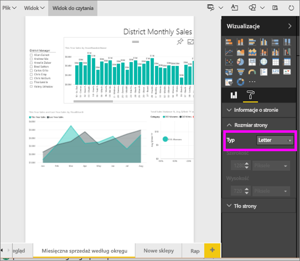
5. Jeśli zmienimy **Widok** na opcję „Dopasuj do szerokości”, nasza kanwa będzie wyświetlać tylko zawartość strony mieszczącą się w rozmiarze Letter.
   
   
6. Wybierz współczynnik **Rozmiar strony** **16:9**.
   
   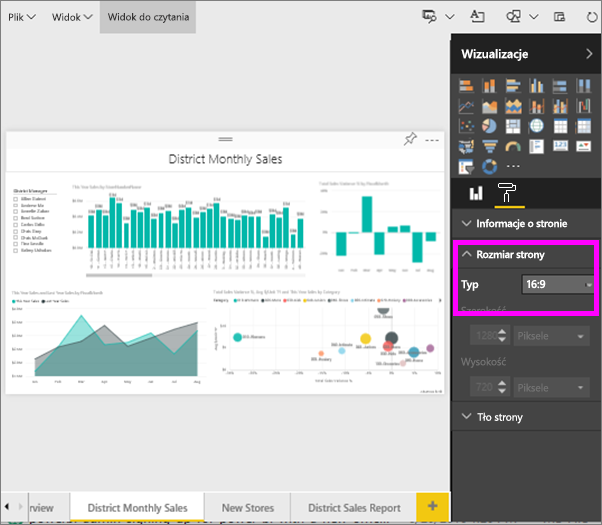
   
   Strona raportu będzie wyświetlana przy użyciu współczynnika 16 (szerokość) do 9 (wysokość). Aby wyświetlić faktyczny rozmiar w pikselach, przyjrzyj się wyszarzonym polom Szerokość i Wysokość (1280 × 720). Jest dużo wolnego miejsca wokół kanwy raportu, ponieważ wcześniej ustawiliśmy **Widok** na opcję „Dopasuj do szerokości”.
7. Kontynuuj eksplorowanie opcji **Rozmiar strony**.

## Używanie połączonych opcji Widok i Rozmiar strony
Użyj opcji Widok i Rozmiar strony w połączeniu, aby utworzyć raport, który będzie wyglądał doskonale po osadzeniu w innej aplikacji.

W tym ćwiczeniu utworzysz stronę raportu, która będzie wyświetlana w aplikacji z dostępnym miejscem 500 pikseli (szerokość) na 750 pikseli (wysokość).

W poprzednim kroku zobaczyliśmy, że nasza strona raportu była wyświetlana w polu o rozmiarze 1280 pikseli (szerokość) na 720 pikseli (wysokość). Wiemy więc, że musimy wykonać wiele działań związanych ze zmianą rozmiaru i organizacją, jeśli chcemy, żeby wszystkie nasze elementy wizualne się zmieściły.

1. Zmień rozmiar i przesuń elementy wizualne tak, aby mieściły się w części mniejszej od połowy obecnego obszaru kanwy.
   
    
2. Wybierz opcję **Rozmiar strony** &gt; **Niestandardowy**.
3. Ustaw Szerokość na wartość 500, a Wysokość na wartość 750.
   
    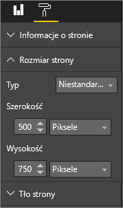
4. Dopasuj stronę raportu, aby wyglądała możliwie najlepiej. Przełącz się między opcjami **Widok > Rozmiar rzeczywisty** i **Widok > Dopasuj do strony**, aby wprowadzać usprawnienia.
   
    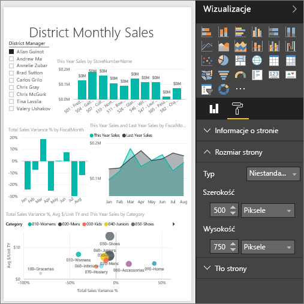

## Następne kroki
[Tworzenie raportów dla Cortany](service-cortana-answer-cards.md)

Powrót do [Ustawienia wyświetlania strony w raporcie usługi Power BI](power-bi-report-display-settings.md)

Przeczytaj więcej na temat [raportów w usłudze Power BI](service-reports.md)

Masz więcej pytań? [Odwiedź społeczność usługi Power BI](http://community.powerbi.com/)

