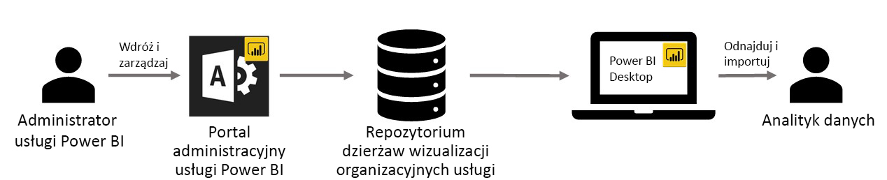

# Korzystanie z wizualizacji niestandardowych organizacji w usłudze Power BI

Niestandardowe elementy wizualne w usłudze Power BI służą do tworzenia unikatowego typu wizualizacji dostosowanych do potrzeb użytkownika lub przedstawianych wyników analiz. Te wizualizacje niestandardowe są często tworzone przez deweloperów, gdy bogaty zestaw elementów wizualnych dostępnych się w usłudze Power BI nie spełnia ich wymagań. 

W niektórych organizacjach wizualizacje niestandardowe mają szczególne znaczenie. Mogą one być niezbędne do przekazania określonych danych lub wyników analiz specyficznych dla organizacji, mogą mieć określone wymagania dotyczące danych lub też wyróżniać metody firm prywatnych. Takie organizacje muszą opracować niestandardowe elementy wizualne, udostępnić je w organizacji oraz zadbać o ich odpowiednie utrzymanie. Niestandardowe elementy wizualne usługi Power BI dają organizacjom taką możliwość.

Na poniższej ilustracji przedstawiono proces przepływu wizualizacji niestandardowych organizacji w usłudze Power BI od administratora przez fazy projektowania i utrzymania aż do analityka danych.

Wizualizacje organizacji są wdrażane i zarządzane przez administratora usługi Power BI w portalu administratora. Po wdrożeniu w repozytorium organizacji użytkownicy mogą łatwo odnajdywać i importować wizualizacje niestandardowe organizacji do swoich raportów bezpośrednio w programie Power BI Desktop.

## Korzystanie z wizualizacji niestandardowych organizacji

Aby dowiedzieć się więcej o sposobach użycia wizualizacji niestandardowych organizacji w utworzonych raportach, zobacz artykuł: [Wizualizacje niestandardowe w usłudze Power BI](power-bi-custom-visuals.md).
 
## Administrowanie wizualizacjami niestandardowymi organizacji

Aby dowiedzieć się więcej na temat sposobu administrowania i zarządzania wizualizacjami niestandardowymi organizacji oraz ich wdrażania, zobacz artykuł zawierający [więcej informacji o wdrażaniu wizualizacji niestandardowych organizacji i zarządzaniu nimi](https://go.microsoft.com/fwlink/?linkid=866790).

> [!WARNING]
> Wizualizacja niestandardowa może zawierać kod stwarzający zagrożenie dla bezpieczeństwa i prywatności. Przed wdrożeniem wizualizacji niestandardowej w repozytorium organizacji upewnij się, że jej autor i źródło należą do zaufanych. 
> 

## Istotne zagadnienia i ograniczenia
 
Istnieje kilka zagadnień i ograniczeń, które trzeba znać.
 
Administrator:

* Starsze wizualizacje niestandardowe (np. wizualizacje niestandardowe, które nie są wbudowane w nowych interfejsach API objętych kontrolą wersji) nie są obsługiwane.

* Jeśli wizualizacja niestandardowa zostanie usunięta z repozytorium, wszystkie istniejące raporty, które z niej korzystają, zakończą renderowanie. Operacja usunięcia z repozytorium jest nieodwracalna. Aby tymczasowo wyłączyć niestandardowy element wizualny, użyj funkcji „Wyłącz”.
 
Użytkownik końcowy:

* Wizualizacje organizacji nie obsługują kolekcji obszarów roboczych usługi Power BI.

* Wizualizacja Visio, wizualizacja PowerApps oraz wizualizacja GlobeMap z platformy handlowej AppSource nie będą renderowane, jeśli zostaną wdrożone za pośrednictwem repozytorium organizacji.
