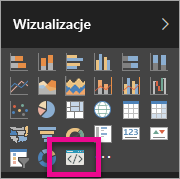

# Rozwiązywanie problemów z wizualizacjami niestandardowymi usługi Power BI

## Debug

**Nie znaleziono polecenia Pbiviz (i podobne błędy)**

Po uruchomieniu polecenia `pbiviz` w wierszu polecenia terminalu powinien zostać wyświetlony ekran pomocy. Jeśli tak nie jest, nie zostało ono poprawnie zainstalowane. Upewnij się, że masz zainstalowaną wersję oprogramowania NodeJS 4.0 lub nowszą.

**Nie można znaleźć wizualizacji debugowania na karcie Wizualizacje**

Wizualizacja debugowania wygląda jak ikona wiersza polecenia na karcie **Wizualizacje**.

Jeśli jej nie widać, sprawdź, czy została włączona w ustawieniach usługi Power BI.

> [!NOTE]
> Wizualizacja debugowania jest aktualnie dostępna tylko w usłudze Power BI, a nie w programie Power BI Desktop ani aplikacji mobilnej. Natomiast spakowana wizualizacja będzie działała wszędzie.

**Nie można skontaktować się z serwerem wizualizacji**

Uruchom serwer wizualizacji, wprowadzając polecenie `pbiviz start` w wierszu polecenia terminalu na poziomie katalogu głównego projektu wizualizacji. Jeśli serwer nie jest uruchomiony, prawdopodobnie nie zainstalowano poprawnie certyfikatów SSL.

Jeśli masz jakieś pytania, uwagi lub problemy, możesz skontaktować się z zespołem pomocy technicznej wizualizacji niestandardowych: *pbicvsupport@microsoft.com* .

## Następne kroki

Aby uzyskać więcej informacji, odwiedź stronę [często zadawanych pytań dotyczących wizualizacji niestandardowych usługi Power BI](power-bi-custom-visuals-faq.md#organizational-custom-visuals).
