# Wizualizacje niestandardowe w usłudze Power BI

Podczas tworzenia lub edytowania raportu usługi Power BI dostępnych jest wiele rodzajów wizualizacji. Te wizualizacje wyświetlane są w okienku **Wizualizacje**. Gdy pobierasz program Power BI Desktop lub otwierasz usługę Power BI (app.powerbi.com), ten zestaw wizualizacji jest już dostępny.

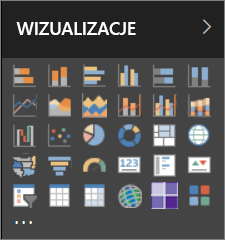

Ale możliwości nie kończą się na tym zestawie wizualizacji. Wybranie wielokropka otwiera kolejne źródło wizualizacji raportów: *wizualizacje niestandardowe*.

Deweloperzy tworzą wizualizacje niestandardowe przy użyciu zestawu SDK wizualizacji niestandardowych, aby umożliwić użytkownikom biznesowym przeglądanie danych w sposób najlepiej odpowiadający ich potrzebom biznesowym. Autorzy raportów mogą następnie importować pliki wizualizacji niestandardowych do swoich raportów i używać ich tak samo, jak pozostałych wizualizacji usługi Power BI. Wizualizacje niestandardowe odgrywają pierwszoplanową rolę w usłudze Power BI. Można je filtrować, wyróżniać, edytować, udostępniać itp.

Wizualizacje niestandardowe mogą występować w postaci trzech kanałów wdrażania:

* Pliki wizualizacji niestandardowych
* Wizualizacje organizacji
* Wizualizacje platformy handlowej

## Pliki wizualizacji niestandardowych

Wizualizacje niestandardowe to pakiety zawierające kod renderowania danych, które są przez nie obsługiwane. Każdy może utworzyć wizualizację niestandardową i spakować ją do jednego pliku `.pbiviz`, który można zaimportować do raportu usługi Power BI.

> [!WARNING]
> Wizualizacja niestandardowa może zawierać kod zagrażający bezpieczeństwu lub prywatności. Przed jej zaimportowaniem do raportu upewnij się, że autor i źródło wizualizacji niestandardowej należą do zaufanych.

## Wizualizacje organizacji

Administratorzy usługi Power BI mogą wdrażać wizualizacje niestandardowe w organizacji, umożliwiając autorom raportów łatwe odnajdowanie i używanie tych wizualizacji, które zostały przez niego zatwierdzone do użycia w organizacji. Dzięki temu administrator może wybierać określone wizualizacje niestandardowe do wdrożenia w organizacji oraz w prosty sposób nimi zarządzać (np. aktualizować wersje, wyłączać je i włączać). Autor raportu zyskuje prosty sposób odnajdowania wizualizacji, które są unikatowe dla organizacji, oraz bezproblemową obsługę aktualizacji wizualizacji.

Aby uzyskać więcej informacji o wizualizacjach niestandardowych organizacji, [przeczytaj więcej na temat wizualizacji organizacji](power-bi-custom-visuals-organization.md).

## Wizualizacje platformy handlowej

Członkowie społeczności oraz firma Microsoft przekazują utworzone przez siebie wizualizacje niestandardowe na rzecz ogółu użytkowników, publikując je na platformie handlowej [AppSource](https://appsource.microsoft.com/en-us/marketplace/apps?product=power-bi-visuals). Te wizualizacje można pobrać i dodać do raportów usługi Power BI. Wszystkie te wizualizacje niestandardowe zostały przetestowane i zatwierdzone przez Microsoft pod kątem funkcjonalności i jakości.

Co to jest usługa [AppSource](developer/office-store.md)? Jest to miejsce, gdzie można znaleźć aplikacje, dodatki i rozszerzenia dla oprogramowania firmy Microsoft. Usługa [AppSource](https://appsource.microsoft.com/en-us/) łączy miliony użytkowników produktów takich jak Office 365, Azure, Dynamics 365, Cortana i Power BI z rozwiązaniami, które pomagają im pracować wydajniej, bardziej wnikliwie lub ładniej niż wcześniej.

### Certyfikowane wizualizacje

Certyfikowane wizualizacje usługi Power BI to wizualizacje platformy handlowej, które przeszły dodatkowe rygorystyczne testy w zakresie jakości i są obsługiwane w dodatkowych scenariuszach, takich jak [subskrypcje powiadomień e-mail](https://docs.microsoft.com/power-bi/service-report-subscribe) i [eksportowanie do programu PowerPoint](https://docs.microsoft.com/power-bi/service-publish-to-powerpoint).
Aby zapoznać się z listą certyfikowanych wizualizacji niestandardowych lub przesłać własne, zobacz [Certyfikowane wizualizacje niestandardowe](https://docs.microsoft.com/power-bi/power-bi-custom-visuals-certified).

Jesteś deweloperem internetowym i chcesz tworzyć własne wizualizacje oraz dodać je do usługi AppSource? Zapoznaj się z artykułem [Tworzenie wizualizacji niestandardowej w usłudze Power BI](developer/custom-visual-develop-tutorial.md) i dowiedz się, jak [publikować wizualizacje niestandardowe w usłudze AppSource](https://appsource.microsoft.com/en-us/marketplace/apps?product=power-bi-visuals).

### Importowanie wizualizacji niestandardowej z pliku

1. Wybierz wielokropek u dołu okienka Wizualizacje.

    

2. Z listy rozwijanej wybierz pozycję **Importuj z pliku**.

    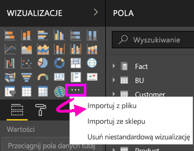

3. W menu Otwórz plik wybierz plik `.pbiviz`, który chcesz zaimportować, a następnie wybierz przycisk Otwórz. Ikona wizualizacji niestandardowej zostanie dodana do dołu okienka Wizualizacje i będzie jej można używać w raporcie.

    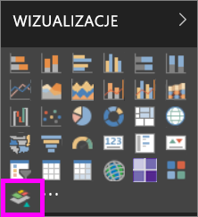

### Importowanie wizualizacji organizacji

1. Wybierz wielokropek u dołu okienka Wizualizacje.

    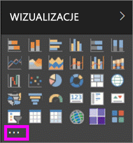

2. Z listy rozwijanej wybierz pozycję Zaimportuj z platformy handlowej.

    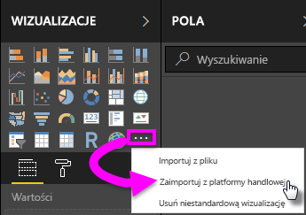

3. W menu górnej karty wybierz pozycję **MOJA ORGANIZACJA**.

    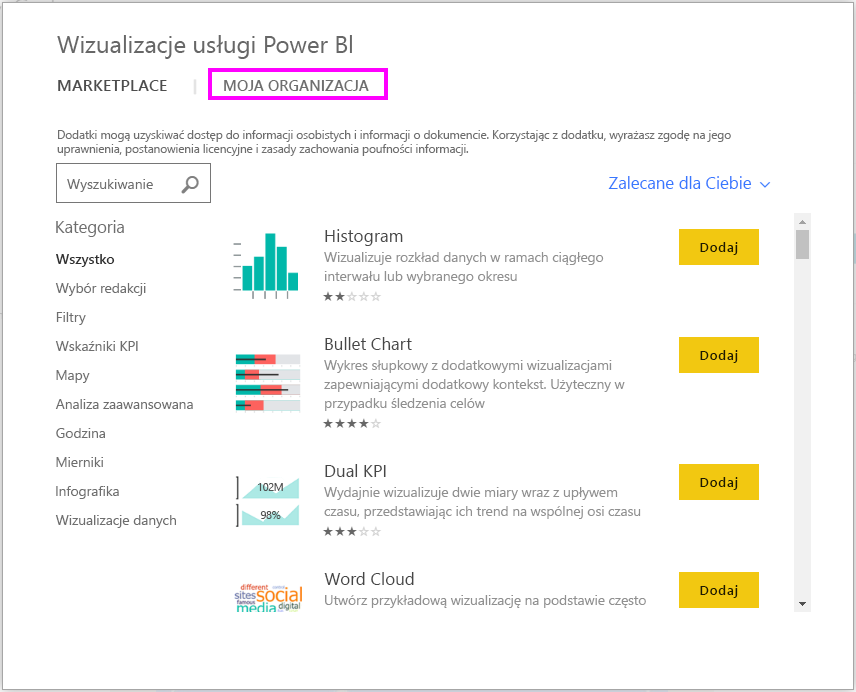

4. Przewiń listę, aby odnaleźć wizualizację, którą chcesz zaimportować.

    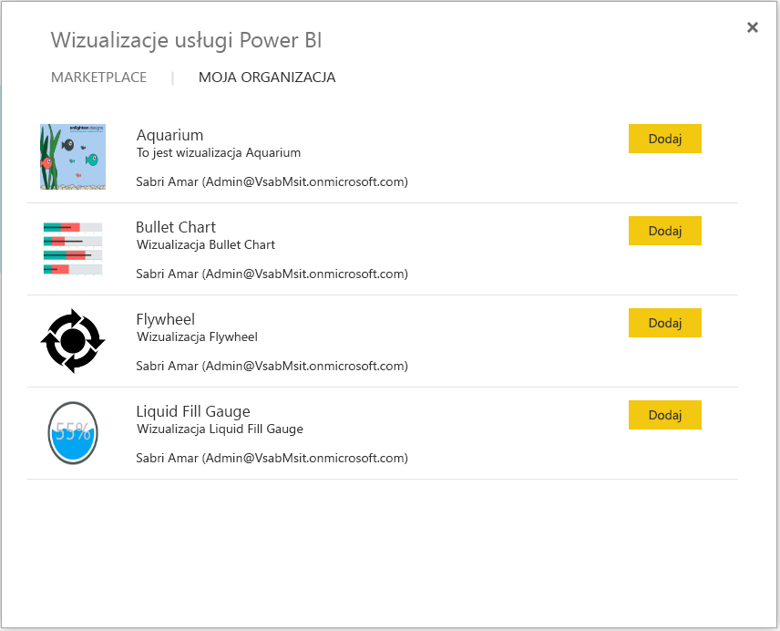

5. Zaimportuj wizualizację niestandardową, wybierając opcję **Dodaj**. Ikona wizualizacji niestandardowej zostanie dodana do dołu okienka Wizualizacje i będzie jej można używać w raporcie.

    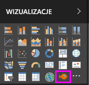

## Pobieranie lub importowanie wizualizacji niestandardowych z usługi AppSource firmy Microsoft

Dostępne są dwie opcje pobierania i importowania wizualizacji niestandardowych: z usługi Power BI i z witryny internetowej AppSource.

### Importowanie wizualizacji w usłudze Power BI

1. Wybierz wielokropek u dołu okienka Wizualizacje.

    

2. Z listy rozwijanej wybierz pozycję **Zaimportuj z platformy handlowej**.

    

3. Przewiń listę, aby odnaleźć wizualizację, którą chcesz zaimportować.

    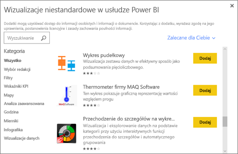

4. Aby dowiedzieć się więcej na temat wizualizacji, wyróżnij ją i wybierz.

    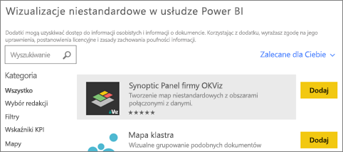

5. Na stronie szczegółów można wyświetlić zrzuty ekranu, wideo, szczegółowy opis i nie tylko.

    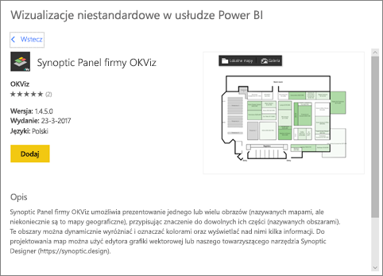

6. Przewiń w dół, aby wyświetlić opinie.

    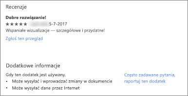

7. Zaimportuj wizualizację niestandardową, wybierając opcję Dodaj. Ikona wizualizacji niestandardowej zostanie dodana do dołu okienka Wizualizacje i będzie jej można używać w raporcie.

    

### Pobieranie i importowanie wizualizacji niestandardowych z witryny AppSource firmy Microsoft

1. Otwórz witrynę [Microsoft AppSource](https://appsource.microsoft.com) i wybierz kartę **Aplikacje**. 

    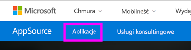

2. Przejdź do [strony wyników aplikacji](https://appsource.microsoft.com/en-us/marketplace/apps), gdzie można wyświetlać najlepsze aplikacje w każdej kategorii, w tym w kategorii *Aplikacje usługi Power BI*. Szukamy jednak wizualizacji niestandardowych, należy więc zawęzić wyniki, wybierając opcję **Wizualizacje usługi Power BI** z listy nawigacji po lewej stronie.

    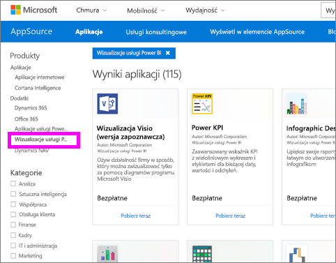

3. Usługa AppSource wyświetla kafelek dla każdej wizualizacji niestandardowej.  Każdy kafelek zawiera migawkę wizualizacji niestandardowej oraz krótki opis i link pobierania. Aby zobaczyć więcej szczegółów, wybierz kafelek.

    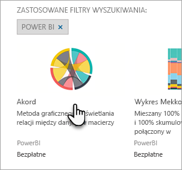

4. Na stronie szczegółów można wyświetlić zrzuty ekranu, wideo, szczegółowy opis i nie tylko. Pobierz wizualizację niestandardową, wybierając opcję **Pobierz teraz** i akceptując warunki użytkowania.

    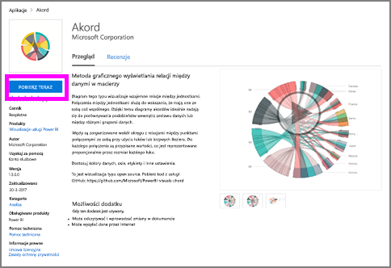

5. Wybierz link, aby pobrać wizualizację niestandardową.

    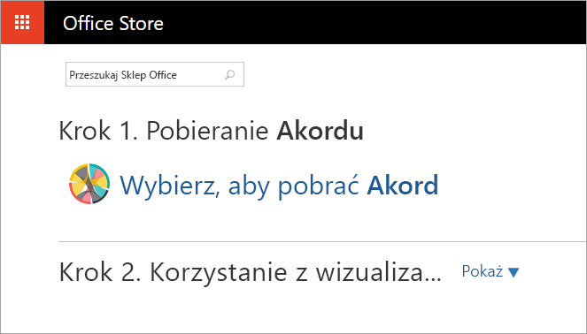

    Strona ta zawiera również instrukcje importowania wizualizacji niestandardowych do programu Power BI Desktop i usługi Power BI.

    Możesz również pobrać przykładowy raport zawierający wizualizację niestandardową, ilustrujący jej możliwości.

    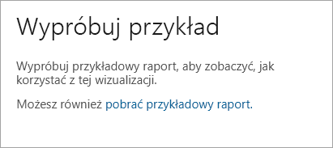

6. Zapisz plik „pbiviz”, a następnie otwórz usługę Power BI.

7. Zaimportuj plik „pbiviz” do raportu (zobacz sekcję [Importowanie wizualizacji niestandardowej z pliku](#import-a-custom-visuals-from-a-file) powyżej)

## Istotne zagadnienia i ograniczenia

* Zaimportowana wizualizacja niestandardowa jest dodawana do konkretnego raportu. Jeśli chcesz użyć wizualizacji w innym raporcie, musisz ją zaimportować również do tego raportu. Po zapisaniu raportu z wizualizacją niestandardową przy użyciu opcji **Zapisz jako** kopia wizualizacji zostaje zapisana wraz z nowym raportem.

* Jeśli nie widzisz okienka **Wizualizacje**, oznacza to, że nie masz uprawnień do edytowania tego raportu.  Wizualizacje możesz dodawać tylko do raportów, które możesz edytować, nie do raportów, które zostały Ci udostępnione.

## Rozwiąż problemy

Aby uzyskać informacje dotyczące rozwiązywania problemów, odwiedź stronę [Rozwiązywanie problemów z wizualizacjami niestandardowymi usługi Power BI](power-bi-custom-visuals-troubleshoot.md).

## Często zadawane pytania

Aby uzyskać więcej informacji i odpowiedzi na pytania, odwiedź stronę [często zadawanych pytań dotyczących wizualizacji niestandardowych usługi Power BI](power-bi-custom-visuals-faq.md#organizational-custom-visuals).

Masz więcej pytań? [Odwiedź Społeczność usługi Power BI](http://community.powerbi.com/).
