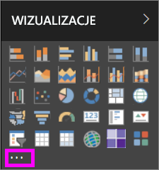

# Wizualizacje niestandardowe w usłudze Power BI
Podczas tworzenia lub edytowania raportu usługi Power BI dostępnych jest wiele rodzajów wizualizacji. Te wizualizacje wyświetlane są w okienku **Wizualizacje**. Gdy pobierasz program Power BI Desktop lub otwierasz usługę Power BI (app.powerbi.com), ten zestaw wizualizacji jest już dostępny. 

Ale możliwości nie kończą się na tym zestawie wizualizacji. Wybranie wielokropka otwiera kolejne źródło wizualizacji raportów: *wizualizacje niestandardowe*.

Wizualizacje niestandardowe są tworzone przez członków społeczności oraz firmę Microsoft i są przechowywane w usłudze [AppSource](https://appsource.microsoft.com/marketplace/apps?product=power-bi-visuals). Te wizualizacje można pobrać i dodać do raportów usługi Power BI. Wszystkie wizualizacje niestandardowe zostały zatwierdzone przez firmę Microsoft i działają podobnie do gotowych wizualizacji dołączonych do usługi Power BI: można je filtrować, wyróżniać, edytować, udostępniać itp. 

Co to jest usługa AppSource? Krótko mówiąc, jest to miejsce, gdzie można znaleźć aplikacje, dodatki i rozszerzenia dla oprogramowania firmy Microsoft. Usługa [AppSource](https://appsource.microsoft.com) łączy miliony użytkowników produktów takich jak Office 365, Azure, Dynamics 365, Cortana i Power BI z rozwiązaniami, które pomagają im pracować wydajniej, bardziej wnikliwie lub ładniej niż wcześniej.

## Dwa typy wizualizacji niestandardowych

Wizualizacje niestandardowe usługi Power BI dostępne w usłudze AppSource dzielą się na 2 kategorie: **zatwierdzone** i **certyfikowane**. Wizualizacje *zatwierdzone w usłudze AppSource* mogą być uruchamiane w przeglądarkach, raportach i pulpitach nawigacyjnych.  Wizualizacje *certyfikowane w usłudze Power BI* przeszły rygorystyczne testy i są obsługiwane w dodatkowych scenariuszach, takich jak [subskrypcje e-mail](service-report-subscribe.md) i [eksportowanie do programu PowerPoint](service-publish-to-powerpoint.md).

Aby zapoznać się z listą certyfikowanych wizualizacji niestandardowych lub przesłać własne, zobacz [Certyfikowane wizualizacje niestandardowe](power-bi-custom-visuals-certified.md).

Jesteś deweloperem internetowym i chcesz tworzyć własne wizualizacje oraz dodać je do usługi AppSource?  Zapoznaj się z artykułem [Wprowadzenie do narzędzi deweloperskich](service-custom-visuals-getting-started-with-developer-tools.md) i dowiedz się, jak [publikować wizualizacje niestandardowe w usłudze AppSource](https://appsource.microsoft.com/marketplace/apps?product=power-bi-visuals).

## Pobieranie lub importowanie wizualizacji niestandardowych z usługi AppSource firmy Microsoft
Dostępne są dwie opcje pobierania i importowania wizualizacji niestandardowych: z usługi Power BI i z witryny internetowej AppSource. 

###    Importowanie wizualizacji w usłudze Power BI
1. Wybierz wielokropek u dołu okienka Wizualizacje. 

    

2. Z listy rozwijanej wybierz polecenie **Zaimportuj ze sklepu**.

    

3. Przewiń listę, aby odnaleźć wizualizację, którą chcesz zaimportować. 

    

4.  Aby dowiedzieć się więcej na temat wizualizacji, wyróżnij ją i wybierz.

    

5.  Na stronie szczegółów można wyświetlić zrzuty ekranu, wideo, szczegółowy opis i nie tylko. 

    

6. Przewiń w dół, aby wyświetlić opinie.

    

7.    Zaimportuj wizualizację niestandardową, wybierając opcję **Dodaj**. Ikona wizualizacji niestandardowej zostanie dodana do dołu okienka Wizualizacje i będzie jej można używać w raporcie.

       

###    Pobieranie i importowanie wizualizacji niestandardowych z witryny AppSource firmy Microsoft

1. Otwórz witrynę [Microsoft AppSource](https://appsource.microsoft.com) i wybierz kartę **Aplikacje**. 

    

2. Spowoduje to przejście do [strony wyników aplikacji](https://appsource.microsoft.com/en-us/marketplace/apps), gdzie można wyświetlać najlepsze aplikacje w każdej kategorii, w tym w kategorii *Aplikacje usługi Power BI*. Szukamy jednak wizualizacji niestandardowych, należy więc zawęzić wyniki, wybierając opcję **Wizualizacje usługi Power BI** z listy nawigacji po lewej stronie.

    

3. Usługa AppSource wyświetla kafelek dla każdej wizualizacji niestandardowej.  Każdy kafelek zawiera migawkę wizualizacji niestandardowej oraz krótki opis i link pobierania. Aby zobaczyć więcej szczegółów, wybierz kafelek. 

    

4. Na stronie szczegółów można wyświetlić zrzuty ekranu, wideo, szczegółowy opis i nie tylko. Pobierz wizualizację niestandardową, wybierając opcję **Pobierz teraz** i zgadzając się na warunki użytkowania. 

    

5. Wybierz link, aby pobrać wizualizację niestandardową.

    

    Strona ta zawiera również instrukcje importowania wizualizacji niestandardowych do programu Power BI Desktop i usługi Power BI.

    Możesz również pobrać przykładowy raport zawierający wizualizację niestandardową, ilustrujący jej możliwości.

    

6. Zapisz plik pbiviz, a następnie otwórz usługę Power BI.    
7. Otwórz raport, w którym chcesz dodać wizualizację niestandardową, i w dolnej części okienka **Wizualizacje** wybierz wielokropek, a następnie opcję **Importuj z pliku**.  

      

8. Wybierz plik z wizualizacją niestandardową, aby dodać ikonę tej wizualizacji niestandardowej do dołu okienka **Wizualizacje**. Wizualizacji niestandardowej można teraz użyć w raporcie.

    
    
##    Istotne zagadnienia i rozwiązywanie problemów

- Zaimportowana wizualizacja niestandardowa jest dodawana do konkretnego raportu. Jeśli chcesz użyć wizualizacji w innym raporcie, musisz ją zaimportować również do tego raportu. Po zapisaniu raportu z wizualizacją niestandardową przy użyciu opcji **Zapisz jako** kopia wizualizacji zostaje zapisana wraz z nowym raportem.

- Jeśli nie widzisz okienka **Wizualizacje**, oznacza to, że nie masz uprawnień do edytowania tego raportu.  Wizualizacje możesz dodawać tylko do raportów, które możesz edytować, nie do raportów, które zostały Ci udostępnione.

Masz więcej pytań? [Odwiedź społeczność usługi Power BI](http://community.powerbi.com/)

