# Zapoznaj się z przewodnikiem dotyczącym okienka filtrów raportu
Ten artykuł szczegółowo opisuje okienko Filtry raportu. Okienko zostanie wyświetlone w [widoku do edycji i widoku do czytania usługi Power BI](service-reading-view-and-editing-view.md) oraz [widoku raportu w programie Power BI Desktop](desktop-report-view.md).

Istnieje wiele sposobów, aby filtrować dane w usłudze Power BI i zalecamy zapoznać się najpierw z artykułem [Informacje o filtrach i wyróżnianiu](power-bi-reports-filters-and-highlighting.md).

## Praca z filtrami
Raporty można otwierać w [widoku do edycji lub widoku do czytania](service-reading-view-and-editing-view.md). W widoku do edycji właściciel raportu może [dodawać filtry do raportu](power-bi-report-add-filter.md). Te filtry są zapisywane razem z raportem. Osoby wyświetlające raport w widoku do czytania mogą wchodzić w interakcje z filtrami, nie mogą jednak zapisywać zmian filtrów w raporcie.

## Filtry w widoku do czytania
Po otwarciu raportu w widoku do czytania okienko Filtry będzie wyświetlane wzdłuż prawej strony kanwy raportu. Jeśli okienko nie jest widoczne, wybierz strzałkę w prawym górnym rogu, aby je rozwinąć.

W tym przykładzie wybraliśmy wizualizację, która ma 6 filtrów. Strona raportu ma także filtry wyświetlane w pozycji **Filtry na poziomie strony**. Istnieje też jeden [filtr przeglądania szczegółowego](power-bi-report-add-filter.md), zaś cały raport ma też filtr: **FiscalYear** to 2013 lub 2014.

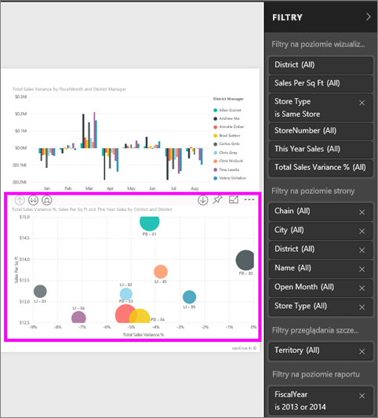

Obok nazwy niektórych filtrów wyświetla się słowo **Wszystkie**, co oznacza, że filtr uwzględnia wszystkie wartości.  Na przykład wartość **Chain (Wszystkie)** na poniższym zrzucie ekranu informuje nas, że ta strona raportu uwzględnia dane dotyczące wszystkich sieci sklepów.  Z drugiej strony filtr na poziomie strony **FiscalYear to 2013 lub 2014** informuje nas, że raport uwzględnia tylko dane za lata obrachunkowe 2013 i 2014.

Każda osoba wyświetlająca ten raport może wchodzić w interakcje z tymi filtrami.

* Wyświetlenie szczegółów filtru przez umieszczenie nad nim kursora i wybranie strzałki obok filtru.
  
   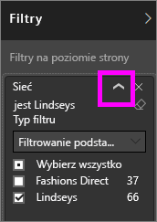
* Zmiana filtru, na przykład zmiana sieci z **Lindseys** na **Fashions Direct**.
  
     
* Usunięcie filtru przez wybranie symbolu **x** obok jego nazwy.
  
  Usunięcie filtru spowoduje usunięcie go z listy, ale nie spowoduje usunięcia danych z raportu.  Jeśli na przykład usuniesz filtr **FiscalYear to 2013 lub 2014**, dane roku obrachunkowego pozostaną w raporcie, ale nie będzie on już filtrowany, aby wyświetlać tylko dane dla roku 2013 i 2014. Będą wyświetlane dane dostępne dla wszystkich lat obrachunkowych.  Jednak po usunięciu filtru nie będzie można go modyfikować, ponieważ zostanie usunięty z listy. Lepszym rozwiązaniem jest wyczyszczenie filtru przy użyciu ikony gumki .
  
  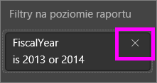

## Filtry w widoku do edycji
Po otwarciu raportu w widoku do edycji okienko Filtry będzie wyświetlane wzdłuż prawej strony kanwy raportu w dolnej części okienka **Wizualizacja**. Jeśli okienko nie jest widoczne, wybierz strzałkę w prawym górnym rogu, aby je rozwinąć.

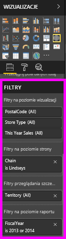  

Jeśli na kanwie nie wybrano wizualizacji, okienko Filtry będzie zawierać tylko filtry dotyczące całej strony raportu lub całego raportu, a także filtry przeglądania szczegółowego (jeśli zostały ustawione). W poniższym przykładzie nie została wybrana wizualizacja, nie ma także filtrów na poziomie strony ani filtrów przeglądania szczegółowego, za to widoczny jest filtr na poziomie raportu.  

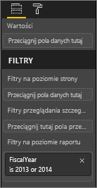  

Po wybraniu wizualizacji na kanwie wyświetlone zostaną także filtry mające zastosowanie tylko do tej wizualizacji:   

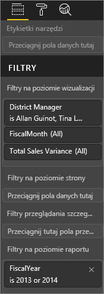

Aby wyświetlić opcje dla konkretnego filtru, wybierz strzałkę w dół obok jego nazwy.  W poniższym przykładzie dla filtru na poziomie raportu wybrano wartości 2013 i 2014. To przykład **filtrowania podstawowego**.  Aby wyświetlić opcje zaawansowane, wybierz pozycję **Filtrowanie zaawansowane**.

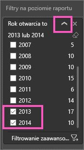

## Czyszczenie filtru
 W zaawansowanym lub podstawowym trybie filtrowania wybierz ikonę gumki , aby zresetować filtr. 

## Dodawanie filtru
* W widoku do edycji dodaj filtr do wizualizacji, strony, przeglądania szczegółowego lub raportu, zaznaczając pole w okienku Pola i przeciągając je do odpowiedniego obszaru filtrów, gdzie widać słowa **Przeciągnij pola tutaj**. Po dodaniu pola jako filtru dostosuj go za pomocą kontrolek Filtrowanie podstawowe i Filtrowanie zaawansowane (opisanych poniżej).

- **Przeciągnięcie nowego pola do obszaru Filtry na poziomie wizualizacji nie powoduje dodania tego pola do wizualizacji**, pozwala jednak filtrować wizualizację za pomocą tego nowego pola. W poniższym przykładzie pole **Chain** zostało dodane jako nowy filtr do wizualizacji. Zwróć uwagę, że samo dodanie pola **Chain** jako filtru nie zmienia wizualizacji, dopóki nie użyjesz kontrolek Filtrowanie podstawowe i Filtrowanie zaawansowane.

    

* Wszystkie pola użyte do utworzenia wizualizacji są także dostępne jako filtry. Wybierz wizualizację, aby ją uaktywnić. Pola, które są używane w wizualizacji, są wyświetlane w okienku Wizualizacje (jeśli korzystasz z widoku do edycji) i w okienku Filtry w obszarze **Filtry na poziomie wizualizacji**.
  
   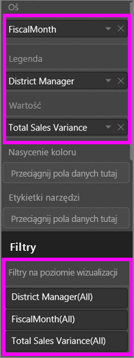  
  
   Dowolne pola możesz dostosować za pomocą kontrolek Filtrowanie podstawowe i Filtrowanie zaawansowane (opisanych poniżej).

## Typy filtrów: filtry pól tekstowych
### Tryb listy
Zaznaczenie pola wyboru powoduje wybranie lub anulowanie wyboru wartości. Pola wyboru **Wszystkie** można użyć do przełączenia stanu (zaznaczenia lub usunięcia zaznaczenia) wszystkich pól wyboru. Pola wyboru reprezentują wszystkie dostępne wartości dla danego pola.  Dostosowanie filtru powoduje aktualizację instrukcji w oparciu o wybrane opcje. 

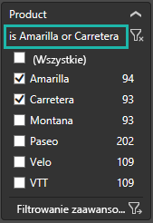

Zwróć uwagę na zmianę instrukcji na „to Amarilla lub Carretera”

### Tryb zaawansowany
Wybierz pozycję **Filtrowanie zaawansowane**, aby przejść do trybu zaawansowanego. Wskaż pola do uwzględnienia za pomocą kontrolek list rozwijanych i pól tekstowych. Wybierając pozycję **I** albo **Lub**, można tworzyć złożone wyrażenia filtrowania. Po ustawieniu odpowiednich wartości wybierz przycisk **Zastosuj filtr**.  

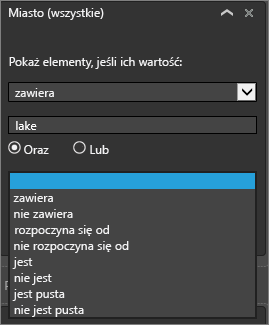

## Typy filtrów: filtry pól liczbowych
### Tryb listy
Jeśli wartości są wartościami skończonymi, po wybraniu nazwy pola zostanie wyświetlona lista.  Zobacz **Filtry pól testowych** &gt; **Tryb listy** powyżej, aby uzyskać pomoc dotyczącą używania pól wyboru.   

### Tryb zaawansowany
Jeśli wartości są wartościami nieskończonymi lub reprezentują zakres, po wybraniu nazwy pola zostanie otwarty zaawansowany tryb filtru. Określ zakres wartości, które mają być wyświetlane, za pomocą listy rozwijanej i pól tekstowych. 

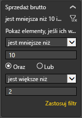

Wybierając pozycję **I** albo **Lub**, można tworzyć złożone wyrażenia filtrowania. Po ustawieniu odpowiednich wartości wybierz przycisk **Zastosuj filtr**.

## Typy filtrów: data i godzina
### Tryb listy
Jeśli wartości są wartościami skończonymi, po wybraniu nazwy pola zostanie wyświetlona lista.  Zobacz **Filtry pól testowych** &gt; **Tryb listy** powyżej, aby uzyskać pomoc dotyczącą używania pól wyboru.   

### Tryb zaawansowany
Jeśli wartości pól reprezentują datę lub godzinę, przy użyciu filtrów daty/godziny można określić czas rozpoczęcia i zakończenia.  

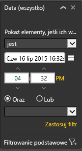

## Następne kroki
[Filtry i wyróżnianie w raportach](power-bi-reports-filters-and-highlighting.md)  
[Interakcja z filtrami i wyróżnianie w widoku do czytania raportu](service-reading-view-and-editing-view.md)  
[Tworzenie filtrów w widoku do edycji](power-bi-report-add-filter.md)  
[Zmiana sposobu wzajemnego filtrowania i wyróżniania krzyżowego wizualizacji raportu](service-reports-visual-interactions.md)

Przeczytaj więcej na temat [raportów w usłudze Power BI](service-reports.md)  
[Power BI — podstawowe pojęcia](service-basic-concepts.md)

Masz więcej pytań? [Odwiedź społeczność usługi Power BI](http://community.powerbi.com/)

