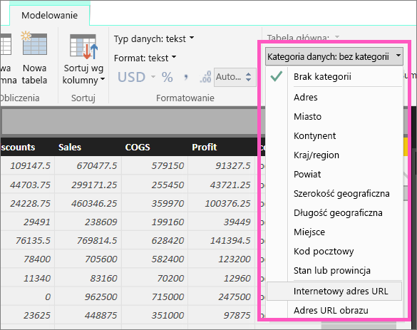
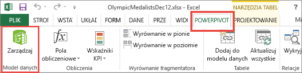
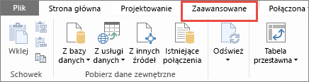
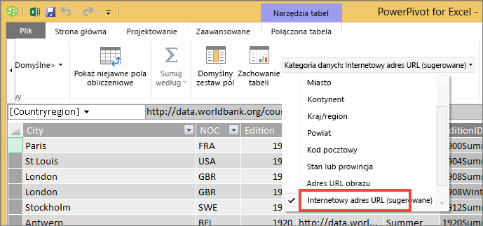

# Hiperlinki w tabelach
W tym temacie opisano, jak tworzyć hiperlinki, używając programu Power BI Desktop. Po utworzeniu hiperlinków można je dodawać do tabel i macierzy raportu za pomocą programu Desktop lub usługi Power BI. 

> **Uwaga**: hiperlinki w [kafelkach na pulpitach nawigacyjnym](service-dashboard-edit-tile.md) i [polach tekstowych na pulpitach nawigacyjnych](service-dashboard-add-widget.md) mogą być tworzone na bieżąco przy użyciu usługi Power BI. Hiperlinki w [polach tekstowych w raportach](service-add-hyperlink-to-text-box.md) mogą być tworzone na bieżąco przy użyciu usługi Power BI i programu Power BI Desktop.
> 
> 

## Tworzenie hiperlinku w tabeli lub macierzy przy użyciu programu Power BI Desktop
Hiperlinki w tabelach i macierzach mogą być tworzone w programie Power BI Desktop, ale nie z poziomu usługi Power BI. Hiperlinki mogą być również tworzone przy użyciu dodatku Power Pivot dla programu Excel przed zaimportowaniem skoroszytu do usługi Power BI. Obie metody zostały opisane poniżej.

## Tworzenie hiperlinku macierzy lub tabeli w programie Power BI Desktop
Procedura dodawania hiperlinku zależy od tego, czy dane zostały zaimportowane, czy też połączenie z nimi odbywa się przy użyciu zapytania bezpośredniego. Poniżej opisano oba scenariusze.

### W przypadku danych zaimportowanych do usługi Power BI
1. Jeśli hiperlink nie został jeszcze utworzony jako pole w zestawie danych, użyj programu Desktop, aby dodać go jako [kolumnę niestandardową](desktop-common-query-tasks.md).
2. W widoku danych zaznacz kolumnę, a następnie na karcie **Modelowanie** wybierz listę rozwijaną **Kategoria danych**.
   
    
3. Wybierz pozycję **Internetowy adres URL**.
4. Przełącz się do widoku raportu i utwórz tabelę lub macierz, korzystając z pola z kategorią Internetowy adres URL. Hiperlinki będą podkreślone i w kolorze niebieskim.
    
> **UWAGA**: adresy URL muszą zaczynać się od **http://, https://** lub **www**.
> 
>   
5. Jeśli nie chcesz wyświetlać długiego adresu URL w tabeli, możesz zamiast tego wyświetlić ikonę hiperlinku . Należy pamiętać, że nie można wyświetlać ikon w macierzach.
   
   * Wybierz wykres, aby go uaktywnić.
   * Wybierz ikonę wałka do malowania , aby otworzyć kartę Formatowanie.
   * Rozwiń pozycję **Wartości**, zlokalizuj **adres URL ikony** i zmień ustawienie na **Włączony**.
6. (Opcjonalnie) [Opublikuj raport z programu Power BI Desktop do usługi Power BI](guided-learning/publishingandsharing.yml?tutorial-step=2) i otwórz raport w usłudze Power BI. Hiperlinki będą działać także tam.

### W przypadku danych połączonych przy użyciu zapytania bezpośredniego
W trybie zapytania bezpośredniego nie można utworzyć nowej kolumny.  Jeśli jednak dane zawierają już adresy URL, można przekształcić je w hiperlinki.

1. W widoku raportu utwórz tabelę za pomocą pola, które zawiera adresy URL.
2. Zaznacz kolumnę, a następnie na karcie **Modelowanie** wybierz listę rozwijaną **Kategoria danych**.
3. Wybierz pozycję **Internetowy adres URL**. Hiperlinki będą podkreślone i w kolorze niebieskim.
4. (Opcjonalnie) [Opublikuj raport z programu Power BI Desktop do usługi Power BI](guided-learning/publishingandsharing.yml?tutorial-step=2) i otwórz raport w usłudze Power BI. Hiperlinki będą działać także tam.

## Tworzenie hiperlinku macierzy lub tabeli przy użyciu dodatku Power Pivot dla programu Excel
Innym sposobem, aby dodać hiperlinki do tabel i macierzy usługi Power BI, jest utworzenie hiperlinków w zestawie danych przed jego zaimportowaniem/połączeniem się z tym zestawem z usługi Power BI. W tym przykładzie użyto skoroszytu programu Excel.

1. Otwórz skoroszyt w programie Excel.
2. Wybierz kartę **PowerPivot**, a następnie wybierz pozycję **Zarządzaj**.
   
   
3. Po otwarciu programu PowerPivot wybierz kartę **Zaawansowane**.
   
   
4. Umieść kursor w kolumnie zawierającej adresy URL, które chcesz zamienić na hiperlinki w tabelach usługi Power BI.
   
   > **UWAGA**: adresy URL muszą zaczynać się od **http://, https://** lub **www**.
   > 
   > 
5. W grupie **Właściwości raportów** wybierz listę rozwijaną **Kategoria danych** i wybierz pozycję **Internetowy adres URL**. 
   
   
6. Z poziomu usługi Power BI lub programu Power BI Desktop nawiąż połączenie z tym skoroszytem lub zaimportuj go.
7. Utwórz wizualizację tabeli, która zawiera pole adresu URL.
   
   

## Istotne zagadnienia i rozwiązywanie problemów
Pytanie: czy można użyć niestandardowego adresu URL jako hiperlinku w tabeli lub macierzy?    
Odpowiedź: nie. Można użyć ikony łącza. Jeśli potrzebujesz niestandardowego tekstu dla hiperlinków, a Twoja lista adresów URL jest krótka, rozważ użycie pola tekstowego.

## Następne kroki
[Wizualizacje w raportach usługi Power BI](visuals/power-bi-report-visualizations.md)

[Power BI — podstawowe pojęcia](service-basic-concepts.md)

Masz więcej pytań? [Odwiedź społeczność usługi Power BI](http://community.powerbi.com/)

