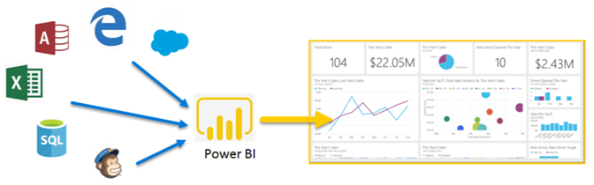
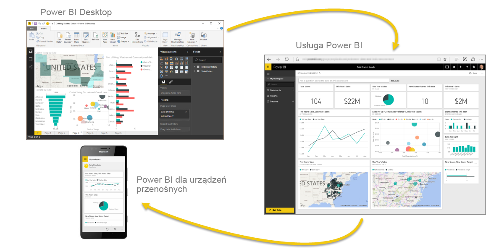
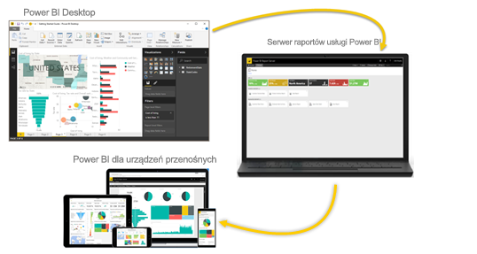

# Co to jest usługa Power BI?
Usługa **Power BI** to zbiór usług oprogramowania, aplikacji i łączników, które działają razem, aby przekształcić niepowiązane źródła danych w spójne, atrakcyjne wizualnie i interaktywne analizy. Niezależnie od tego, czy dane to prosty arkusz kalkulacyjny programu Excel, czy też kolekcja chmurowych i lokalnych hybrydowych hurtowni danych, usługa **Power BI** umożliwia łatwe łączenie ze źródłami danych, wizualizowanie (lub odnajdywanie) ważnych informacji i udostępnianie ich wszystkim wybranym osobom.

Usługa **Power BI** może być szybka i prosta — pozwalając na szybki wgląd w szczegółowe dane pochodzące z arkusza kalkulacyjnego programu Excel lub lokalnej bazy danych. Lecz usługa **Power BI** jest także niezawodna i gotowa do pracy w przedsiębiorstwie obejmującej intensywne modelowanie i analizy w czasie rzeczywistym, a także niestandardowe programowanie. Dlatego może być osobistym narzędziem do raportowania i wizualizacji, a także służyć jako aparat obsługujący analizy i proces podejmowania decyzji na potrzeby grupy projektów, działów lub całych firm.

## Elementy usługi Power BI
Usługa Power BI składa się z aplikacji klasycznej systemu Windows o nazwie **Power BI Desktop**, usługi online typu SaaS (*oprogramowanie jako usługa*) o nazwie **Power BI** oraz **aplikacji** mobilnych Power BI dostępnych dla telefonów i tabletów z systemem Windows, a także dla urządzeń z systemami iOS i Android.

Te trzy elementy — **aplikacja klasyczna**, **usługa** i **aplikacje mobilne** — zaprojektowano tak, aby umożliwić użytkownikom tworzenie, udostępnianie i używanie analiz biznesowych w sposób najbardziej efektywny dla nich lub ról, które pełnią.

## Jak usługa Power BI dopasowuje się do Twojej roli
Sposób używania usługi Power BI może zależeć od Twojej roli w projekcie lub zespole. A inne osoby, w innych rolach, mogą używać usługi Power BI inaczej i także skutecznie.

Na przykład możesz używać przede wszystkim **usługi Power BI**, lecz Twój współpracownik zagłębiony w liczbach i raportach biznesowych może intensywnie korzystać z programu **Power BI Desktop** (i publikować z niego raporty do usługi Power BI, z którymi następnie Ty się zapoznajesz). Inny współpracownik, w dziale sprzedaży, może używać głównie aplikacji Power BI dla telefonu do monitorowania postępu realizacji planów sprzedaży i analizowania nowych potencjalnych klientów.

Jeśli jesteś deweloperem, możesz użyć interfejsów API usługi Power BI do wypychania danych do zestawów danych lub osadzania pulpitów nawigacyjnych i raportów we własnych niestandardowych aplikacjach. Masz pomysł na nową wizualizację? Skompiluj ją samodzielnie i udostępnij innym użytkownikom.  

Możesz także korzystać z każdego z elementów usługi **Power BI** w innym czasie, w zależności od celu pracy lub roli w danym projekcie lub przedsięwzięciu.

Być może przeglądasz zapasy i postęp produkcji za pomocą pulpitu nawigacyjnego w czasie rzeczywistym w usłudze, a także używasz programu **Power BI Desktop** do tworzenia raportów dotyczących statystyki zaangażowania klientów dla zespołu. Sposób korzystania z usługi Power BI może zależeć od tego, która funkcja lub usługa środowiska Power BI jest najlepsza w danej sytuacji, lecz wszystkie one są dostępne dla Ciebie — i dlatego to środowisko jest takie elastyczne i atrakcyjne.

Aby zapoznać się z dokumentami, które odnoszą się do Twojej roli:
- Usługa Power BI dla [***projektantów***](desktop-what-is-desktop.md)
- Usługa Power BI dla [***użytkowników***](consumer/end-user-consuming.md)
- Usługa Power BI dla [***deweloperów***](developer/what-can-you-do.md)
- Usługa Power BI dla [***administratorów***](service-admin-administering-power-bi-in-your-organization.md)

## Przepływ pracy w usłudze Power BI
Wspólny przepływ pracy w usłudze Power BI rozpocznie się po połączeniu ze źródłami danych i utworzeniu raportu w programie **Power BI Desktop**. Raport ten jest następnie publikowany z programu **Desktop** do **usługi Power BI** i udostępniany w taki sposób, aby użytkownicy **usługi** i **urządzeń przenośnych** mogli *korzystać* z raportu (wyświetlać go i pracować z nim).
Czasami może zajść potrzeba nadania współpracownikom uprawnień podobnych do Twoich (uprawnień *twórcy*). Dzięki temu będą oni mogli używać **usługi** do edytowania raportów, tworzenia pulpitów nawigacyjnych, a także udostępniania swojej pracy.

Nie zawsze dzieje się to w ten sposób, mimo że jest to jeden z najpopularniejszych przepływów pracy, który pokazuje, jak trzy główne elementy usługi Power BI wzajemnie się uzupełniają.

A jeśli jeszcze nie wszystko jest gotowe do przeniesienia do chmury i chcesz przechowywać raporty za zaporą firmową?  Kontynuuj czytanie.

## Raportowanie w środowisku lokalnym przy użyciu serwera raportów usługi Power BI
Tworzenie i wdrażanie raportów dla urządzeń przenośnych i raportów z podziałem na strony usługi Power BI oraz zarządzanie nimi lokalnie przy użyciu wielu gotowych do użycia narzędzi i usług zapewnianych przez Serwer raportów usługi Power BI.

Serwer raportów usługi Power BI to rozwiązanie wdrażane za zaporą, które dostarcza raporty do odpowiednich użytkowników na różne sposoby: wyświetlając je w przeglądarce internetowej, na urządzeniu przenośnym lub w postaci wiadomości e-mail. W związku z tym, że serwer raportów usługi Power BI jest zgodny z usługą Power BI w chmurze, możesz przenieść swoje środowisko pracy do chmury, gdy będzie gotowe.

## Następne kroki
[Logowanie, pobieranie danych i zapoznawanie się z usługą Power BI](service-the-new-power-bi-experience.md)   
[Samouczek: wprowadzenie do usługi Power BI](service-get-started.md)
