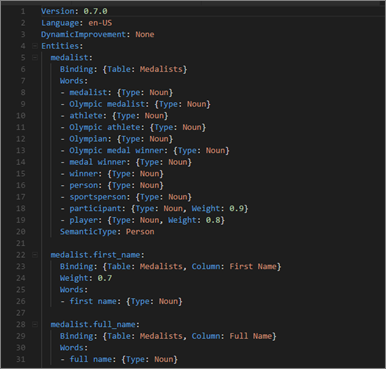
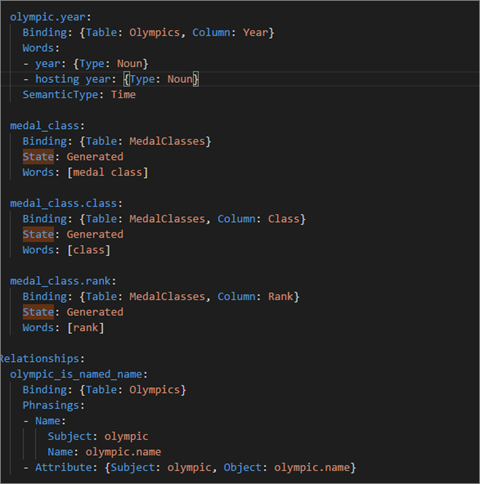

# <a name="language-modeling-and-the-linguistic-schema"></a>Modelowanie języka i schemat językowy 
Używanie typowych fraz i języka naturalnego w celu zadawania pytań na temat danych daje dużo możliwości. Jest to o wiele bardziej skuteczne, gdy dane „odpowiadają” — to właśnie umożliwia funkcja Pytania i odpowiedzi w usłudze Power BI. Funkcja Pytania i odpowiedzi usługi Power BI stara się znaleźć poprawną odpowiedź na Twoje pytanie. 

Aby jeszcze bardziej usprawnić interakcję z tą funkcją, można poprawić odpowiedzi. Jeden ze sposobów osiągnięcia tego celu polega na zmodyfikowaniu schematu językowego. 

Wszystko zaczyna się od danych przedsiębiorstwa.  Lepszy model danych ułatwia użytkownikom uzyskanie użytecznych odpowiedzi. Jeden ze sposobów udoskonalenia modelu polega na dodaniu schematu językowego, który definiuje i kategoryzuje terminologię oraz relacje między tabelą a nazwami kolumn w zestawie danych. Schematami językowymi można zarządzać w programie Power BI Desktop. 

## <a name="what-is-a-linguistic-schema"></a>Co to jest schemat językowy?
Schemat językowy opisuje terminy i wyrażenia, które dotyczą obiektów w zestawie danych i powinny być zrozumiałe dla funkcji Pytania i odpowiedzi. Obejmują one części mowy, synonimy i frazy, odnoszące się do tego zestawu danych. Podczas importowania zestawu danych lub nawiązywania połączenia z nim usługa Power BI tworzy schemat językowy, oparty na strukturze tego zestawu danych. Aby funkcja Pytania i odpowiedzi mogła ustalić cel Twojego pytania, szuka dopasowań i relacji w danych. Wyszukiwane są na przykład rzeczowniki, czasowniki, przymiotniki, frazy oraz inne elementy. Ponadto wyszukiwane są relacje, na przykład kolumny, które odpowiadają dopełnieniom orzeczenia. 

Prawdopodobnie sporo wiesz o częściach mowy (jeśli nie, zapoznaj się z informacjami w dalszej części artykułu), ale być może frazy są dla Ciebie nowością.  Fraza dotyczy sposobu wyrażania relacji między różnymi elementami. Na przykład, aby opisać relację między klientami i produktami, możesz powiedzieć „customers buy products” (klienci kupują produkty). Z kolei aby opisać relację między klientami a informacjami o wieku, możesz powiedzieć „ages indicate how old customers are” (wiek określa, ile lat ma klient). Aby natomiast opisać relację między klientami a numerami telefonów, możesz po prostu powiedzieć „customers have phone numbers” (klienci mają numery telefonów).

Takie frazy mogą mieć różną postać i długość. Niektóre odpowiadają bezpośrednio relacjom w modelu danych. Inne pozwalają powiązać kolumny z tabelami, które zawierają te kolumny. Jeszcze inne umożliwiają powiązanie wielu tabel i kolumn przy użyciu złożonych relacji. We wszystkich przypadkach frazy opisują powiązania między różnymi elementami przy użyciu powszechnie używanych terminów.

Schematy językowe są zapisywane w formacie YAML. Ten format jest powiązany z bardzo popularnym formatem JSON, ale ma bardziej elastyczną składnię, którą jest łatwiej zrozumieć. Schematy językowe można edytować i eksportować oraz importować je do programu Power BI Desktop.

## <a name="prerequisites"></a>Wymagania wstępne
- Jeśli jeszcze tego nie zrobiono, na początku warto zapoznać się z artykułem dotyczącym [udoskonalania modelu danych na potrzeby korzystania z funkcji Pytania i odpowiedzi](desktop-qna-in-reports.md). Zawiera on wiele wskazówek związanych z projektowaniem i usprawnianiem modelu danych, a także ważną sekcję dotyczącą dodawania synonimów.  

- Wyróżniamy dwa sposoby korzystania z funkcji Pytania i odpowiedzi.  Pierwszy polega na przygotowaniu lub „modelowaniu” danych.  Drugim sposobem jest zadawanie pytań i eksplorowanie danych, czyli „korzystanie” z nich. W niektórych firmach tworzeniem modeli i zestawów danych oraz ich publikowaniem w usłudze Power BI zajmują się osoby modelujące dane lub administratorzy IT.  Pozostali pracownicy mogą pracować z tymi danymi w trybie online.  W innych organizacjach poszczególni członkowie personelu mogą wykonywać oba rodzaje zadań. 

    Ten temat dotyczy roli pracowników modelujących dane. Są to osoby, które zajmują się optymalizowaniem zestawu danych w celu zapewnienia możliwie najlepszych wyników generowanych przez funkcję Pytania i odpowiedzi. 

- [Przykładowe pliki yaml i pbix](https://go.microsoft.com/fwlink/?linkid=871858)    
- Edytor plików YAML — zalecamy używanie programu [Visual Studio Code](https://code.visualstudio.com/)


### <a name="set-up-an-editor-for-yaml-files"></a>Konfigurowanie edytora plików YAML
Zalecamy używanie programu Visual Studio Code, który umożliwia edytowanie plików YAML schematu językowego. Program Visual Studio Code zapewnia wbudowaną obsługę plików YAML i umożliwia instalowanie rozszerzeń, które pozwalają weryfikować format schematu językowego usługi Power BI.
1. Zainstaluj program [Visual Studio Code](https://code.visualstudio.com/).    

2. Wybierz wcześniej zapisany przykładowy schemat językowy: [plik YAML](https://go.microsoft.com/fwlink/?linkid=871858) (SummerOlympics.lsdl.yaml).    
4. Wybierz pozycje **Visual Studio Code** i **Zawsze otwieraj pliki typu yaml za pomocą tej aplikacji**.

    

4. W programie Visual Studio Code zainstaluj rozszerzenie YAML Support by Red Hat.

   

    a. Wybierz kartę **Rozszerzenia** (ostatnią po lewej stronie) lub naciśnij klawisze CTRL+SHIFT+X.    
        
    b. Wyszukaj „yaml” i wybierz pozycję **YAML Support by Red Hat** z listy.    
    c. Wybierz pozycję **Zainstaluj > Załaduj ponownie**.


## <a name="working-with-linguistic-schemas"></a>Praca ze schematami językowymi
Schematy językowe można edytować i importować oraz eksportować je w [widoku relacji](desktop-relationship-view.md) programu Power BI Desktop. Jeden ze sposobów edytowania schematu językowego polega na [dodaniu synonimów w okienku **Synonimy**](desktop-qna-in-reports.md). Metoda ta nie wymaga otwarcia pliku YAML.


 Inny sposób edytowania schematu językowego polega na wyeksportowaniu pliku YAML i jego bezpośrednim zmodyfikowaniu.  Podczas edytowania pliku YAML schematu językowego kolumny tabeli oznacza się jako różne elementy gramatyczne oraz definiuje się słowa, których mogą używać współpracownicy do sformułowania pytania. Na przykład należy wskazać kolumny będące podmiotem i dopełnieniem oraz dodać alternatywne słowa, używane przez współpracowników do odwoływania się do tabel, kolumn i miar w modelu. 



Aby edytować schemat językowy, musisz go otworzyć (wyeksportować) w programie Desktop. Z kolei importowanie polega na ponownym zapisywaniu pliku YAML w tej samej lokalizacji.  Można jednak importować również inne pliki YAML,  jeśli na przykład zainwestowano dużo czasu w opracowywanie podobnego zestawu danych — dodawanie części mowy, identyfikowanie relacji oraz tworzenie fraz i synonimów. 

Wszystkie te informacje oraz wszelkie wprowadzone udoskonalenia pozwalają funkcji Pytania i odpowiedzi generować bardziej użyteczne wyniki oraz udostępniać automatyczne uzupełnianie i podsumowanie pytań.


## <a name="edit-a-linguistic-schema"></a>Edytowanie schematu językowego
W przypadku eksportowania schematu językowego z programu Desktop po raz pierwszy cała zawartość pliku lub jej większość zostanie automatycznie wygenerowana przez aparat funkcji Pytania i odpowiedzi. Te wygenerowane jednostki, słowa (synonimy), relacje i frazy są oznaczone tagiem **State: Generated**. Są one umieszczane w pliku głównie ze względów informacyjnych, ale mogą być przydatne podczas wprowadzania własnych zmian. 

> [!NOTE]
> Przykładowy plik YAML używany w tym samouczku został specjalnie przygotowany, dlatego nie zawiera tagów **State: Generated** i **State: Deleted**. Aby je wyświetlić, otwórz oryginalny plik pbix w widoku relacji i wyeksportuj schemat językowy.




Podczas importowania pliku schematu językowego do programu Power BI Desktop wszystkie elementy oznaczone jako **State: Generated** są ignorowane (a później generowane ponownie), dlatego jeśli chcesz zmienić wygenerowaną zawartość, musisz dodatkowo usunąć odpowiedni tag **State: Generated**. I podobnie, jeśli chcesz usunąć część wygenerowanej zawartości, musisz zmienić tag **State: Generated** na **State: Deleted**, aby uniemożliwić jej ponowne generowanie podczas importowania pliku schematu językowego.

1. Otwórz zestaw danych w *widoku relacji* w programie Power BI Desktop. 
2. Wybierz kartę **Modelowanie** i wybierz pozycję **Eksportuj schemat językowy**.
3. Wybierz program Visual Code (lub inny edytor).
4. Wprowadź zmiany i zapisz plik YAML.
5. W programie Desktop wybierz pozycję **Widok relacji > Modelowanie > Schemat językowy > Importuj schemat językowy**.
6. Przejdź do lokalizacji, w której zapisano zmodyfikowany plik YAML, i wybierz go. Pojawi się komunikat informujący o pomyślnym zaimportowaniu pliku YAML schematu językowego.

    

### <a name="add-phrasings-to-the-linguistic-schema"></a>Dodawanie fraz do schematu językowego
Fraza dotyczy sposobu wyrażania relacji między różnymi elementami. Na przykład, aby opisać relację między klientami i produktami, możesz powiedzieć „customers buy products” (klienci kupują produkty). Z kolei aby opisać relację między klientami a informacjami o wieku, możesz powiedzieć „ages indicate how old customers are” (wiek określa, ile lat ma klient). Opisując relację między sportowcami a medalami, możesz po prostu powiedzieć „athletes win medals” (sportowcy zdobywają medale).

Takie frazy mogą mieć różną postać i długość. Niektóre odpowiadają bezpośrednio relacjom w modelu semantycznym. Inne pozwalają powiązać kolumny z tabelami, które zawierają te kolumny. Jeszcze inne umożliwiają powiązanie wielu tabel i kolumn przy użyciu złożonych relacji. We wszystkich przypadkach frazy opisują powiązania między różnymi elementami przy użyciu powszechnie używanych terminów.

## <a name="where-do-phrasings-come-from"></a>Skąd pochodzą frazy?
Wiele prostych fraz jest dodawanych do schematu językowego automatycznie na podstawie struktury modelu i skojarzeń związanych z nazwami kolumn. Na przykład:
- Większość kolumn jest powiązanych ze swoimi tabelami za pomocą prostych fraz, takich jak „products have descriptions” (z produktami są skojarzone opisy).
- Z relacji modelu wynikają frazy domyślne, użyteczne w obu kierunkach relacji, na przykład „orders have products” (z zamówieniami są skojarzone produkty) i „products have orders” (z produktami są skojarzone zamówienia).
- Z niektórych relacji modelu mogą — w związku z nazwami kolumn — wynikać bardziej złożone frazy domyślne, takie jak „orders are shipped to cities” (zamówienia są dostarczane do miast).

Jednak funkcja Pytania i odpowiedzi nie jest w stanie zrozumieć bardzo wielu opisów używanych przez użytkowników. W takich przypadkach można ręcznie dodać własne frazy.


## <a name="why-should-i-add-phrasings"></a>Dlaczego należy dodawać frazy?
Po pierwsze, dodanie frazy umożliwia zdefiniowanie nowego terminu. Na przykład jeśli chcesz użyć polecenia „list the oldest customers” (wyświetl listę najstarszych klientów), najpierw musisz nauczyć funkcję Pytania i odpowiedzi, co oznacza termin „old” (stary). Możesz to zrobić, dodając frazę „ages indicate how old customers are” (wiek określa, ile lat ma klient).

Po drugie, dodanie frazy umożliwia pozbycie się niejednoznaczności. Podstawowe wyszukiwanie słów kluczowych działa tylko wtedy, gdy słowo ma jedno znaczenie. Na przykład „flights to Chicago” (loty do Chicago) oznacza coś zupełnie innego niż „flights from Chicago” (loty z Chicago), ale funkcja Pytania i odpowiedzi nie odróżni ich, dopóki nie dodasz fraz „flights are from departure cities” (lot zaczyna się w mieście odlotu) i „flights are to arrival cities” (lot kończy się w mieście przylotu). I podobnie, odróżnienie fraz „cars that John sold to Mary” (samochody, które John sprzedał Mary) i „cars that John bought from Mary” (samochody, które John kupił od Mary) będzie możliwe dopiero po dodaniu fraz „customers buy cars from employees” (klienci kupują samochody od pracowników) i „employees sell customers cars” (pracownicy sprzedają samochody klientom).

Ostatnie zastosowanie fraz dotyczy udoskonalania mechanizmu przeredagowań. Komunikat „Show the customers and their products” (Wyświetl listę klientów i ich produktów), zwrócony przez funkcję Pytania i odpowiedzi, nie jest w pełni czytelny. Bardziej zrozumiałe są komunikaty „Show the customers and the products they bought” (Wyświetl listę klientów i zakupionych przez nich produktów) i „Show the customers and the products they reviewed” (Wyświetl listę klientów i przeglądanych przez nich produktów) — w zależności od tego, jak funkcja Pytania i odpowiedzi zrozumiała pytanie. Dodanie niestandardowych fraz zwiększa konkretność i jednoznaczność przeredagowań.


## <a name="what-kinds-of-phrasings-are-there"></a>Jakie rodzaje fraz występują?
Przed zapoznaniem się z różnymi typami fraz najpierw warto przypomnieć sobie kilka podstawowych pojęć gramatycznych:
- *Rzeczownik* to osoba, miejsce lub rzecz. 
    - Przykłady: car, teenager, Marty, flux capacitor (samochód, nastolatek, Marcin, kondensator przepływowy)
- *Czasownik* oznacza akcję lub stan. 
    - Przykłady: hatch, burst, devour, eject (wykluwać się, wybuchać, pożerać, wyrzucać)
- *Przymiotnik* to słowo opisowe, które określa rzeczownik. 
    - Przykłady: powerful, magical, golden, stolen (potężny, magiczny, złoty, skradziony)
- *Przyimek* to słowo występujące przed rzeczownikiem, które pozwala powiązać ten rzeczownik z innym rzeczownikiem, czasownikiem lub przymiotnikiem. 
    - Przykłady: of, for, near, from (z, dla, obok, od)
-  *Atrybut* to właściwość lub cecha czegoś.
-  *Nazwa* to słowo lub grupa słów, które wskazują osobę, zwierzę, miejsce lub rzecz albo odnoszą się do tych pojęć.   


## <a name="attribute-phrasings"></a>Frazy atrybutywne
Frazy atrybutywne są motorem funkcji Pytania i odpowiedzi. Taka fraza występuje, gdy jeden element pełni funkcję atrybutu innego elementu. Frazy atrybutywne są proste i umożliwiają wykonywanie większości trudnych operacji, jeśli nie zdefiniowano bardziej szczegółowych fraz. Do opisywania fraz atrybutywnych służy podstawowy czasownik „have” (np. „products have categories” [z produktami są skojarzone kategorie] i „host countries have host cities” [w krajach-gospodarzach leżą miasta-gospodarze]). Ponadto frazy te automatycznie umożliwiają tworzenie pytań z przyimkami „of” i „for” (np. „categories of products” [kategorie produktów], „orders for products” [zamówienia produktów]) oraz formą dzierżawczą („John’s orders” [zamówienia Johna]). Frazy atrybutywne są używane na przykład w takich pytaniach:
- Which customers have orders? (Którzy klienci złożyli zamówienia?)
- List host cities by country ascending (Wyświetl miasta-gospodarze w poszczególnych krajach w kolejności rosnącej)
- Show orders that have chai (Wyświetl zamówienia zawierające herbatę)
- List customers with orders (Wyświetl listę klientów, którzy złożyli zamówienia)
- What is the category of each product? (Do jakiej kategorii należą poszczególne produkty?)
- Count Robert King's orders (Policz zamówienia złożone przez Roberta Kinga)    

Przeważająca większość fraz atrybutywnych wymaganych w modelu jest generowana automatycznie na podstawie przynależności do tabeli lub kolumny oraz relacji modelu. Z tego względu zazwyczaj nie trzeba ich tworzyć samodzielnie.
Oto przykładowa fraza atrybutywna w schemacie językowym:

```json
product_has_category:
  Binding: {Table: Products}
  Phrasings:
  - Attribute: {Subject: product, Object: product.category}
```
 
## <a name="name-phrasings"></a>Frazy z nazwami
Frazy z nazwami są przydatne, jeśli w modelu danych znajduje się tabela zawierająca nazwane obiekty, takie jak nazwiska sportowców czy klientów. Na przykład dodanie frazy „product names are names of products” (nazwy produktów wskazują produkty) jest wymagane, jeśli się chce używać nazw produktów w pytaniach. Możliwe jest również użycie słowa „named” jako czasownika (np. „List customers named John Smith” [Wyświetl listę klientów, którzy nazywają się John Smith]), ale jego najważniejsze zastosowanie polega na połączeniu z innymi frazami, co pozwala odwoływać się do określonego wiersza tabeli za pomocą wartości nazwy. Na przykład w przypadku frazy „Customers that bought chai” (Klienci, którzy kupili herbatę) funkcja Pytania i odpowiedzi „wie”, że słowo „chai” odwołuje się do całego wiersza w tabeli produktów, a nie tylko do wartości w kolumnie z nazwą produktu. Frazy z nazwami są używane na przykład w takich pytaniach:    
- Which employees are named Robert King (Którzy pracownicy nazywają się Robert King)
- Who is named Ernst Handel (Kto nazywa się Ernst Handel)
- Fernand De Montigny's sports (Dyscypliny sportowe uprawiane przez Fernanda De Montigny’ego)
- Count of athletes named Mary (Liczba sportowców o imieniu Mary)
- What did Robert King buy? (Co kupił Robert King?)

Jeśli do utworzenia nazw kolumn w modelu zastosowano przemyślaną konwencję (np. „Name” lub „ProductName” zamiast „PrdNm”), większość wymaganych w modelu fraz z nazwami zostanie wygenerowana automatycznie. Z tego względu zazwyczaj nie trzeba ich tworzyć samodzielnie.

Oto przykładowa fraza z nazwą w schemacie językowym:

```json
employee_has_name:
  Binding: {Table: Employees}
  Phrasings:
  - Name:
      Subject: employee
      Name: employee.name
```

 
## <a name="adjective-phrasings"></a>Frazy przymiotnikowe
Frazy przymiotnikowe definiują nowe przymiotniki, używane do opisywania elementów w modelu. Na przykład do zadawania pytań, takich jak „list the happy customers in Des Moines” (wyświetl dane zadowolonych klientów w Des Moines), jest potrzebna fraza „happy customers are customers where rating > 6” (zadowoleni klienci mają klasyfikację większą niż 6). Występuje kilka postaci fraz przymiotnikowych, używanych w różnych sytuacjach.

*Prosta fraza przymiotnikowa* definiuje nowy przymiotnik na podstawie warunku, na przykład „discontinued products are products where status = D” (wycofane produkty mają stan o wartości D). Proste frazy przymiotnikowe są używane na przykład w takich pytaniach:
- Which products are discontinued? (Które produkty zostały wycofane?)
- List the discontinued products (Wyświetl listę wycofanych produktów)
- List the gold medalists (Wyświetl listę złotych medalistów)
- Products that are backordered (Produkty zaległe)

Oto przykładowa prosta fraza przymiotnikowa w schemacie językowym product_is_discontinued:

```json
Binding: {Table: Products}
  Conditions:
  - Target: product.discontinued
    Operator: Equals
    Value: true
  Phrasings:
  - Adjective:
      Subject: product
      Adjectives: [discontinued]
```

*Frazy przymiotnikowe miar* definiują nowe przymiotniki na podstawie wartości liczbowej, która wskazuje zakres stosowania danego przymiotnika, na przykład „lengths indicate how long rivers are” (długości określają, jak długie są rzeki) i „small countryregions have small land areas” (małe regiony mają małą powierzchnię). Frazy przymiotnikowe miar są używane na przykład w takich pytaniach:
- List the long rivers (Wyświetl listę długich rzek)
- Which rivers are the longest? (Które rzeki są najdłuższe?)
- List the smallest countryregions that won gold in basketball (Wyświetl listę najmniejszych regionów, których reprezentacje zdobyły złoto na mistrzostwach koszykówki)
- How long is the Rio Grande? (Ile wynosi długość rzeki Rio Grande?)

Oto przykładowa fraza przymiotnikowa miar w schemacie językowym river_has_length:

 ```json
Binding: {Table: Rivers}
  Phrasings:
  - Adjective:
      Subject: river
      Adjectives: [long]
      Antonyms: [short]
      Measurement: river.length
```

*Dynamiczne frazy przymiotnikowe* definiują zestaw nowych przymiotników na podstawie wartości kolumny w modelu, na przykład „colors describe products” (kolory opisują produkty) i „events have event genders” (w zawodach sportowych uczestniczą sportowcy określonej płci). Dynamiczne frazy przymiotnikowe są używane na przykład w takich pytaniach:
- List the red products (Wyświetl listę czerwonych produktów)
- Which products are green? (Które produkty są zielone?)
- Show skating events for females (Wyświetl zawody łyżwiarskie dla kobiet)
- Count issues that are active (Policz aktywne problemy)

Oto przykładowa dynamiczna fraza przymiotnikowa w schemacie językowym product_has_color:
```json
Binding: {Table: Products}
  Phrasings:
  - DynamicAdjective:
      Subject: product
      Adjective: product.color
```

 
## <a name="noun-phrasings"></a>Frazy rzeczownikowe
Frazy rzeczownikowe definiują nowe rzeczowniki, które opisują podzbiory elementów w modelu. Często zawierają one typ specyficznej dla modelu miary lub warunku. Na przykład w naszym modelu igrzysk olimpijskich warto dodać frazy, które umożliwiają odróżnienie mistrzów od medalistów, dyscyplin piłkarskich od dyscyplin wodnych oraz zespołów od występów indywidualnych, a także pozwalają określać kategorie wiekowe sportowców (nastolatki, dorośli, seniorzy) itd. W przypadku bazy danych filmów możemy dodać frazę rzeczownikową „flops are movies where net profit < 0” (porażka to film, dla którego zysk netto jest mniejszy niż 0), co pozwala zadawać pytania, takie jak „count the flops by year” (policz porażki w poszczególnych latach). Występują dwie postaci fraz rzeczownikowych, używane w różnych sytuacjach.

*Proste frazy rzeczownikowe* definiują nowe rzeczowniki na podstawie warunku, na przykład „contractors are employees where full time = false” (podwykonawcy to pracownicy, którzy nie mają etatu) i „champion is athlete where count of medals >5” (mistrz to sportowiec, który ma więcej niż 5 medali). Proste frazy rzeczownikowe są używane na przykład w takich pytaniach:

- Which employees are contractors? (Którzy pracownicy są podwykonawcami?)
- Count the contractors in Portland (Policz podwykonawców w Portland)
- How many champions in 2016? (Ile jest mistrzów w 2016 r?)

Oto przykładowa prosta fraza rzeczownikowa w schemacie językowym employee_is_contractor:

```json
Binding: {Table: Employees}
  Conditions:
  - Target: employee.full_time
    Operator: Equals
    Value: false
  Phrasings:
  - Noun:
      Subject: employee
      Nouns: [contractor]
```

*Dynamiczne frazy rzeczownikowe* definiują zestaw nowych rzeczowników na podstawie wartości w kolumnie w modelu, na przykład „jobs define subsets of employees” (rodzaje pracy definiują grupy pracowników). Dynamiczne frazy rzeczownikowe są używane na przykład w takich pytaniach:

- List the cashiers in Chicago (Wyświetl listę kasjerów w Chicago)
- Which employees are baristas? (Którzy pracownicy są baristami?)
- List the referees in 1992 (Wyświetl listę sędziów z 1992 r.)

Oto przykładowa dynamiczna fraza rzeczownikowa w schemacie językowym employee_has_job:

 ```json
Binding: {Table: Employees}
  Phrasings:
  - DynamicNoun:
      Subject: employee
      Noun: employee.job
```

## <a name="preposition-phrasings"></a>Frazy przyimkowe
Frazy przyimkowe umożliwiają opisanie relacji — między elementami modelu — utworzonych za pomocą przyimków. Na przykład fraza „cities are in countries” (miasta znajdują się w krajach) umożliwia zrozumienie pytań, takich jak „count the cities in Washington” (policz miasta w stanie Waszyngton). Niektóre frazy przyimkowe są tworzone automatycznie, jeśli dana kolumna zostanie rozpoznana jako jednostka geograficzna. Frazy przyimkowe są używane na przykład w takich pytaniach:

- Count the customers in New York (Policz klientów w Nowym Jorku)
- List the books about linguistics (Wyświetl listę książek o językoznawstwie)
- Which city is John Galt in? (W którym mieście mieszka John Galt?)
- How many books are by Stephen Pinker? (Ile książek napisał Stephen Pinker?)
 
Oto przykładowa fraza przyimkowa w schemacie językowym customers_are_in_cities:

 ```json
Binding: {Table: Customers}
  Phrasings:
  - Preposition:
      Subject: customer
      Prepositions: [in]
      Object: customer.city
```

 
## <a name="verb-phrasings"></a>Frazy czasownikowe
Frazy czasownikowe umożliwiają opisanie relacji — między elementami modelu — utworzonych za pomocą czasowników. Na przykład fraza „customers buy products” (klienci kupują produkty) umożliwia zrozumienie pytań, takich jak „who bought cheese?” (kto kupił ser?) i „what did John buy?” (co kupił John?). Frazy czasownikowe są najbardziej elastyczne i często łączą ze sobą więcej niż dwa elementy, na przykład „employees sell customers products” (pracownicy sprzedają produkty klientom). Frazy czasownikowe są używane na przykład w takich pytaniach:

- Who sold what to whom? (Kto i co sprzedał komu?)
- Which employee sold chai to John? (Który pracownik sprzedał herbatę Johnowi?)
- How many customers were sold chai by Mary? (Ilu klientom Mary sprzedała herbatę?)
- List the products that Mary sold to John (Wyświetl listę produktów, które Mary sprzedała Johnowi)
- Which discontinued products were sold to Chicago customers by Boston employees? (Które wycofane produkty pracownicy z Bostonu sprzedali klientom z Chicago?)

Frazy czasownikowe mogą również zawierać frazy przyimkowe, co dodatkowo zwiększa elastyczność, na przykład „athletes win medals at competitions” (sportowcy zdobywają medale na zawodach) lub „customers are given refunds for products” (klienci otrzymują zwrot kosztów produktów). Frazy czasownikowe zawierające frazy przyimkowe są używane na przykład w takich pytaniach:

- How many athletes won a gold medal at the Visa Championships? (Ilu sportowców zdobyło złoty medal na mistrzostwach Visa Championships?)
- Which customers were given a refund for cheese? (Którzy klienci otrzymali zwrot kosztów sera?)
- At which competition did Danell Leyva win a bronze medal? (W którym konkursie Danell Leyva zdobył brązowy medal?)

Niektóre frazy czasownikowe są tworzone automatycznie, jeśli uda się ustalić, że dana kolumna zawiera zarówno czasownik, jak i przyimek.

Oto przykładowa fraza czasownikowa w schemacie językowym customers_buy_products_from_salespeople:

```json
Binding: {Table: Orders}
  Phrasings:
  - Verb:
      Subject: customer
      Verbs: [buy, purchase]
      Object: product
      PrepositionalPhrases:
      - Prepositions: [from]
        Object: salesperson
```

## <a name="relationships-with-multiple-phrasings"></a>Relacje z wieloma frazami
Relację można często przedstawić na kilka sposobów. W takim przypadku z relacją może być skojarzona więcej niż jedna fraza. Z relacją występującą między jednostką tabeli a jednostką kolumny bardzo często jest skojarzona zarówno fraza atrybutywna, jak i inna fraza. Na przykład w przypadku relacji między klientem a nazwą klienta warto określić zarówno frazę atrybutywną (np. „customers have names” [z klientami są skojarzone nazwy]), jak i frazę z nazwą (np. „customer names are the names of customers” [nazwy klientów wskazują klientów]), aby móc zadawać oba typy pytań.

Oto przykładowa relacja z dwiema frazami, zawarta w schemacie językowym customer_has_name:

  ```json
Binding: {Table: Customers}
  Phrasings:
    - Attribute: {Subject: customer, Object: customer.name}
    - Name:
        Subject: customer
        Object: customer.name
```

Kolejny przykład może polegać na dodaniu alternatywnej frazy „employees sell customers products” (pracownicy sprzedają produkty klientom) do relacji „customers buy products from employees” (klienci kupują produkty od pracowników). Zwróć uwagę, że nie musisz dodawać różnych wersji frazy, takich jak „employees sell products **to customers**” (pracownicy sprzedają produkty klientom) lub „products are sold to customers **by employees**” (produkty są sprzedawane klientom przez pracowników), ponieważ przyimki „by” i „to” pozwalają funkcji Pytania i odpowiedzi automatycznie rozpoznać podmiot i dopełnienie dalsze.

## <a name="considerations-and-troubleshooting"></a>Istotne zagadnienia i rozwiązywanie problemów
Jeśli w pliku .lsdl.yaml wprowadzisz zmiany niezgodne z formatem schematu językowego, pojawi się mniej więcej taki komunikat o błędzie walidacji: 

    


Masz więcej pytań? [Odwiedź społeczność usługi Power BI](http://community.powerbi.com/)
