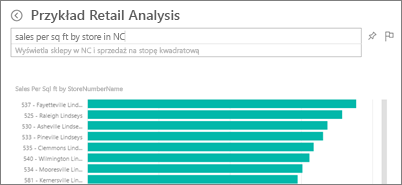
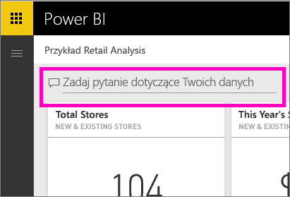
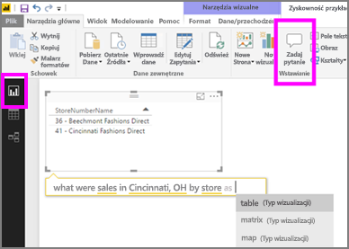

# Funkcja pytań i odpowiedzi w usłudze Power BI i programie Power BI Desktop
## Co to jest funkcja pytań i odpowiedzi?
Czasem najszybszym sposobem uzyskania odpowiedzi na podstawie danych jest zadanie pytania przy użyciu języka naturalnego. Na przykład „what were total sales last year” (ile wynosiła łączna sprzedaż w zeszłym roku).  Pytania i odpowiedzi pozwalają eksplorować dane, korzystając z intuicyjnych możliwości języka naturalnego, oraz uzyskiwać odpowiedzi w formie wykresów i schematów. Funkcja Pytania i odpowiedzi różni się od wyszukiwarki — Pytania i odpowiedzi zwraca tylko wyniki dotyczące danych w usłudze Power BI.

Ten artykuł to punkt wyjścia dla wszystkich informacji o funkcji pytań i odpowiedzi. Wybierz link poniżej, aby dowiedzieć się, jak funkcja pytań i odpowiedzi działa w usłudze Power BI (pulpity nawigacyjne i raporty), programie Power BI Desktop (raporty), usłudze Power BI Embedded oraz usłudze Power BI dla urządzeń przenośnych.  

> [!NOTE]
> Funkcja **pytań i odpowiedzi w usłudze Power BI** obsługuje tylko udzielanie odpowiedzi na zapytania w języku naturalnym zadawane w języku angielskim. Możesz również wypróbować funkcję w wersji zapoznawczej dla pytań zadawanych w języku hiszpańskim. W programie **Power BI Desktop** wybierz pozycję **Plik**, **Opcje i ustawienia**, **Opcje**, a następnie wyszukaj kartę **Funkcje w wersji zapoznawczej**. Zaznacz pole wyboru **Obsługa języka hiszpańskiego w funkcji pytań i odpowiedzi**.  
>
>

Zadanie pytania to dopiero początek.  Pobaw się, przeglądając dane, poprawiając lub rozszerzając pytania, odkrywając nowe wiarygodne informacje, przybliżając szczegóły lub oddalając, aby uzyskać szersze spojrzenie. Zachwycą Cię szczegółowe informacje oraz dokonane obserwacje.

Środowisko jest w pełni interaktywne i szybkie! Obsługa za pośrednictwem magazynu w pamięci zapewnia niemal natychmiastowe odpowiedzi.

##  Funkcja pytań i odpowiedzi dla *użytkowników*
Gdy współpracownik udostępni Ci pulpit nawigacyjny, pole pytania funkcji pytań i odpowiedzi znajdziesz na pulpicie nawigacyjnym usługi Power BI (app.powerbi.com), w dolnej części pulpitu nawigacyjnego w usłudze Power BI dla urządzeń przenośnych oraz nad wizualizacją w usłudze Power BI Embedded. Funkcji pytań i odpowiedzi będzie można używać do eksplorowania danych, ale nie będzie można zapisywać żadnych wizualizacji utworzonych za jej pomocą, chyba że właściciel udzielił Ci uprawnień do edycji.

## Funkcja pytań i odpowiedzi dla *twórców*
Jeśli jesteś *twórcą* raportów usługi Power BI lub masz uprawnienia do edycji zestawu danych, na pulpicie nawigacyjnym usługi Power BI oraz na każdej stronie raportu w usłudze Power BI i programie Power BI Desktop znajdziesz pole pytania funkcji pytań i odpowiedzi. Wszelkie wizualizacje utworzone za pomocą funkcji pytań i odpowiedzi możesz zapisać na pulpicie nawigacyjnym i w raporcie.

Oprócz używania funkcji pytań i odpowiedzi do eksplorowania swoich danych, twórcy i właściciele zestawu danych mogą poprawiać wyniki funkcji pytań i odpowiedzi dla użytkowników, [modyfikując zestawy danych](service-prepare-data-for-q-and-a.md), dodając [polecane pytania](service-q-and-a-create-featured-questions.md) oraz [włączając i wyłączając funkcję pytań i odpowiedzi ](service-q-and-a-direct-query.md) dla lokalnych aktywnych połączeń zestawów danych. W [scenariuszach osadzenia](developer/qanda.md) deweloperzy mogą wybrać jeden z 2 trybów: **interaktywny** i **tylko wynik**.

## Skąd funkcja pytań i odpowiedzi wie, jak odpowiadać na pytania?
### Których zestawów danych używa funkcja pytań i odpowiedzi?
Skąd funkcja pytań i odpowiedzi wie, jak odpowiadać na pytania dotyczące danych? Polega ona na nazwach tabel, kolumn i pól obliczeniowych w źródłowym zestawie danych. Co więc użytkownik (lub właściciel zestawu danych) uważa za ważne!

Na przykład załóżmy, że masz tabelę programu Excel o nazwie „Sprzedaż” z kolumnami zatytułowanymi „Produkt”, „Miesiąc”, „Sprzedane jednostki”, „Sprzedaż brutto” i „Zysk”. Możesz zadawać pytania dotyczące dowolnej z tych jednostek.  Możesz zapytać „pokaż *sprzedaż*”, „całkowity *zysk* według *miesiąca*”, „sortuj *produkty* według *sprzedanych jednostek*” i inne.

Funkcja pytań i odpowiedzi może odpowiadać na pytania, które są oparte na sposobie organizacji zestawu danych. Jak to będzie działać w usłudze Salesforce? Gdy połączysz się ze swoim kontem witryny salesforce.com, usługa Power BI automatycznie wygeneruje pulpit nawigacyjny.  Zanim zaczniesz zadawać pytania za pomocą funkcji pytań i odpowiedzi, zapoznaj się z danymi wyświetlanymi w wizualizacjach pulpitu nawigacyjnego oraz w danych wyświetlanych na liście rozwijanej pytań i odpowiedzi.

* Jeśli etykiety osi i wartości wizualizacji zawierają terminy „sprzedaż”, „konto”, „miesiąc” i „możliwości”, możesz bezpiecznie zadawać pytania, takie jak: „Które *konto* ma największe *możliwości* lub pokaż *sprzedaż* według miesiąca jako wykres słupkowy”.
* Jeśli lista rozwijana zawiera terminy „sprzedawcy”, „stan” i „rok”, możesz bezpiecznie zadawać pytania, takie jak: „który *sprzedawca* miał najniższą *sprzedaż* na *Florydzie* w *2013*”.

Jeśli masz dane wydajności witryny internetowej w usłudze Google Analytics, możesz zadać pytanie o czas pozostawania na stronie internetowej, liczbę unikatowych odwiedzin strony i stopień zaangażowania użytkownika. Lub, jeśli zadajesz zapytanie do danych demograficznych, możesz zadawać pytania na temat wieku i przychodu gospodarstwa domowego według lokalizacji.

### Jakich wizualizacji używa funkcja pytań i odpowiedzi?
Funkcja pytań i odpowiedzi wybiera najlepsze wizualizacje na podstawie wyświetlanych danych. Niekiedy dane w źródłowych zestawach danych są definiowane jako określony typ lub kategoria i pomaga to funkcji pytań i odpowiedzi określić sposób ich wyświetlania. Na przykład, jeśli dane są zdefiniowane jako typ Data, najprawdopodobniej będą wyświetlane jako wykres liniowy. Dane, które należą do kategorii miejscowość, najprawdopodobniej będą wyświetlane jako mapa.

Można określić funkcji pytań i odpowiedzi, której wizualizacji użyć, dodając ją do na swojego pytania. Jednak należy pamiętać, że nie zawsze może być możliwe wyświetlenie w funkcji pytań i odpowiedzi danych w żądanym typie wizualizacji.

Aby uzyskać informacje na temat słów kluczowych, które są rozpoznawane przez funkcję pytań i odpowiedzi, zobacz [Porady dotyczące zadawanie pytań](service-q-and-a-tips.md).

## Więcej informacji na temat funkcji Pytania i odpowiedzi w usłudze Power BI
[Omówienie: Jak używać funkcji pytań i odpowiedzi na pulpitach nawigacyjnych i w raportach usługi Power BI](power-bi-tutorial-q-and-a.md): szczegółowe instrukcje dotyczące korzystania z funkcji pytań i odpowiedzi wraz z omówieniem jej działania.

[Aplikacja usługi Microsoft Power BI dla urządzeń przenośnych](mobile-apps-ios-qna.md) dla systemu iOS na urządzeniach iPad, iPhone i iPod Touch.

[Usługa Microsoft Power BI Embedded](developer/qanda.md) dołącza funkcję pytań i odpowiedzi do aplikacji.

[Porady dotyczące zadawania pytań w funkcji Pytania i odpowiedzi](service-q-and-a-tips.md): dowiedz się, jak komunikować się przy użyciu funkcji Pytania i odpowiedzi w celu uzyskiwania optymalnych wyników.

[Dodaj proponowane pytania do zestawów danych](service-q-and-a-create-featured-questions.md), a funkcja Pytania i odpowiedzi zasugeruje te pytania współpracownikom.

[Włącz funkcję pytań i odpowiedzi dla swoich lokalnych zestawów danych](service-q-and-a-direct-query.md): jeśli potrzebujesz bramy do połączenia z zestawem danych, użyj ustawień usługi Power BI, aby włączyć i wyłączyć funkcję pytań i odpowiedzi.

[Samouczek: używanie funkcji pytań i odpowiedzi z przykładem Retail Sales w usłudze Power BI](power-bi-visualization-introduction-to-q-and-a.md): korzystanie z funkcji pytań i odpowiedzi w ramach realistycznego samouczka dotyczącego branży.

[Dbanie o poprawne współdziałanie danych z funkcją Pytania i odpowiedzi](service-prepare-data-for-q-and-a.md): jeśli jesteś osobą odpowiedzialną za tworzenie zestawów danych i modeli danych,  ten temat jest dla Ciebie.

Masz więcej pytań? [Odwiedź społeczność usługi Power BI](http://community.powerbi.com/)
