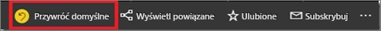
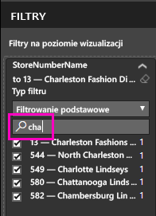
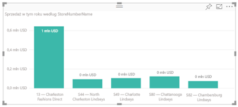
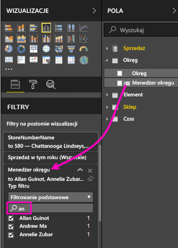
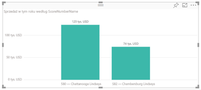

# Dodawanie filtru do raportu usługi Power BI (w widoku do edycji)

W tym artykule przedstawiono sposób dodawania filtru strony, filtru wizualnego, filtru raportu lub filtru przeglądania szczegółowego do raportu w usłudze Power BI. Przykłady z tego artykułu działają w usłudze Power BI. Czynności wykonywane w programie Power BI Desktop są prawie identyczne.

**Czy wiesz?** Usługa Power BI oferuje nową funkcję filtrowania — obecnie w wersji zapoznawczej. Przeczytaj więcej na temat [nowej funkcji filtrowania w raportach usługi Power BI](power-bi-report-filter-preview.md).

## Filtry w widoku do edycji lub w widoku do czytania
Interakcje z raportami można przeprowadzać w dwóch różnych widokach: widoku do czytania i widoku do edycji. Dostępne możliwości filtrowania zależą od widoku, w którym się znajdujesz. Przeczytaj temat opisujący [filtry i wyróżnianie w raportach usługi Power BI](power-bi-reports-filters-and-highlighting.md), aby uzyskać szczegółowe informacje.

W tym artykule opisano sposób tworzenia filtrów w **widoku do edycji** raportu.  Aby uzyskać więcej informacji o filtrach w widoku do czytania, zobacz temat [Interakcja z filtrami w widoku do czytania raportu](consumer/end-user-reading-view.md).

## Typy filtrów w okienku Filtry
Niezależnie od tego, czy używasz usługi Power BI, czy programu Power BI Desktop, okienko Filtry jest wyświetlane po prawej stronie kanwy raportów. Jeśli okienko Filtry nie jest widoczne, wybierz ikonę „>” w prawym górnym rogu, aby je rozwinąć.

Istnieją cztery typy filtrów: **filtr strony**, **filtr wizualny**, **filtr przeglądania szczegółowego** i **filtr raportu**.

Filtry są *trwałe*, dlatego po opuszczeniu raportu usługa Power BI zachowuje filtr, fragmentator i inne wprowadzone zmiany widoku danych. Dzięki temu można wrócić do pracy z raportem w miejscu, w którym została przerwana. Jeśli nie chcesz, aby zmiany filtru były trwałe, wybierz pozycję **Przywróć domyślne** na górnym pasku menu.

## Dodawanie filtru do wizualizacji
Filtr można dodać do wybranej wizualizacji na dwa sposoby (jest on również nazywany „filtrem wizualnym”). 

* Filtrowanie pola, które jest już używane przez wizualizację.
* Zidentyfikowanie pola, które nie jest jeszcze używane przez wizualizację i dodanie tego pola bezpośrednio do zasobnika **Filtry na poziomie wizualizacji**.

Ta procedura korzysta z przykładu Retail Analysis, więc możesz go pobrać, jeśli chcesz wykonać jej kroki. Pobierz [przykład Retail Analysis](sample-retail-analysis.md).

### Filtrowanie pól w wizualizacji

1. Otwórz [raport w widoku do edycji](service-the-report-editor-take-a-tour.md).
   
   
2. Jeśli nie zostało to jeszcze zrobione, otwórz okienko Wizualizacje i filtry oraz okienko Pola.
   
   
3. Wybierz wizualizację, aby ją uaktywnić. Wszystkie pola używane przez wizualizację znajdują się w okienku **Pola**, a także w okienku **Filtry** pod nagłówkiem **Filtry na poziomie wizualizacji**.
   
   
4. Na tym etapie dodasz filtr do pola już używanego przez wizualizację. 
   
    Przewiń w dół do obszaru **Filtry na poziomie wizualizacji** i wybierz strzałkę, aby rozwinąć pole, które chcesz filtrować. W tym przykładzie filtrowanym polem będzie **StoreNumberName**.
     
     
    
    Ustaw kontrolkę filtrowania **Podstawowe**, **Zaawansowane** lub **Pierwsze N**. W tym przykładzie wyszukamy ciąg **cha** w obszarze filtrowania podstawowego i wybierzemy pięć sklepów.
     
     
   
    Wizualizacja zmieni się w celu odzwierciedlenia nowego filtru. Jeśli zapiszesz raport razem z filtrem, na początku czytelnicy raportu zobaczą filtrowaną wizualizację i będą mogli wchodzić w interakcję z filtrem w widoku do czytania, zaznaczając lub usuwając wartości.
     
    

### Filtrowanie przy użyciu pola spoza wizualizacji

Teraz dodajmy do wizualizacji nowe pole w postaci filtru na poziomie wizualizacji.
   
1. W okienku Pola wybierz pole, które chcesz dodać jako nowy filtr na poziomie wizualizacji, i przeciągnij je do **obszaru Filtry na poziomie wizualizacji**.  W tym przykładzie przeciągniemy pole **District Manager** do zasobnika **Filtry na poziomie wizualizacji**, wyszukamy ciąg **an** i zaznaczymy trzech menedżerów. 
     
    

    Zwróć uwagę, że pole **District Manager** *nie* zostało dodane do wizualizacji. Wizualizacja nadal składa się z pola **StoreNumberName** w obszarze osi i pola **This Year Sales** w obszarze wartości.  
     
    

    Wizualizacja jest teraz filtrowana, aby pokazać dane dotyczące tegorocznej sprzedaży tylko tych menedżerów w określonych sklepach.
     
    

    Jeśli zapiszesz raport razem z filtrem, czytelnicy raportu będą mogli wchodzić w interakcję z filtrem **District Manager** w widoku do czytania, zaznaczając lub usuwając wartości.

## Dodawanie filtru do całej strony

Filtr można również dodać do całej strony (jest to filtr widoku strony).
1. Otwórz [raport w widoku do edycji](service-the-report-editor-take-a-tour.md).
2. Jeśli nie zostało to jeszcze zrobione, otwórz okienko Wizualizacje i filtry oraz okienko Pola.
3. W okienku Pola wybierz pole, które chcesz dodać jako nowy filtr na poziomie strony, i przeciągnij je do obszaru **Filtry na poziomie strony**.  
4. Wybierz wartości, które chcesz filtrować, i ustaw kontrolkę filtrowania **Podstawowe** lub **Zaawansowane**.
   
   Wszystkie wizualizacje na stronie, na które ma wpływ ten filtr, są ponownie rysowane w celu odzwierciedlenia zmiany. 
   
   

    Jeśli zapiszesz raport razem z filtrem, czytelnicy raportu będą mogli wchodzić w interakcję z filtrem w widoku do czytania, zaznaczając lub usuwając wartości.

## Dodawanie filtru przeglądania szczegółowego
Przeglądanie szczegółowe w usłudze Power BI i programie Power BI Desktop umożliwia tworzenie strony *docelowej* raportu, która koncentruje się na określonej jednostce — takiej jak dostawca, klient lub producent. Użytkownicy znajdujący się na innych stronach raportu mogą teraz kliknąć prawym przyciskiem myszy punkt danych dotyczący konkretnej jednostki i przejść do wyznaczonej strony.

### Tworzenie filtru przeglądania szczegółowego
Aby wykonać prezentowane instrukcje, otwórz przykład Customer Profitability w widoku do edycji. Załóżmy, że chcesz utworzyć stronę, która zawiera dane dotyczące obszarów kierowniczych.   

1. Dodaj nową stronę do raportu i nadaj jej nazwę **Team Executive**. Będzie to strona *docelowa* przeglądania szczegółowego.
2. Dodaj wizualizacje, które śledzą kluczowe metryki w ramach obszarów działalności kierowników zespołów.    
3. Dodaj pozycję **Executive > Executive Name** do filtrów przeglądania szczegółowego.    
   
    
   
    Zwróć uwagę, że usługa Power BI dodaje strzałkę wstecz do strony raportu.  Po wybraniu strzałki wstecz użytkownicy zostaną przeniesieni do strony *źródłowej* raportu, na której wcześniej wybrali opcję przeglądania szczegółowego. Strzałka wstecz działa tylko w widoku do czytania.
   
     

### Używanie filtru przeglądania szczegółowego
Zobaczmy, jak działa filtr przeglądania szczegółowego.

1. Rozpocznij od strony **Team Scorecard** raportu.    
2. Załóżmy, że nazywasz się Andrew Ma i chcesz, aby na stronie raportu Team Executive zostały odfiltrowane wszystkie dane poza tymi dotyczącymi Ciebie.  Na lewym górnym wykresie warstwowym kliknij prawym przyciskiem myszy dowolny zielony punkt danych, aby otworzyć opcję menu przeglądania szczegółowego.
   
    
3. Wybierz pozycję **Przeglądanie szczegółowe > Team Executive**, aby użyć filtru przeglądania szczegółowego na stronie raportu o nazwie **Team Executive**. Strona jest filtrowana w celu wyświetlenia informacji na temat punktu danych, który kliknięto prawym przyciskiem myszy. W tym przypadku Andrew Ma. Tylko pole uwzględnione w filtrach przeglądania szczegółowego zostanie przekazane do strony raportu szczegółowego.  
   
    

## Dodawanie filtru do całego raportu (filtr raportu)
1. Otwórz [raport w widoku do edycji](service-the-report-editor-take-a-tour.md).
2. Jeśli nie zostało to jeszcze zrobione, otwórz okienko Wizualizacje i filtry oraz okienko Pola.
3. W okienku Pola wybierz pole, które chcesz dodać jako nowy filtr na poziomie raportu, i przeciągnij je do obszaru **Filtry na poziomie raportu**.  
4. Wybierz wartości, które chcesz filtrować.

    Wizualizacja na aktywnej stronie, oraz na wszystkich stronach raportu, zmieni się w celu odzwierciedlenia nowego filtru. Jeśli zapiszesz raport razem z filtrem, czytelnicy raportu będą mogli wchodzić w interakcję z filtrem w widoku do czytania, zaznaczając lub usuwając wartości.

1. Wybierz strzałkę wstecz, aby wrócić do poprzedniej strony raportu.

## Istotne zagadnienia i rozwiązywanie problemów

- Czasami filtry na poziomie wizualizacji i filtry na poziomie strony mogą zwracać różne wyniki.  Na przykład po dodaniu filtru na poziomie wizualizacji usługa Power BI filtruje według wyników zagregowanych.  Domyślna agregacja to sumowanie, ale [typ agregacji można zmienić](service-aggregates.md).  

    Następnie po dodaniu filtru na poziomie strony usługa Power BI filtruje bez użycia agregacji.  Dzieje się tak, ponieważ strona może zawierać wiele wizualizacji, z których każda może korzystać z różnych typów agregacji.  Dlatego filtr jest stosowany w przypadku każdego wiersza danych.

- Jeśli nie widzisz okienka Pola, upewnij się, że jesteś w [widoku do edycji](service-interact-with-a-report-in-editing-view.md) raportu    
- Jeśli wprowadzono wiele zmian filtrów i chcesz przywrócić domyślne ustawienia autora raportu, wybierz pozycję **Przywróć domyślne** z górnego paska menu.

## Następne kroki
[Zapoznaj się z przewodnikiem dotyczącym okienka filtrów raportu](consumer/end-user-report-filter.md)

[Filtry i wyróżnianie w raportach](power-bi-reports-filters-and-highlighting.md)

[Interakcja z filtrami i wyróżnianie w widoku do czytania raportu](consumer/end-user-reading-view.md)

[Zmiana sposobu wzajemnego filtrowania i wyróżniania krzyżowego wizualizacji raportu](consumer/end-user-interactions.md)

Masz więcej pytań? [Odwiedź społeczność usługi Power BI](http://community.powerbi.com/)

