# Dodawanie filtru do raportu usługi Power BI (w widoku do edycji)
> [!TIP]
> Zalecamy, aby najpierw zapoznać się z artykułem [Informacje o filtrach i wyróżnianiu w raportach usługi Power BI](power-bi-reports-filters-and-highlighting.md).

Przykłady przedstawione w tym artykule dotyczą usługi Power BI. Czynności wykonywane w programie Power BI Desktop są jednak prawie identyczne.
> 
> 

## Różnica między filtrami raportu w widoku do edycji i w widoku do czytania
Istnieją dwa tryby interakcji z raportami: [Widok do czytania](service-reading-view-and-editing-view.md) i [Widok do edycji](service-interact-with-a-report-in-editing-view.md).  Dostępne możliwości filtrowania zależą od trybu, w którym pracujesz.

* Widok do edycji umożliwia dodawanie filtrów raportu, strony i wizualizacji. Podczas zapisywania raportu filtry zostają zapisane razem z nim. Osoby wyświetlające raport w widoku do czytania mogą wchodzić w interakcje z filtrami, które zostały dodane.
* Widok do czytania pozwala na wchodzenie w interakcje ze wszystkimi istniejącymi w raporcie filtrami wizualnymi, filtrami raportu, filtrami przeglądania szczegółowego i filtrami stron, ale nie jest możliwe dodawanie nowych filtrów. Zmiany wprowadzone w okienku Filtry są zapisywane z raportem — nawet wtedy, gdy raport jest wyświetlany w aplikacji mobilnej.  

> [!NOTE]
> W tym artykule opisano sposób tworzenia filtrów w **widoku do edycji** raportu.  Aby uzyskać więcej informacji o filtrach w widoku do czytania, zobacz [Interakcja z filtrami w widoku do czytania raportu](service-reading-view-and-editing-view.md).

## Filtry dostępne w okienku *Filtry* usługi Power BI
Niezależnie od tego, czy używasz usługi Power BI, czy programu Power BI Desktop, okienko Filtry jest wyświetlane po prawej stronie kanwy raportów. Jeśli okienko Filtry nie jest widoczne, wybierz ikonę „>” w prawym górnym rogu, aby je rozwinąć.

Istnieją cztery typy filtrów.

- **Filtr strony** dotyczy wszystkich wizualizacji na stronie raportu.     
- **Filtr wizualny** dotyczy jednej wizualizacji na stronie raportu.    
- **Filtr przeglądania szczegółowego** dotyczy pojedynczej jednostki w raporcie.    
- **Filtr raportu** dotyczy wszystkich stron w raporcie.    

    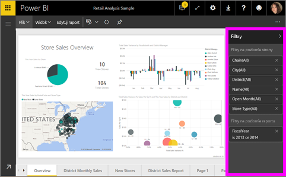

## Dodawanie filtru do określonej wizualizacji (filtr wizualny)
Można to zrobić na dwa sposoby: 

* Filtrowanie pola, które jest już używane przez wizualizację
* Zidentyfikowanie pola, które nie jest jeszcze używane przez wizualizację i dodanie tego pola bezpośrednio do zasobnika **Filtry na poziomie wizualizacji**.

### Filtrowanie pól znajdujących się już w wizualizacji
1. Otwórz [raport w widoku do edycji](service-reading-view-and-editing-view.md).
   
   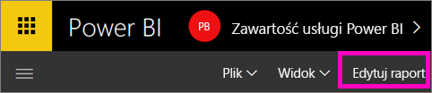
2. Jeśli nie zostało to jeszcze zrobione, otwórz okienko Wizualizacje i filtry oraz okienko Pola.
   
   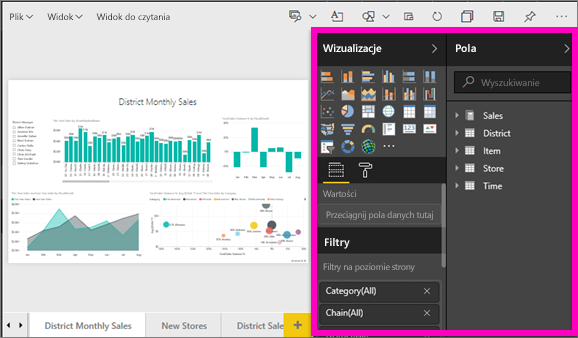
3. Wybierz wizualizację, aby ją uaktywnić. Wszystkie pola używane przez wizualizację są wyświetlane w okienku **Pola**, a także w okienku **Filtry** pod nagłówkiem **Filtry na poziomie wizualizacji**.
   
   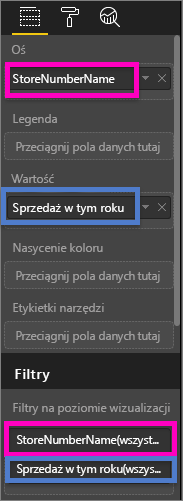
4. Na tym etapie dodasz filtr do pola już używanego przez wizualizację. 
   
   * Przewiń w dół do obszaru **Filtry na poziomie wizualizacji** i wybierz strzałkę, aby rozwinąć pole, które chcesz filtrować. W tym przykładzie filtrowanym polem będzie **StoreNumberName**
     
      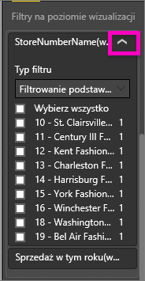 
   * Ustaw kontrolkę filtrowania **Podstawowe**, **Zaawansowane** lub **Pierwsze N** (zobacz [Jak używać filtrów raportu](power-bi-how-to-report-filter.md)). W tym przykładzie należy wybrać filtrowanie Podstawowe i umieścić znaczniki wyboru obok liczb 10, 11, 15 i 18.
     
      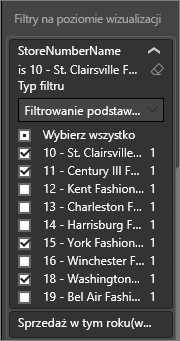 
   * Wizualizacja zmieni się w celu odzwierciedlenia nowego filtru. Jeśli zapiszesz raport razem z filtrem, czytelnicy raportu mogą wchodzić w interakcję z filtrem w widoku do czytania, zaznaczając lub usuwając wartości.
     
      
5. Teraz dodaj do wizualizacji zupełnie nowe pole w postaci filtru na poziomie wizualizacji.
   
   * W okienku Pola wybierz pole, które chcesz dodać jako nowy filtr na poziomie wizualizacji i przeciągnij go do obszaru **Filtry na poziomie wizualizacji**.  W tym przykładzie należy przeciągnąć pole **District Manager** do zasobnika **Filtry na poziomie wizualizacji** i zaznaczyć wyłącznie pole Andrew Ma. 
     
      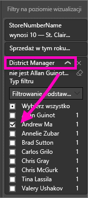
   * Zwróć uwagę, że pole **District Manager** *nie* zostało dodane do wizualizacji. Wizualizacja nadal składa się z pola **StoreNumberName** w obszarze osi i pola **This Year Sales** w obszarze wartości.  
     
      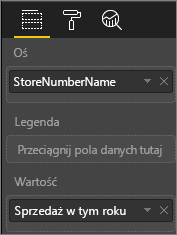
   * Wizualizacja jest teraz filtrowana, aby pokazać dane dotyczące tegorocznej sprzedaży Andrew w określonych sklepach.
     
     

## Dodawanie filtru do całej strony (filtr widoku strony)
1. Otwórz [raport w widoku do edycji](service-reading-view-and-editing-view.md).
2. Jeśli nie zostało to jeszcze zrobione, otwórz okienko Wizualizacje i filtry oraz okienko Pola.
3. W okienku Pola wybierz pole, które chcesz dodać jako nowy filtr na poziomie strony i przeciągnij go do obszaru **Filtry na poziomie strony**.  
4. Wybierz wartości, które chcesz filtrować i ustaw kontrolkę filtrowania **Podstawowe** lub **Zaawansowane** (zobacz [Jak używać filtrów raportu](power-bi-how-to-report-filter.md)).
   
   Wszystkie wizualizacje na stronie, na które ma wpływ ten filtr, są ponownie rysowane w celu odzwierciedlenia zmiany. 
   
   

Jeśli zapiszesz raport razem z filtrem, czytelnicy raportu mogą wchodzić w interakcję z filtrem w widoku do czytania, zaznaczając lub usuwając wartości.

## Dodawanie filtru przeglądania szczegółowego
Przeglądanie szczegółowe w usłudze Power BI i programie Power BI Desktop umożliwia tworzenie strony *docelowej* raportu, która koncentruje się na określonej jednostce — takiej jak dostawca, klient lub producent. Użytkownicy znajdujący się na innych stronach raportu mogą teraz kliknąć prawym przyciskiem myszy punkt danych dotyczący konkretnej jednostki i przejść do wyznaczonej strony.

### Tworzenie filtru przeglądania szczegółowego
Aby wykonać prezentowane instrukcje, otwórz przykład Customer Profitability w widoku do edycji. Załóżmy, że chcesz utworzyć stronę, która zawiera dane dotyczące obszarów kierowniczych.   

1. Dodaj nową stronę do raportu i nadaj jej nazwę **Team Executive**. Będzie to strona *docelowa* przeglądania szczegółowego.
2. Dodaj wizualizacje, które śledzą kluczowe metryki w ramach obszarów działalności kierowników zespołów.    
3. Dodaj pozycję **Executive > Executive Name** do filtrów przeglądania szczegółowego.    
   
    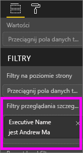
   
    Zwróć uwagę, że usługa Power BI dodaje strzałkę wstecz do strony raportu.  Po wybraniu strzałki wstecz użytkownicy zostaną przeniesieni do strony *źródłowej* raportu, na której wcześniej wybrali opcję przeglądania szczegółowego. Strzałka wstecz działa tylko w widoku do czytania.
   
     

### Używanie filtru przeglądania szczegółowego
Zobaczmy, jak działa filtr przeglądania szczegółowego.

1. Rozpocznij od strony **Team Scorecard** raportu.    
2. Załóżmy, że nazywasz się Andrew Ma i chcesz, aby na stronie raportu Team Executive zostały odfiltrowane wszystkie dane poza tymi dotyczącymi Ciebie.  Na lewym górnym wykresie warstwowym kliknij prawym przyciskiem myszy dowolny zielony punkt danych, aby otworzyć opcję menu przeglądania szczegółowego.
   
    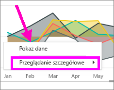
3. Wybierz pozycję **Przeglądanie szczegółowe > Team Executive**, aby użyć filtru przeglądania szczegółowego na stronie raportu o nazwie **Team Executive**. Strona jest filtrowana w celu wyświetlenia informacji na temat punktu danych, który kliknięto prawym przyciskiem myszy. W tym przypadku Andrew Ma. Tylko pole uwzględnione w filtrach przeglądania szczegółowego zostanie przekazane do strony raportu szczegółowego.  
   
    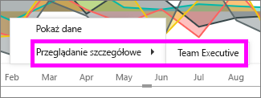

## Dodawanie filtru do całego raportu (filtr raportu)
1. Otwórz [raport w widoku do edycji](service-reading-view-and-editing-view.md).
2. Jeśli nie zostało to jeszcze zrobione, otwórz okienko Wizualizacje i filtry oraz okienko Pola.
3. W okienku Pola wybierz pole, które chcesz dodać jako nowy filtr na poziomie raportu i przeciągnij go do obszaru **Filtry na poziomie raportu**.  
4. Wybierz wartości, które chcesz filtrować (zobacz [Jak używać filtrów raportu](power-bi-how-to-report-filter.md)).

    Wizualizacja na aktywnej stronie, oraz na wszystkich stronach raportu, zmieni się w celu odzwierciedlenia nowego filtru. Jeśli zapiszesz raport razem z filtrem, czytelnicy raportu mogą wchodzić w interakcję z filtrem w widoku do czytania, zaznaczając lub usuwając wartości.

1. Wybierz strzałkę wstecz, aby wrócić do poprzedniej strony raportu.

## Istotne zagadnienia i rozwiązywanie problemów
### Dlaczego filtry na poziomie wizualizacji i filtry na poziomie strony zwracają różne wyniki
Po dodaniu filtru na poziomie wizualizacji usługa Power BI filtruje według wyników zagregowanych.  Domyślna agregacja to sumowanie, ale [typ agregacji można zmienić](service-aggregates.md).  

Po dodaniu filtru na poziomie strony usługa Power BI filtruje bez użycia agregacji.  Dzieje się tak, ponieważ strona może zawierać wiele wizualizacji, z których każda może korzystać z różnych typów agregacji.  Dlatego filtr jest stosowany w przypadku każdego wiersza danych.

Jeśli nie widzisz okienka Pola, upewnij się, że jesteś w [widoku do edycji](service-interact-with-a-report-in-editing-view.md) raportu

## Następne kroki
 [Jak używać filtrów raportu](power-bi-how-to-report-filter.md)

  [Filtry i wyróżnianie w raportach](power-bi-reports-filters-and-highlighting.md)

[Interakcja z filtrami i wyróżnianie w widoku do czytania raportu](service-reading-view-and-editing-view.md)

[Zmiana sposobu wzajemnego filtrowania i wyróżniania krzyżowego wizualizacji raportu](service-reports-visual-interactions.md)

Masz więcej pytań? [Odwiedź społeczność usługi Power BI](http://community.powerbi.com/)

