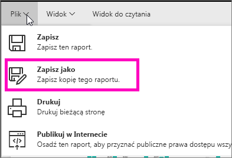
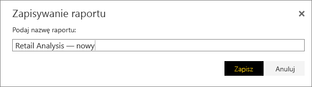
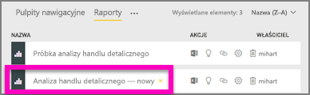

# Tworzenie nowego raportu na podstawie istniejącego raportu
Być może masz już raport, który już jest połączony z Twoim zestawem danych i ma pewne elementy wizualne, które chcesz ponownie użyć lub zmodyfikować.  Dlaczego nie skopiować tego raportu jako podstawy dla nowego raportu?  W tym celu:

1. [Otwórz raport](service-report-open.md).
2. Z menu **Plik** wybierz pozycję **Zapisz jako**.
   
   
3. Wpisz nazwę dla nowego raportu i wybierz pozycję **Zapisz**.
   
   
   
   Komunikat z potwierdzeniem informuje, że nowy raport został zapisany w bieżącym obszarze roboczym w usłudze Power BI.
   
   
4. Otwórz kartę **Raporty** swojego obszaru roboczego i wybierz nowy raport, aby go otworzyć. Opcjonalnie usuń elementy wizualne, których nie chcesz zachować, zmodyfikuj inne elementy wizualne i dodaj nowe.
   
   
5. Baw się, aktualizując i edytując swój nowy raport.

## Następne kroki:
[Tworzenie nowych wizualizacji](power-bi-report-add-visualizations-ii.md)

[Usuwanie wizualizacji](service-delete.md), które nie są już potrzebne
