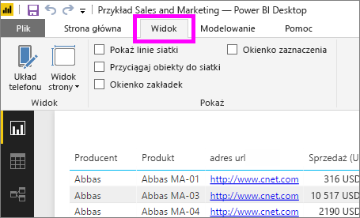
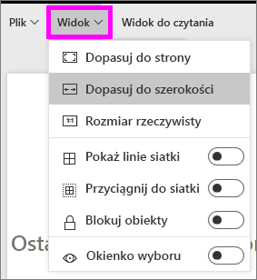
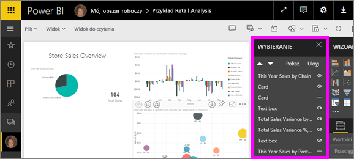

# Ustawienia wyświetlania strony w raporcie usługi Power BI
Rozumiemy, że zachowanie doskonałej zgodności Twojego układ raportu piksel w piksel ma krytyczne znaczenie. Czasami może to stanowić wyzwanie, ponieważ Ty i Twoi współpracownicy wyświetlacie te raporty na ekranach o różnych współczynnikach proporcji i rozmiarach. 

Domyślny widok wyświetlany jest **dopasowany do strony** a domyślny rozmiar wyświetlania wynosi **16:9**. Jeśli chcesz zablokować inny współczynnik proporcji lub chcesz dopasować raport w inny sposób, istnieją dwa narzędzia, które to ułatwiają: ustawienia ***Widok strony*** i ustawienia ***Rozmiar strony***.

<iframe width="560" height="315" src="https://www.youtube.com/embed/5tg-OXzxe2g" frameborder="0" allowfullscreen></iframe>

## Gdzie znaleźć ustawienia Widok strony w usłudze Power BI i w programie Power BI Desktop?
Ustawienia Widok strony są dostępne zarówno w usłudze Power BI, jak i w programie Power BI Desktop, ale interfejs jest nieco inny. W dwóch poniższych sekcjach opisano, gdzie znaleźć ustawienia widoku w narzędziach usługi Power BI.

### W programie Power BI Desktop
W widoku Raport wybierz kartę **Widok**, aby otworzyć ustawienia Widok strony, a także ustawienia układu telefonu.

  

### W usłudze Power BI (app.powerbi.com)
W usłudze Power BI otwórz raport i wybierz pozycję **Widok** z górnego paska menu po lewej stronie.

Ustawienia widoku strony są dostępne w [widoku do czytania i w widoku do edycji](service-reading-view-and-editing-view.md). W widoku do edycji właściciel raportu może przypisać ustawienia widoku strony do poszczególnych stron raportu i te ustawienia są zapisywane wraz z raportem. Gdy współpracownicy otworzą ten raport w widoku do czytania, zobaczą strony raportu wyświetlane przy użyciu ustawień właściciela.  W widoku do czytania współpracownicy mogą zmienić *niektóre* ustawienia Widok strony, ale zmiany nie są zapisywane podczas zamykania raportu.

##    Ustawienia Widok strony
Pierwszy zestaw ustawień *Widok strony* kontroluje wyświetlanie strony raportu względem okna przeglądarki.  Wybierz spośród opcji:

* **Dopasuj do strony** (domyślna): zawartość jest skalowana tak, aby najlepiej dopasować się do strony
* **Dopasuj do szerokości**: zawartość jest skalowana tak, aby najlepiej dopasować się do szerokości strony
* **Rzeczywisty rozmiar**: zawartość jest wyświetlana w pełnym rozmiarze

Drugi zestaw ustawień *Widok strony* kontroluje pozycjonowanie obiektów na kanwie raportu

* **Pokaż linie siatki**: włącz linie siatki, aby ułatwić pozycjonowanie obiektów na kanwie raportu
* **Przyciągnij do siatki**: w połączeniu z opcją **Pokaż linie siatki** umożliwia dokładne ustawienie pozycji obiektów i wyrównanie ich na kanwie raportu 
* **Blokuj obiekty**: zablokuj wszystkie obiekty na kanwie, aby nie można było ich przenosić ani zmieniać ich rozmiaru
* **Okienko Wybór**: okienko Wybór zawiera listę wszystkich obiektów na kanwie i umożliwia określenie, czy dany obiekt ma być widoczny, czy ukryty

    

## Ustawienia rozmiaru strony

Ustawienia *Rozmiar strony* są dostępne tylko dla właścicieli raportów. W usłudze Power BI (app.powerbi.com) oznacza to możliwość otworzenia raportu w [widoku do edycji](service-reading-view-and-editing-view.md). Te ustawienia kontrolują współczynnik proporcji ekranu i rzeczywisty rozmiar (w pikselach) kanwy raportu.   

* Proporcje 4:3
* Proporcje 16:9 (ustawienie domyślne)
* Cortana
* Letter
* Niestandardowe (wysokość i szerokość w pikselach)

## Następne kroki
[Dowiedz się, jak korzystać z ustawień Widok strony i Rozmiar strony w swoich raportach usługi Power BI](power-bi-change-report-display-settings.md).

Przeczytaj więcej na temat [raportów w usłudze Power BI](service-reports.md)

[Power BI — podstawowe pojęcia](service-basic-concepts.md)

Masz więcej pytań? [Odwiedź społeczność usługi Power BI](http://community.powerbi.com/)

