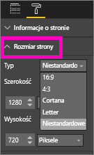

# Ustawienia wyświetlania strony w raporcie usługi Power BI
Rozumiemy, że zachowanie doskonałej zgodności Twojego układ raportu piksel w piksel ma krytyczne znaczenie. Czasami może to stanowić wyzwanie, ponieważ Ty i Twoi współpracownicy wyświetlacie te raporty na ekranach o różnych współczynnikach proporcji i rozmiarach. 

Domyślny widok wyświetlany jest **dopasowany do strony** a domyślny rozmiar wyświetlania wynosi **16:9**. Jeśli chcesz zablokować inny współczynnik proporcji lub chcesz dopasować raport w inny sposób, istnieją dwa narzędzia, które to ułatwiają: ustawienia ***Widok strony*** i ustawienia ***Rozmiar strony***.

<iframe width="560" height="315" src="https://www.youtube.com/embed/5tg-OXzxe2g" frameborder="0" allowfullscreen></iframe>

## Ustawienia widoku strony

Ustawienia *widoku strony* kontrolują wyświetlanie strony raportu względem okna przeglądarki.  Wybierz spośród opcji:

* **Dopasuj do strony** (domyślna): zawartość jest skalowana tak, aby najlepiej dopasować się do strony
* **Dopasuj do szerokości**: zawartość jest skalowana tak, aby najlepiej dopasować się do szerokości strony
* **Rzeczywisty rozmiar**: zawartość jest wyświetlana w pełnym rozmiarze

Ustawienia widoku strony są dostępne zarówno w pozycji [Widok do czytania](service-interact-with-a-report-in-reading-view.md) i [Widok do edycji](service-interact-with-a-report-in-editing-view.md). W widoku do edycji właściciel raportu może przypisać ustawienie widoku strony do poszczególnych stron raportu i te ustawienia są zapisywane wraz z raportem. Gdy współpracownik otworzy ten raport w widoku do czytania, zobaczy strony raportu wyświetlane przy użyciu ustawień właściciela.  Jednak podczas pracy z raportem w widoku do czytania użytkownik może czasowo zmienić ustawienia widoku strony.  Gdy użytkownik opuści raport, ustawienie widoku strony powróci do wartości, które zostały określone przez właściciela raportu.

## Ustawienia rozmiaru strony

Ustawienie *Rozmiar strony* kontroluje współczynnik proporcji ekranu i rzeczywisty rozmiar (w pikselach).  Ustawienia rozmiaru strony są dostępne tylko w widoku do edycji.

* Proporcje 4:3
* Proporcje 16:9 (ustawienie domyślne)
* Cortana
* Letter
* Niestandardowe (wysokość i szerokość w pikselach)

## Następne kroki
[Ustawienia wyświetlania strony w raporcie usługi Power BI](power-bi-change-report-display-settings.md).

Przeczytaj więcej na temat [raportów w usłudze Power BI](service-reports.md)

[Power BI — podstawowe pojęcia](service-basic-concepts.md)

Masz więcej pytań? [Odwiedź społeczność usługi Power BI](http://community.powerbi.com/)

