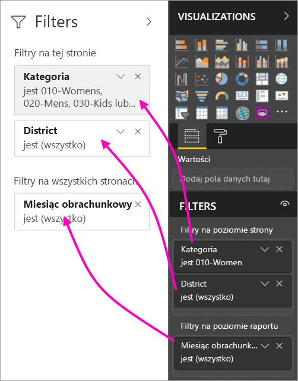

# Nowe funkcje filtrowania w raportach usługi Power BI (wersja zapoznawcza)

W tym artykule opisujemy nowe funkcje filtrowania w usłudze Power BI, które zapewniają teraz nowe możliwości i zostały przeprojektowane. Kiedy projektujesz raporty w programie Power BI Desktop lub w usłudze Power BI, możesz sprawić, by okienko Filtry wyglądało i działało jak cały raport. W przypadku nowej funkcji stare okienko Filtry działa jak okienko edycji filtrów, a nowe okienko Filtr jest jedynym okienkiem widocznym dla użytkowników raportu. 
 

Jeśli jesteś projektantem raportów, przy użyciu nowych filtrów możesz wykonywać następujące czynności:

- Pokaż widok filtrów przeznaczony tylko do odczytu w nagłówku wizualizacji, aby użytkownicy dokładnie wiedzieli, jakie filtry i fragmentatory dotyczą danej wizualizacji.
- Sformatuj i dostosuj okienko filtru, aby wyglądało jak część raportu.
- Zdefiniuj, czy okienko Filtry będzie domyślnie otwarte lub zwinięte, gdy użytkownik otworzy raport.
- Ukryj całe okienko filtru lub tylko określone filtry, których użytkownicy raportu nie powinni zobaczyć.
- Kontroluj widoczność, a nawet twórz zakładki, otwieraj i rozwijaj w zależności od stanu nowego okienka filtru.
- Zablokuj filtry, których użytkownicy nie powinni edytować.

## Włączanie nowej funkcji filtrowania 

Nową funkcję można włączyć w programie Power BI Desktop. Następnie można modyfikować filtry w programie lub w usłudze Power BI (https://app.powerbi.com). Ze względu na to, że nowa funkcja filtrowania jest obecnie dostępna w wersji zapoznawczej, musisz ją najpierw włączyć w programie Power BI Desktop. 

### Włączanie nowych filtrów dla wszystkich nowych raportów

1. Wybierz pozycję **Plik** > **Opcje i ustawienia** > **Opcje** > **Funkcje w wersji zapoznawczej**, a następnie zaznacz pole wyboru **Nowa funkcja filtrowania**. 
2. Uruchom ponownie program Power BI Desktop, aby wyświetlić nową funkcję filtrowania we wszystkich nowych raportach.

Po ponownym uruchomieniu programu Power BI Desktop nowa funkcja będzie domyślnie włączona dla wszystkich nowych raportów.  

### Włączanie nowych filtrów dla istniejącego raportu

Nowe filtry można również włączyć dla istniejących raportów.

1. W istniejącym raporcie wybierz pozycje **Plik** > **Opcje i ustawienia** > **Opcje**
2. W obszarze **Ustawienia raportu** wybierz pozycję **Włącz zaktualizowane okienko filtru i dla tego raportu pokazuj filtry w nagłówku wizualizacji**.

## Tworzenie nowego okienka filtru

Po włączeniu nowego okienka filtru zostanie ono wyświetlone z prawej strony raportu i będzie domyślnie sformatowane zgodnie z bieżącymi ustawieniami raportu. Stare okienko filtru działa teraz jak okienko edycji filtrów. W nowym okienku filtru zostanie wyświetlone to, co będą mogli zobaczyć użytkownicy raportu po jego opublikowaniu. Możesz zaktualizować istniejące filtry w nowym okienku, ale użyj starego okienka filtru do skonfigurowania, które filtry należy dodać.

1. Najpierw zdecyduj, czy chcesz, by użytkownicy raportu widzieli okienko filtru. Jeśli chcesz, by go widzieli, wybierz ikonę oka  obok okienka Filtry.

2. Aby rozpocząć tworzenie nowego okienka filtru, przeciągnij odpowiednie pola do okienka edycji filtrów jako stronę wizualizacji lub filtry na poziomie raportu. Zobaczysz je w nowym okienku Filtry.

    

Gdy dodasz wizualizację do kanwy raportu, usługa Power BI automatycznie doda filtr dla każdego pola w wizualizacji. Power BI nie doda tych filtrów automatycznych do okienka filtru przeznaczonego tylko do odczytu. Aby dodać je samodzielnie, musisz wybrać ikonę oka.

 
## Blokowanie lub ukrywanie filtrów

Poszczególne karty filtrów można zablokować lub ukryć. Kiedy zablokujesz filtr, użytkownicy raportu zobaczą go, ale nie będą mogli go zmienić. Jeśli go ukryjesz, nie będą go mogli nawet zobaczyć. Ukrywanie kart filtrów jest zwykle przydatne, jeśli chcesz ukryć filtry czyszczenia danych, które wykluczają wartości null lub nieoczekiwane wartości. 

- W okienku edycji filtrów zaznacz lub odznacz ikony **Zablokuj filtr** lub **Ukryj filtr** na karcie filtru.

   

Gdy włączysz lub wyłączysz te ustawienia w okienku edycji filtrów, zmiany będą widoczne w nowym okienku filtru. Ukryte filtry nie są wyświetlane w oknie podręcznym filtrów dla wizualizacji.

Możesz również skonfigurować swój stan okienka filtru w taki sposób, aby był zgodny z zakładkami raportu. Wszystkie stany otwarcia, zamknięcia i widoczności okienka można dodać do zakładek.
 
## Formatowanie nowego okienka Filtry

Istotną zaletą tej nowej funkcji jest to, że teraz można formatować okienko filtru w celu dostosowania wyglądu i działania raportu. Możesz formatować okienko filtru w różny sposób dla każdej strony w raporcie. Oto elementy, które można formatować: 

- Kolor tła
- Przezroczystość tła
- Włączenie lub wyłączenie obramowania okienka filtru
- Kolor obramowania okienka filtru

Elementy te można również sformatować dla kart filtrów w zależności od tego, czy są one stosowane (mają jakieś ustawienia) lub dostępne (wyczyszczone): 

- Kolor tła
- Przezroczystość tła
- Obramowanie: włączone lub wyłączone
- Kolor obramowania

### Określanie formatu okienka Filtry i kart

1. W raporcie kliknij sam raport lub tło (*tapetę*), a następnie w okienku **Wizualizacje** wybierz pozycję **Formatuj**. 
    Pojawią się opcje formatowania strony raportu, tapety oraz okienka i kart filtrów.

        

1. Rozwiń **okienko filtru**, aby ustawić kolor tła, czcionki, ikony i lewej krawędzi w celu uzupełnienia strony raportu.

    

1. Rozwiń węzeł **Karty filtrów**, aby ustawić opcje **Dostępne** i **Zastosowano** dla koloru i obramowania. Jeśli ustawisz różne kolory dla dostępnych i zastosowanych kart, będzie oczywiste, które filtry są stosowane. 
  
    

## Wyświetlanie filtrów dla wizualizacji w trybie odczytu

W trybie odczytu po umieszczeniu kursora nad wizualizacją zostaje wyświetlone okno podręczne zawierające wszystkie filtry, fragmentatory i inne elementy, które mają wpływ na wizualizację. Formatowanie okna podręcznego jest takie samo jak formatowanie okienka filtru. 

Typy filtrów, które zawiera ten widok: 
- Filtry podstawowe
- Fragmentatory
- Wyróżnianie krzyżowe 
- Filtrowanie krzyżowe
- Filtry zaawansowane
- Filtry N pierwszych
- Filtry daty względnej
- Fragmentatory synchronizacji
- Filtry uwzględniające/wykluczające
- Filtry przekazywane przy użyciu adresu URL

## Już wkrótce

W najbliższych miesiącach planujemy wprowadzić następujące ulepszenia:
- Możliwość zmiany kolejności kart filtrów
- Jedna funkcja okienka filtru dla twórców raportu 
- Więcej opcji formatowania

Wypróbuj nową funkcję filtrowania. Podziel się z nami swoimi opiniami i zaproponuj, co możemy jeszcze ulepszyć. 

## Następne kroki
[Jak używać filtrów raportu](consumer/end-user-report-filter.md)

[Filtry i wyróżnianie w raportach](power-bi-reports-filters-and-highlighting.md)

[Interakcja z filtrami i wyróżnianie w widoku do czytania raportu](consumer/end-user-reading-view.md)

[Zmiana sposobu wzajemnego filtrowania i wyróżniania krzyżowego wizualizacji raportu](consumer/end-user-interactions.md)

Masz więcej pytań? [Odwiedź społeczność usługi Power BI](http://community.powerbi.com/)

