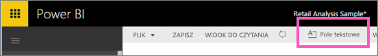
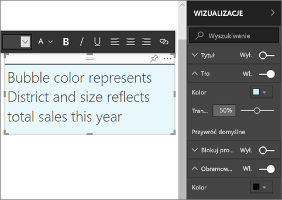
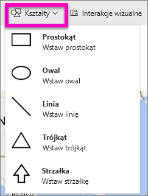
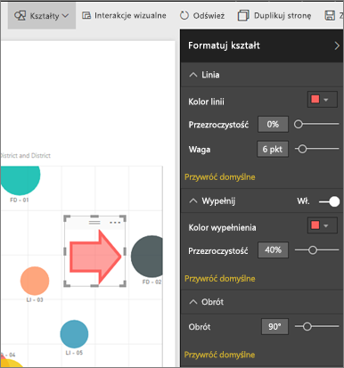

# Zawartość statyczna w raportach usługi Power BI
Pola tekstowe i kształty można dodać do raportów za pomocą usługi Power BI i programu Power BI Desktop. W obu przypadkach musisz mieć uprawnienia do edytowania raportu. Jeśli raport został Ci udostępniony, nie będziesz mieć dostępu do widoku do edycji. 

Zobacz, jak Will używa programu Power BI Desktop w celu [dodania obrazów statycznych do raportu](guided-learning/visualizations.yml#step-11), a następnie wykonaj poniższe kroki, aby spróbować zrobić to samodzielnie przy użyciu usługi Power BI.
> 
> <iframe width="560" height="315" src="https://www.youtube.com/embed/_3q6VEBhGew" frameborder="0" allowfullscreen></iframe>
> 

## Dodawanie pola tekstowego do raportu
1. Otwórz raport w widoku do edycji.

2. Umieść kursor w dowolnym miejscu na kanwie raportu i wybierz pozycję **Pole tekstowe**.
   
   
2. Wpisz tekst w polu tekstowym i, opcjonalnie, sformatuj czcionkę, kolor i wyrównanie tekstu. 
   
   
3. Aby ustalić położenie pola tekstowego, wybierz szary obszar u góry i przeciągnij go. Następnie, aby zmienić rozmiar pola tekstowego, wybierz i przeciągnij dowolny uchwyt obrysu. 
   
   

4. Kiedy pole tekstowe jest nadal zaznaczone, dodaj dodatkowe formatowanie w okienku WIZUALIZACJE. W tym przykładzie sformatowaliśmy tło i obramowanie. Możesz również określić dokładny rozmiar i położenie pola tekstowego.  

   

5. Aby zamknąć pole tekstowe, wybierz dowolne puste miejsce na kanwie raportów. 

5. Wybierz ikonę pinezki , aby przypiąć pole tekstowe do pulpitu nawigacyjnego. 

## Dodawanie kształtu do raportu
1. Umieść kursor w dowolnym miejscu na kanwie raportu i wybierz pozycję **Kształty**.
   
   
2. Z listy rozwijanej wybierz kształt, aby dodać go do Twojej kanwy raportu. Dodajmy strzałkę kierującą uwagę na bąbelek o najwyższej całkowitej wariancji sprzedaży. 
   
   W okienku **Formatowanie kształtu** dostosuj kształt. W tym przykładzie utworzyliśmy czerwoną strzałką z ciemnoczerwonym obramowaniem obróconą o 90 stopni.
   
   
3. Aby ustalić położenie kształtu, wybierz szary obszar u góry i przeciągnij go. A żeby mienić rozmiar kształtu, wybierz i przeciągnij dowolny uchwyt obrysu. Podobnie jak w przypadku pola tekstowego, można także określić dokładny rozmiar i położenie kształtu.

> **UWAGA**: nie można przypiąć kształtu do pulpitu nawigacyjnego, z wyjątkiem sytuacji, w której jest on przypinany jako jeden z elementów wizualnych podczas [przypinania strony dynamicznej](service-dashboard-pin-live-tile-from-report.md). 
> 
> 

### Następne kroki
[Dodawanie hiperlinku do pola tekstowego](service-add-hyperlink-to-text-box.md)

[Power BI — podstawowe pojęcia](service-basic-concepts.md)

Masz więcej pytań? [Odwiedź społeczność usługi Power BI](http://community.powerbi.com/)
