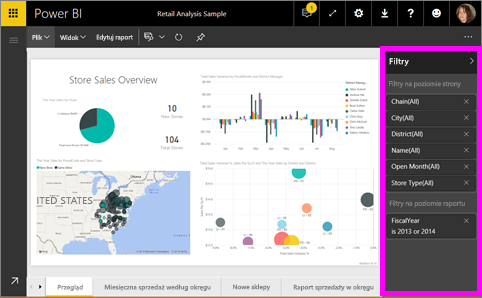
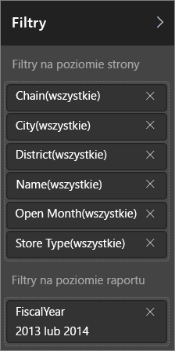
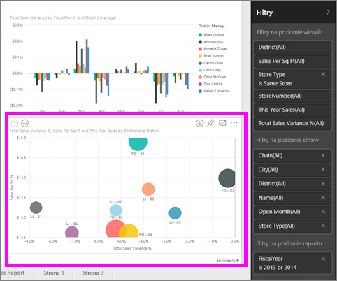
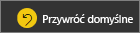
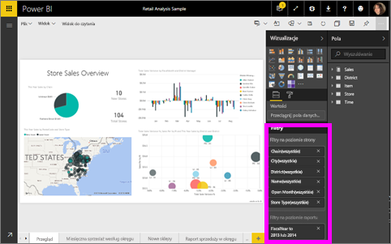

# Informacje o filtrach i wyróżnianiu w raportach usługi Power BI
 W tym artykule przedstawiono podstawowe informacje dotyczące filtrowania i wyróżniania w usłudze Power BI. W programie Power BI Desktop środowisko użytkownika jest prawie identyczne. ***Filtry*** usuwają wszystkie dane oprócz tych, na których chcesz skupić uwagę. ***Wyróżnianie*** nie jest filtrowaniem. Nie usuwa ono danych, a jedynie wyróżnia pewien podzbiór widocznych danych; niewyróżnione dane pozostają widoczne, ale są przygaszone.

Istnieje wiele różnych sposobów filtrowania i wyróżniania raportów w usłudze Power BI. Zebranie wszystkich tych informacji w jednym artykule byłoby zbyt mylące, postanowiliśmy więc podzielić ten temat na następujące sekcje:

* Wprowadzenie do filtrów i wyróżniania (artykuł, który aktualnie czytasz)
* Sposoby [tworzenia i używania filtrów w widoku do edycji](power-bi-report-add-filter.md) w raportach. Jeśli masz uprawnienia do edytowania raportu, możesz tworzyć, modyfikować i usuwać filtry w raportach.
* Sposoby [filtrowania i wyróżniania w raporcie udostępnionym](consumer/end-user-reading-view.md) w widoku do czytania raportu. Dostępne możliwości są bardziej ograniczone, można jednak nadal korzystać z szerokiej gamy opcji filtrowania i wyróżniania.  
* Szczegółowa prezentacja dotycząca [kontrolek filtrowania i wyróżniania dostępnych w widoku do edycji](consumer/end-user-report-filter.md), w tym dokładny przegląd typów filtrów (np. daty i godziny, numeryczne, tekstowe) oraz różnica między opcjami podstawowymi i zaawansowanymi.
* Gdy wiesz już, jak wygląda domyślne działanie filtrów i wyróżniania, dowiedz się, jak [zmienić sposób wzajemnego filtrowania i wyróżniania dla wizualizacji na stronie](consumer/end-user-interactions.md)

## Wprowadzenie do okienka Filtry

Filtry można stosować w okienku **Filtry** lub [dokonując wyborów we fragmentatorach](visuals/power-bi-visualization-slicers.md) bezpośrednio w raporcie. Okienko Filtry zawiera używane w raporcie tabele i pola oraz ewentualne zastosowane filtry. 

Istnieją cztery typy filtrów.

- **Filtr strony** dotyczy wszystkich wizualizacji na stronie raportu.     
- **Filtr wizualny** dotyczy jednej wizualizacji na stronie raportu. Filtry na poziomie wizualizacji są widoczne tylko po wybraniu wizualizacji na kanwie raportu.    
- **Filtr raportu** dotyczy wszystkich stron w raporcie.    
- **Filtr przeglądania szczegółowego** dotyczy pojedynczej jednostki w raporcie.    

Możesz wyszukiwać w filtrach stron, filtrach wizualnych i filtrach raportów w widoku do czytania lub widoku do edycji, aby znaleźć i wybrać potrzebną wartość. 

Jeśli obok filtru znajduje się wyraz **Wszystkie**, oznacza to że, wszystkie wartości w polu zostały uwzględnione w filtrze.  Na przykład **Chain(Wszystkie)** na poniższym zrzucie ekranu oznacza, że ta strona raportu uwzględnia dane dotyczące wszystkich sieci sklepów.  Z drugiej strony filtr na poziomie raportu **FiscalYear to 2013 lub 2014** informuje nas, że raport uwzględnia tylko dane za lata obrachunkowe 2013 i 2014.

## Filtry w widoku do czytania lub w widoku do edycji
Istnieją dwa tryby interakcji z raportami: [Widok do czytania](consumer/end-user-reading-view.md) i Widok do edycji. Dostępne możliwości filtrowania zależą od trybu, w którym pracujesz.

* Widok do edycji umożliwia dodawanie filtrów raportu, strony, przeglądania szczegółowego i wizualnych. Po zapisaniu raportu te filtry są zapisywane razem z nim, nawet jeśli otworzysz go w aplikacji mobilnej. Osoby wyświetlające raport w widoku do czytania mogą wchodzić w interakcje z filtrami, które zostały dodane, ale nie mogą dodawać nowych filtrów.
* W widoku do czytania możesz wchodzić w interakcje z dowolnymi filtrami, które istnieją już w raporcie, oraz zapisywać dokonywane wybory. Nie możesz dodawać nowych filtrów.

### Filtry w widoku do czytania
Jeśli masz tylko dostęp do raportu w widoku do czytania, okienko filtrów będzie wyglądać podobnie do poniższego:

Ta strona raportu ma sześć filtrów na poziomie strony oraz jeden filtr na poziomie raportu.

Każda wizualizacja może mieć filtry dla wszystkich pól w wizualizacji, a autor raportu może dodać kolejne filtry. Na poniższej ilustracji wykres bąbelkowy ma sześć filtrów.

W widoku do czytania można przeglądać dane, modyfikując istniejące filtry. Wprowadzone zmiany są zapisywane z raportem, nawet wtedy, gdy raport jest otwierany w aplikacji mobilnej. Dowiedz się, jak się to odbywa, [zapoznając się z prezentacją okienka Filtry raportu](consumer/end-user-report-filter.md)

Podczas zamykania raportu filtry są zapisywane. Aby cofnąć filtrowanie i wrócić do domyślnego filtrowania, fragmentowania, przechodzenia do szczegółów i sortowania ustawionego przez autora raportu, wybierz pozycję **Przywróć domyślne** z górnego paska menu.

### Filtry w widoku do edycji
Jeśli masz uprawnienia właściciela do raportu i otworzysz go w widoku do edycji, zobaczysz, że **Filtry** to tylko jedno z dostępnych okienek do edycji.

Tak jak w widoku do czytania, ta strona raportu ma sześć filtrów na poziomie strony oraz jeden filtr na poziomie raportu. Wybierając wykres bąbelkowy, można sprawdzić, że ma także sześć zastosowanych filtrów na poziomie wizualizacji.

Korzystając z filtrów i wyróżniania, można wykonywać więcej czynności w widoku do edycji. Przede wszystkim możemy dodawać nowe filtry. Dowiedz się, jak [dodawać filtr do raportu](power-bi-report-add-filter.md) i wykonywać inne czynności.

## Wyróżnianie ad hoc
Wybierz pole na kanwie raportu, aby wyróżnić inne wizualizacje na stronie. Aby usunąć puste miejsce w ramach tej samej wizualizacji, zaznacz je. Wyróżnianie tego typu stanowi ciekawy sposób szybkiego sprawdzania wpływów danych. Aby dostosować sposób działania wyróżniania tego typu, zobacz temat [Interakcje wizualne](consumer/end-user-interactions.md).

## Następne kroki
[Dodawanie filtru do raportu (w widoku do edycji)](power-bi-report-add-filter.md)

[Zapoznaj się z przewodnikiem po filtrach raportów](consumer/end-user-report-filter.md)

[Zmiana sposobu wzajemnego filtrowania i wyróżniania krzyżowego wizualizacji raportu](consumer/end-user-interactions.md)

Masz więcej pytań? [Odwiedź społeczność usługi Power BI](http://community.powerbi.com/)

