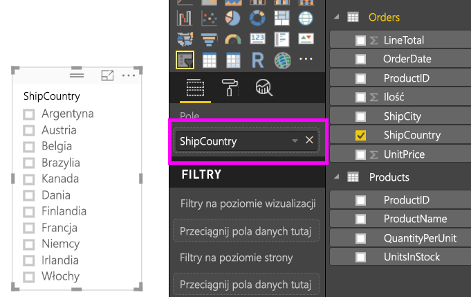
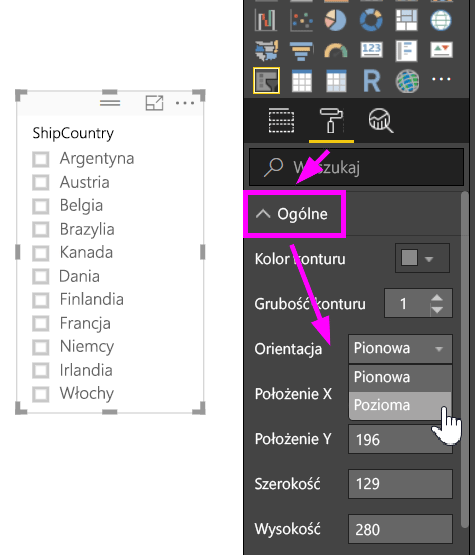
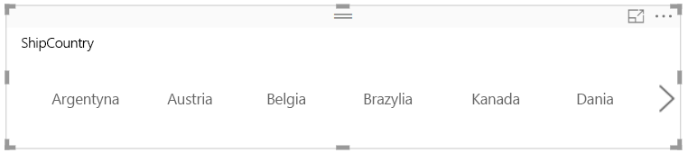
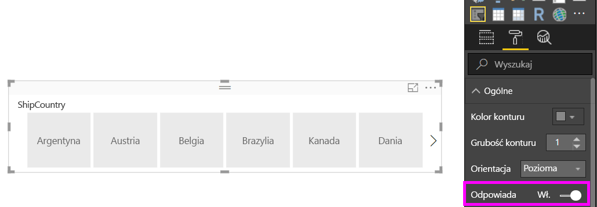
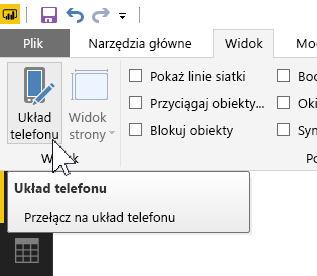
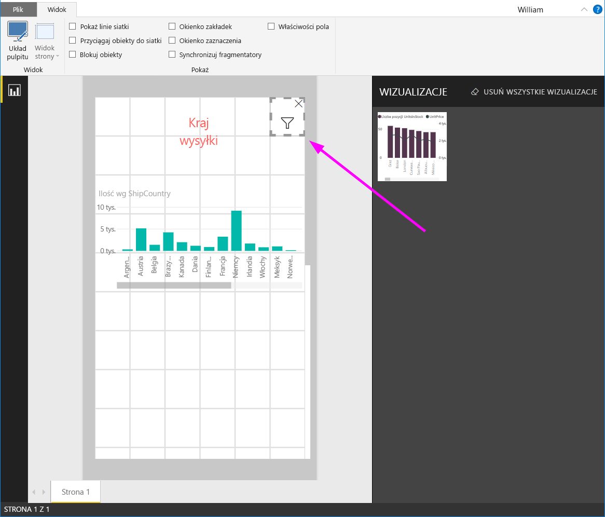

# Tworzenie fragmentatora dynamicznego z możliwością zmiany rozmiaru w usłudze Power BI

Fragmentatory dynamiczne dopasowują swój rozmiar do dowolnego obszaru w raporcie. Fragmentatory dynamiczne można dopasowywać do różnych rozmiarów i kształtów — od poziomych, przez kwadratowe, do pionowych — a rozmieszczenie wartości we fragmentatorze zmienia się automatycznie. W programie Power BI Desktop i w usłudze Power BI dynamiczne mogą być fragmentatory poziome i fragmentatory dat/zakresu. Fragmentatory dat/zakresu mają także ulepszone obszary dotykowe, dzięki czemu zmienianie ich za pomocą palca jest łatwiejsze. Fragmentatory dynamicznie mogą być dowolnie duże lub małe. Ponadto ich rozmiar zmienia się automatycznie w celu dopasowania do raportów w usłudze Power BI i w aplikacjach mobilnych Power BI. 

## Tworzenie fragmentatora

Pierwszym krokiem do utworzenia fragmentatora dynamicznego jest utworzenie fragmentatora podstawowego. 

1. Wybierz ikonę **Fragmentator**  w okienku **Wizualizacje**.
2. Przeciągnij pole, według którego chcesz filtrować, do obszaru **Pole**.

    

## Konwertowanie na fragmentator poziomy

1. Po wybraniu fragmentatora w okienku **Wizualizacje** wybierz kartę **Format**.
2. Rozwiń sekcję **Ogólne**, a następnie w polu **Orientacja** wybierz pozycję **Pozioma**.

     

1.  Prawdopodobnie trzeba będzie go poszerzyć, aby pokazać więcej wartości.

     

## Tworzenie fragmentatora dynamicznego i eksperymentowanie z nim

Ten krok jest łatwy. 

1. Tuż poniżej pola **Orientacja** w sekcji **Ogólne** karty **Format** przesuń suwak **Dynamiczny** na pozycję **Włączone**.  

    

1. Teraz możesz z nim poeksperymentować. Przeciągnij narożniki, aby stał się niski, wysoki, szeroki lub wąski. Jeśli odpowiednio go zmniejszysz, stanie się jedynie ikoną filtru.

    

## Dodawanie go do układu raportu na telefon

W programie Power BI Desktop można utworzyć układ telefonu dla każdej strony raportu. Jeśli strona ma układ telefonu, jest wyświetlana na telefonie komórkowym w orientacji pionowej. W przeciwnym razie trzeba ją wyświetlać w orientacji poziomej. 

1. W menu **Widok** wybierz pozycję **Układ telefonu**.

     
    
1. Przeciągnij na siatkę wszystkie wizualizacje, które mają się znaleźć w raporcie na telefon. Gdy przeciągniesz fragmentator dynamiczny, ustaw dla niego dowolny rozmiar — w tym przypadku jest to ikona filtru.

    

Dowiedz się więcej o tworzeniu [raportów zoptymalizowanych pod kątem aplikacji mobilnych Power BI](desktop-create-phone-report.md).

## Tworzenie fragmentatora dynamicznego z fragmentatora czasu lub zakresu

Możesz wykonać te same czynności, aby fragmentator czasu lub zakresu stał się dynamiczny. Po ustawieniu suwaka **Dynamiczny** na pozycję **Włączone** zauważysz kilka rzeczy:

- Kolejność pól wejściowych w wizualizacjach jest optymalizowana w zależności od rozmiaru dozwolonego na kanwie. 
- Wyświetlanie elementów danych jest zoptymalizowane pod kątem maksymalnej użyteczności fragmentatora w zależności od rozmiaru dozwolonego na kanwie. 
- Nowe zaokrąglone paski uchwytu na fragmentatorach optymalizują interakcje dotykowe. 
- Jeśli wizualizacja jest zbyt mała, aby była użyteczna, staje się ona ikoną przedstawiającą typ wizualizacji znajdującej się w danym miejscu. Aby z niej skorzystać, wystarczy nacisnąć ją dwukrotnie w celu otwarcia w trybie koncentracji uwagi. Pozwala to zaoszczędzić cenne miejsce na stronie raportu bez utraty funkcjonalności.

## Następne kroki

- [Fragmentatory w usłudze Power BI](power-bi-visualization-slicers.md)
- Masz więcej pytań? [Zadaj pytanie społeczności usługi Power BI](http://community.powerbi.com/)