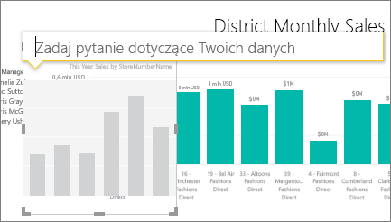

# Samouczek: używanie funkcji pytań i odpowiedzi do tworzenia wizualizacji i konstruowania raportów
[Omówienie funkcji pytań i odpowiedzi](power-bi-q-and-a.md) zapewniło wprowadzenie do funkcji pytań i odpowiedzi usługi Power BI oraz przedstawiło rozróżnienie między *użytkownikami* (osobami, którym udostępniono pulpity nawigacyjne i raporty) a *twórcami* (właścicielami podstawowych raportów i zestawów danych). Pierwsza część tego samouczka jest przeznaczona głównie dla osób korzystających z pulpitów nawigacyjnych przy użyciu usługi Power BI. Natomiast druga część jest przeznaczona dla osób tworzących raporty za pomocą usługi Power BI albo programu Power BI Desktop. Tematy [Funkcja pytań i odpowiedzi a usługa Power BI dla urządzeń przenośnych](mobile-apps-ios-qna.md) i [Funkcja pytań i odpowiedzi w usłudze Power BI Embedded](developer/qanda.md) zostały opisane w oddzielnych artykułach.

Funkcja pytań i odpowiedzi jest interaktywna i nawet przyjemna, a często jedno pytanie będzie prowadziło do wielu innych, ponieważ wizualizacje ujawniają ciekawe ścieżki do tropienia. Zobacz, jak Amanda demonstruje używanie funkcji pytań i odpowiedzi do tworzenia wizualizacji, zagłębiania się w nie i przypinania ich do pulpitów nawigacyjnych.

<iframe width="560" height="315" src="https://www.youtube.com/embed/qMf7OLJfCz8?list=PL1N57mwBHtN0JFoKSR0n-tBkUJHeMP2cP" frameborder="0" allowfullscreen></iframe>

## Część 1. Używanie funkcji pytań i odpowiedzi na pulpicie nawigacyjnym w usłudze Power BI (app.powerbi.com)
Pulpit nawigacyjny zawiera kafelki przypięte z co najmniej jednego zestawu danych, więc możesz zadawać pytania o dowolne dane zawarte w którymkolwiek z tych zestawów danych. Aby sprawdzić, które raporty i zestawy danych zostały użyte do utworzenia pulpitu nawigacyjnego, na pasku menu wybierz pozycję **Przejrzyj powiązane**.

Pole pytania funkcji pytań i odpowiedzi znajduje się w lewym górnym rogu pulpitu nawigacyjnego i to właśnie tam wpisujesz swoje pytanie, używając języka naturalnego. Funkcja pytań i odpowiedzi rozpoznaje wpisywane słowa i określa, gdzie (w którym zestawie danych) znaleźć odpowiedzi. Funkcja pytań i odpowiedzi pomaga też uformować Twoje pytanie za pomocą automatycznego uzupełniania, przeredagowania oraz innych pomocy tekstowych i wizualnych.

Odpowiedź na Twoje pytanie jest wyświetlana jako interaktywna wizualizacja aktualizowana w miarę modyfikacji pytania.

1. Otwórz pulpit nawigacyjny i umieść kursor w polu pytania. Jeszcze przed rozpoczęciem wpisywania funkcja pytań i odpowiedzi wyświetla nowy ekran z sugestiami ułatwiającymi sformułowanie pytania. Zobaczysz nazwy tabel w [podstawowych zestawach danych](service-get-data.md) i może nawet zobaczysz pełne wyświetlone pytania, jeśli właściciel zestawu danych utworzył [polecane pytania](service-q-and-a-create-featured-questions.md).

   

   Zawsze możesz wybrać jedno z tych pytań jako punkt początkowy i dalej uściślać pytanie, aby znaleźć określoną odpowiedź, której szukasz. Możesz też użyć nazwy tabeli, aby ułatwić sformułowanie nowego pytania.

2. Wybierz jedną z opcji zestawu danych lub zacznij pisać własne pytanie i wybierz sugestię z listy rozwijanej.

   

3. W miarę pisania pytania funkcja pytań i odpowiedzi wybiera najlepszą [wizualizację](power-bi-visualization-types-for-reports-and-q-and-a.md) do zaprezentowania odpowiedzi, przy czym wizualizacja zmienia się dynamicznie w miarę modyfikowania pytania.

   

4. Gdy wpisujesz pytanie, usługa Power BI wyszukuje najlepszą odpowiedź w dowolnym zestawie danych, który ma kafelek na tym pulpicie nawigacyjnym.  Jeśli wszystkie kafelki pochodzą z *zestawu danych A*,odpowiedź będzie pochodziła z *zestawu danych A*.  Jeśli istnieją kafelki z *zestawu danych A* i *zestawu danych B*, funkcja pytań i odpowiedzi wyszuka najlepszą odpowiedź z tych 2 zestawów danych.

   > [!TIP]
   > Dlatego należy zachować ostrożność, jeśli masz tylko jeden kafelek z *zestawu danych A* i usuniesz go z pulpitu nawigacyjnego, funkcja pytań i odpowiedzi nie będzie już miała dostępu do *zestawu danych A*.
   >
   >
5. Gdy wynik Cię zadowala, [przypnij wizualizację do pulpitu nawigacyjnego](service-dashboard-pin-tile-from-q-and-a.md), wybierając ikonę pinezki w prawym górnym rogu. Jeśli pulpit nawigacyjny został Ci udostępniony lub jest częścią aplikacji, nie można będzie jej przypiąć.

   

##    Część 2. Używanie funkcji pytań i odpowiedzi w raporcie w usłudze Power BI i programie Power BI Desktop

Za pomocą funkcji pytań i odpowiedzi możesz zbadać zestaw danych i dodać wizualizacje do raportu i pulpitów nawigacyjnych. Raport jest oparty na jednym zestawie danych i może być całkowicie pusty lub zawierać strony pełne wizualizacji. Jednak samo to, że raport jest pusty, nie oznacza, że nie ma żadnych danych do eksplorowania — zestaw danych jest połączony z raportem i oczekuje na eksplorowanie oraz tworzenie wizualizacji.  Aby zobaczyć, który zestaw danych jest używany do tworzenia raportu, otwórz raport w widoku do odczytu usługi Power BI i na pasku menu wybierz pozycję **Przejrzyj powiązane**.

Aby można było używać funkcji pytań i odpowiedzi w raportach, musisz mieć uprawnienia do edycji raportu i podstawowego zestawu danych. W [temacie Omówienie funkcji Pytania i odpowiedzi](power-bi-q-and-a.md) nazywaliśmy taki scenariusz scenariuszem *twórcy*. Dlatego jeśli jesteś *użytkownikiem* raportu, który został Ci udostępniony, funkcja pytań i odpowiedzi nie będzie dostępna.

1. Otwórz raport w widoku do edycji (usługa Power BI) lub w widoku raportu (program Power BI Desktop) i na pasku menu wybierz pozycję **Zadaj pytanie**.

    **Pulpit**    
    

    **Usługa**    
    

2. Pole pytania funkcji pytań i odpowiedzi jest wyświetlane w obszarze roboczym Twojego raportu. W poniższym przykładzie pole pytania jest wyświetlane na innej wizualizacji. Nie jest to problem, ale może lepiej byłoby [dodać pustą stronę do raportu](power-bi-report-add-page.md) przed zadaniem pytania.

    

3. Umieść kursor w polu pytania. W trakcie wpisywania funkcja pytań i odpowiedzi wyświetla sugestie ułatwiające sformułowanie pytania.

   

4. W miarę pisania pytania funkcja pytań i odpowiedzi wybiera najlepszą [wizualizację](power-bi-visualization-types-for-reports-and-q-and-a.md) do zaprezentowania odpowiedzi, przy czym wizualizacja zmienia się dynamicznie w miarę modyfikowania pytania.

   

5. Jeśli wizualizacja jest odpowiednia, naciśnij klawisz ENTER. Aby zapisać wizualizację w raporcie, wybierz pozycję **Plik > Zapisz**.

6. Wejdź w interakcje z nową wizualizacją. Nie ma znaczenia, jak wizualizacja została utworzona — dostępne są takie same interakcje i funkcje oraz takie samo formatowanie.

   

   Jeśli wizualizacja została utworzona w usłudze Power BI, możesz nawet [przypiąć ją do pulpitu nawigacyjnego](service-dashboard-pin-tile-from-q-and-a.md).

## Poinformuj funkcję pytań i odpowiedzi, której wizualizacji użyć.
Za pomocą funkcji pytań i odpowiedzi nie tylko możesz zadawać pytania tak, aby dane same przemówiły, możesz też wskazać usłudze Power BI sposób wyświetlenia odpowiedzi. Po prostu dodaj „jako <visualization type>„ na końcu pytania.  Na przykład „Pokaż spis magazynu według roślin jako mapę” i „pokaż cały spis jako kartę”.  Wypróbuj to samodzielnie.

##  Istotne zagadnienia i rozwiązywanie problemów
- Jeśli połączenie z zestawem danych jest realizowane za pomocą połączenia na żywo lub bramy, funkcja pytań i odpowiedzi musi być [włączona dla tego zestawu danych](service-q-and-a-direct-query.md).

- Raport został otwarty, a opcja pytań i odpowiedzi nie jest widoczna. Jeśli używasz usługi Power BI, upewnij się, że raport jest otwarty w widoku do edycji. Jeśli nie możesz otworzyć widoku do edycji, oznacza to, że nie masz uprawnień do edytowania tego raportu i nie będzie można używać funkcji pytań i odpowiedzi dla tego raportu.

## Następne kroki
Powrót do [pytań i odpowiedzi w usłudze Power BI](power-bi-q-and-a.md)   
[Samouczek: używanie funkcji pytań i odpowiedzi z przykładem Retail Sales](power-bi-visualization-introduction-to-q-and-a.md)   
[Porady dotyczące zadawania pytań w funkcji pytań i odpowiedzi](service-q-and-a-tips.md)   
[Przygotowanie skoroszytu dla funkcji pytań i odpowiedzi](service-prepare-data-for-q-and-a.md)  
[Przygotowywanie lokalnego zestawu danych dla funkcji pytań i odpowiedzi](service-q-and-a-direct-query.md)
[Przypinanie kafelka do pulpitu nawigacyjnego z funkcji pytań i odpowiedzi](service-dashboard-pin-tile-from-q-and-a.md)
